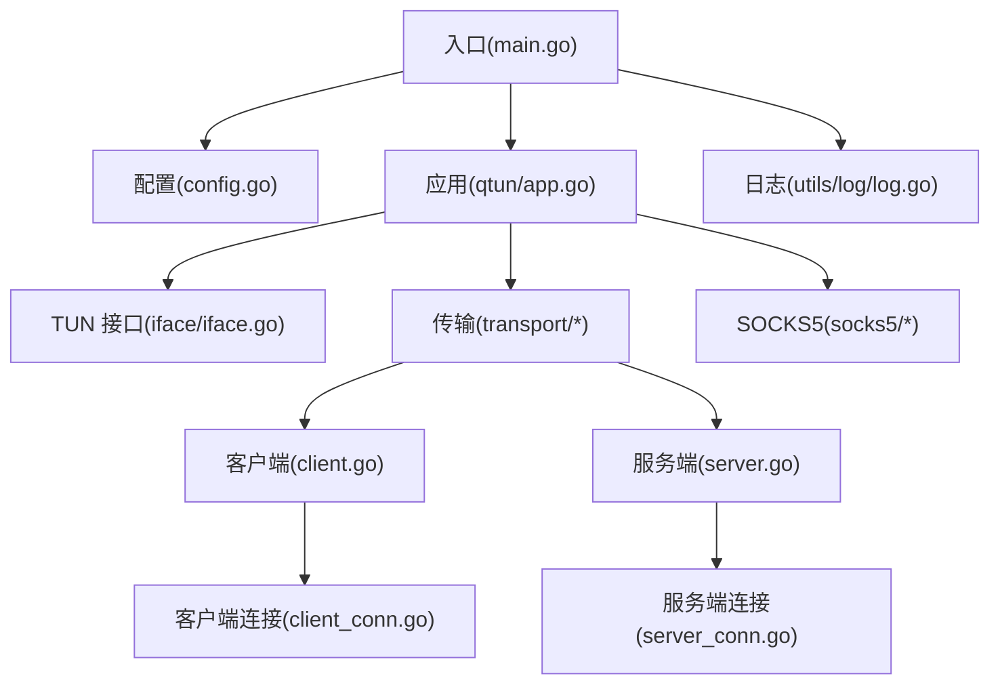
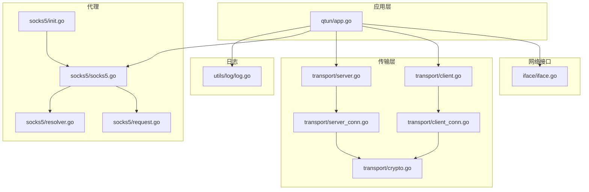
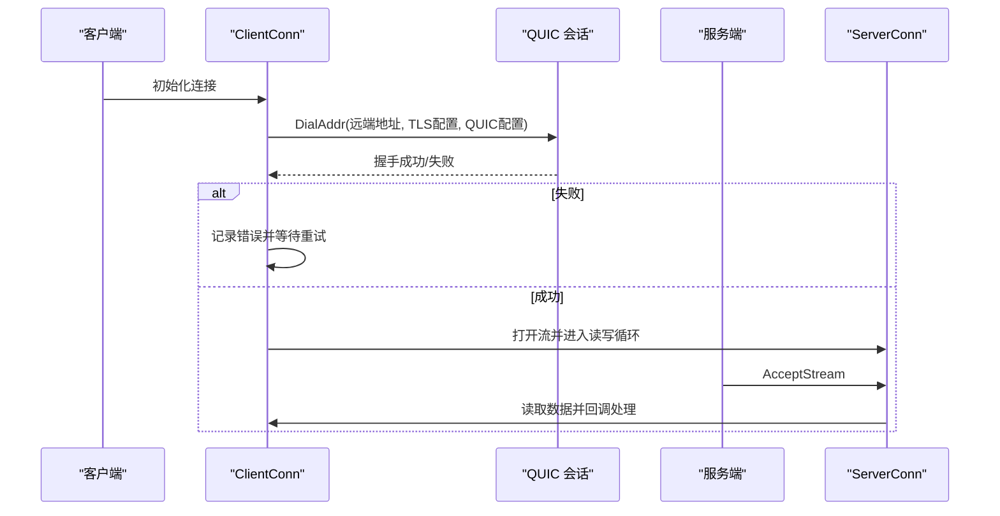
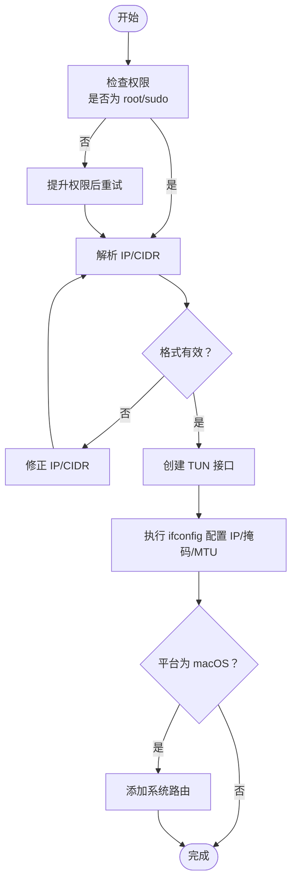
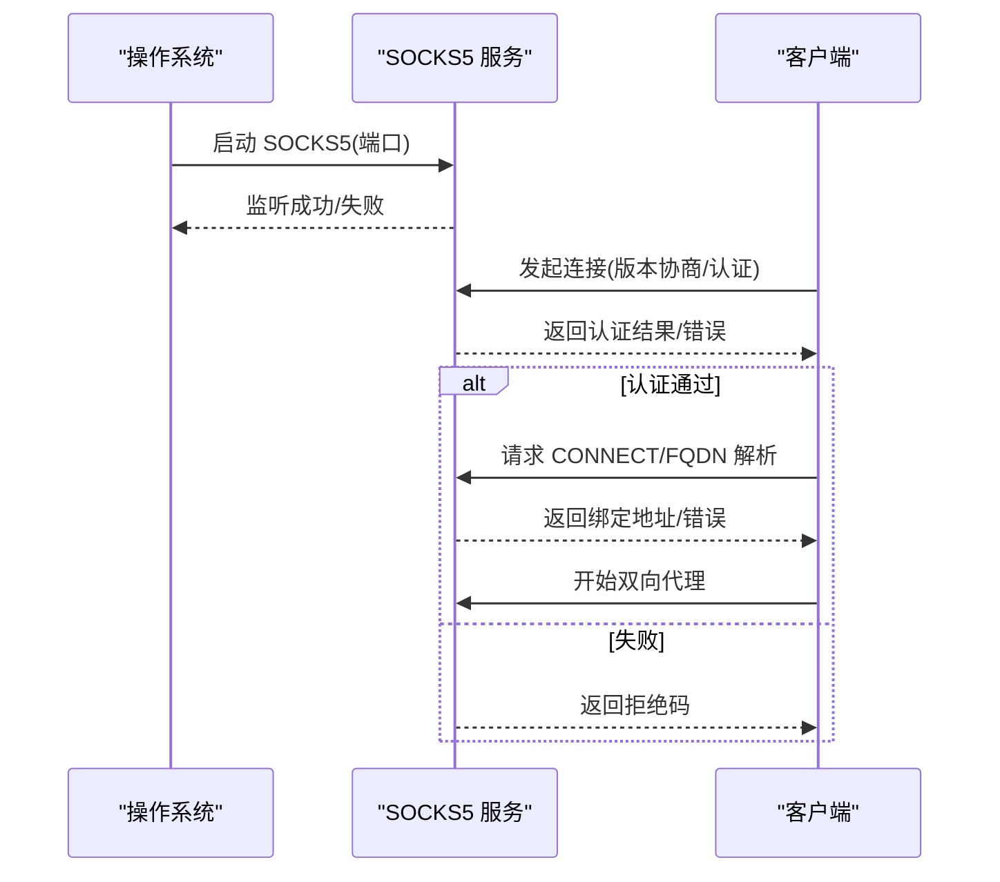
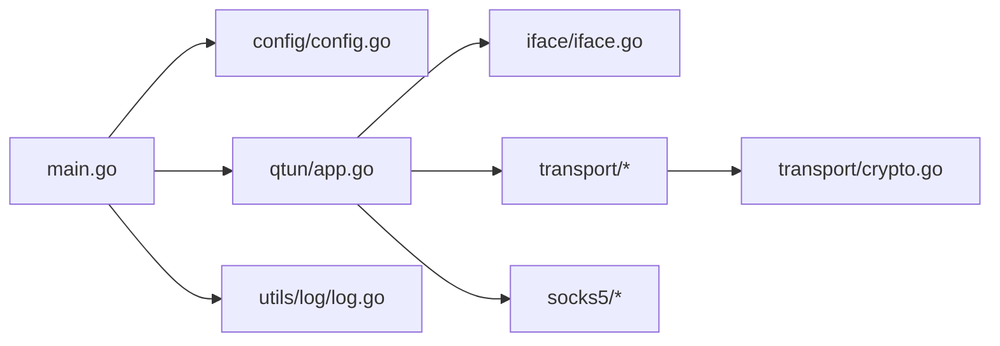

# 常见问题

<cite>
**本文引用的文件**
- [README.md](file://README.md)
- [main.go](file://main.go)
- [config/config.go](file://config/config.go)
- [qtun/app.go](file://qtun/app.go)
- [iface/iface.go](file://iface/iface.go)
- [transport/server.go](file://transport/server.go)
- [transport/client.go](file://transport/client.go)
- [transport/client_conn.go](file://transport/client_conn.go)
- [transport/server_conn.go](file://transport/server_conn.go)
- [transport/crypto.go](file://transport/crypto.go)
- [socks5/socks5.go](file://socks5/socks5.go)
- [socks5/init.go](file://socks5/init.go)
- [socks5/request.go](file://socks5/request.go)
- [socks5/resolver.go](file://socks5/resolver.go)
- [utils/log/log.go](file://utils/log/log.go)
- [PERFORMANCE_TEST_GUIDE.md](file://PERFORMANCE_TEST_GUIDE.md)
</cite>

## 目录
1. [简介](#简介)
2. [项目结构](#项目结构)
3. [核心组件](#核心组件)
4. [架构总览](#架构总览)
5. [详细组件分析](#详细组件分析)
6. [依赖关系分析](#依赖关系分析)
7. [性能注意事项](#性能注意事项)
8. [故障排查指南](#故障排查指南)
9. [结论](#结论)
10. [附录](#附录)

## 简介
本文件面向使用 qtun 的用户与运维人员，聚焦于“连接失败、网络不通、性能问题、配置错误”等常见问题，提供症状、可能原因与可操作的解决步骤。内容覆盖 QUIC 连接建立失败的排查、TUN 接口配置错误的修复、SOCKS5 代理无法访问的诊断流程，并给出针对不同操作系统（Windows、macOS、Linux）的特定建议。同时包含防火墙、端口占用、权限不足等系统层面问题的处理方法，以及问题自检清单与快速修复指南。

## 项目结构
- 入口与命令行参数解析：main.go 定义命令行选项、初始化日志与应用生命周期。
- 配置管理：config/config.go 提供全局配置结构与初始化。
- 应用主循环：qtun/app.go 负责 TUN 接口启动、客户端/服务端模式切换、数据面转发与路由维护。
- 传输层：transport/ 下实现基于 QUIC 的客户端与服务端连接、加密与数据收发。
- 网络接口：iface/iface.go 负责创建 TUN 接口、配置 IP 与 MTU、添加系统路由。
- 代理：socks5/ 下实现 SOCKS5 服务端，支持认证、规则集与地址解析。
- 日志：utils/log/log.go 提供日志级别控制与输出。

**图示来源**
- [main.go](file://main.go#L70-L103)
- [config/config.go](file://config/config.go#L17-L23)
- [qtun/app.go](file://qtun/app.go#L37-L48)
- [iface/iface.go](file://iface/iface.go#L31-L74)
- [transport/client.go](file://transport/client.go#L41-L83)
- [transport/server.go](file://transport/server.go#L48-L76)
- [transport/client_conn.go](file://transport/client_conn.go#L130-L151)
- [transport/server_conn.go](file://transport/server_conn.go#L53-L74)
- [socks5/socks5.go](file://socks5/socks5.go#L99-L118)
- [utils/log/log.go](file://utils/log/log.go#L10-L25)

**章节来源**
- [README.md](file://README.md#L1-L99)
- [main.go](file://main.go#L22-L103)
- [config/config.go](file://config/config.go#L3-L23)

## 核心组件
- 命令行与运行时
  - 参数项：密钥、远端地址、监听地址、IP/CIDR、MTU、线程数、端口、日志级别、模式开关等。
  - 行为：根据模式启动 SOCKS5、HTTP 文件服务器或直接运行 qtun 应用；初始化日志。
- 应用层
  - 服务端：启动 QUIC 监听、接收连接、读写处理、路由清理。
  - 客户端：多线程 QUIC 连接、重连机制、心跳保活、数据包转发。
  - TUN：创建 TUN 接口、配置 IP/掩码/MTU、添加系统路由。
  - 代理：SOCKS5 服务端，支持认证、规则与 DNS 解析。
- 传输层
  - QUIC：服务端/客户端均使用 quic-go，配置窗口、保活、协议名。
  - 加密：基于密钥派生的 AES-GCM，客户端/服务端统一密钥校验。
- 日志
  - 控制台输出、支持 info/debug 级别。

**章节来源**
- [main.go](file://main.go#L53-L66)
- [qtun/app.go](file://qtun/app.go#L37-L48)
- [transport/server.go](file://transport/server.go#L96-L103)
- [transport/client.go](file://transport/client.go#L85-L95)
- [transport/crypto.go](file://transport/crypto.go#L10-L17)
- [utils/log/log.go](file://utils/log/log.go#L10-L25)

## 架构总览
下图展示从应用到传输、TUN 与代理的整体交互：

**图示来源**
- [qtun/app.go](file://qtun/app.go#L37-L48)
- [transport/client.go](file://transport/client.go#L41-L83)
- [transport/server.go](file://transport/server.go#L48-L76)
- [transport/client_conn.go](file://transport/client_conn.go#L130-L151)
- [transport/server_conn.go](file://transport/server_conn.go#L53-L74)
- [transport/crypto.go](file://transport/crypto.go#L10-L17)
- [iface/iface.go](file://iface/iface.go#L31-L74)
- [socks5/socks5.go](file://socks5/socks5.go#L99-L118)
- [socks5/init.go](file://socks5/init.go#L5-L22)
- [socks5/request.go](file://socks5/request.go#L119-L156)
- [socks5/resolver.go](file://socks5/resolver.go#L17-L23)
- [utils/log/log.go](file://utils/log/log.go#L10-L25)

## 详细组件分析

### QUIC 连接建立失败排查
- 症状
  - 客户端反复重试但无法建立连接；日志提示连接失败或超时。
  - 服务端监听异常或崩溃重启。
- 可能原因
  - 端口被占用或防火墙阻断。
  - 密钥不一致导致解密失败。
  - QUIC 配置不匹配（协议名、窗口大小、保活周期）。
  - 服务端 TLS 证书生成异常或客户端跳过校验导致握手失败。
- 排查步骤
  - 确认服务端监听地址与端口未被占用，开放对应 UDP 端口。
  - 核对客户端与服务端密钥一致，确保加密模块正常初始化。
  - 检查 QUIC 配置（协议名、窗口、保活）是否一致。
  - 使用抓包工具观察握手过程，确认协议名与参数。
  - 查看服务端日志中监听与接受连接的错误信息。
- 修复建议
  - 更换监听端口或关闭冲突进程。
  - 保持密钥一致，必要时重新生成密钥并同步。
  - 调整 QUIC 配置参数，确保两端一致。
  - 临时允许本地回环或放通防火墙策略进行验证。

**图示来源**
- [transport/client_conn.go](file://transport/client_conn.go#L69-L117)
- [transport/server.go](file://transport/server.go#L112-L148)
- [transport/server_conn.go](file://transport/server_conn.go#L58-L115)

**章节来源**
- [transport/client.go](file://transport/client.go#L50-L68)
- [transport/client_conn.go](file://transport/client_conn.go#L69-L117)
- [transport/server.go](file://transport/server.go#L96-L103)
- [transport/server_conn.go](file://transport/server_conn.go#L58-L115)
- [transport/crypto.go](file://transport/crypto.go#L10-L17)

### TUN 接口配置错误修复
- 症状
  - TUN 接口创建失败；IP/掩码/MTU 设置无效；系统路由未添加。
- 可能原因
  - 权限不足（需 root/sudo）。
  - 平台差异导致命令参数不一致（macOS vs Linux）。
  - CIDR/IP 格式错误或与网段冲突。
- 排查步骤
  - 确认以管理员权限运行程序。
  - 检查 IP/CIDR 是否合法，避免与现有网段冲突。
  - 观察平台分支逻辑，确认 macOS/Linux 的 ifconfig/route 命令参数正确。
  - 查看接口名称与状态，确认 up 成功。
- 修复建议
  - 使用 sudo 运行；修正 IP/CIDR；调整 MTU 以适配网络环境。
  - 在 macOS 上确认系统路由已添加；在 Linux 上确认内核支持 TUN 设备。

**图示来源**
- [iface/iface.go](file://iface/iface.go#L31-L74)
- [iface/iface.go](file://iface/iface.go#L76-L92)

**章节来源**
- [iface/iface.go](file://iface/iface.go#L31-L74)
- [iface/iface.go](file://iface/iface.go#L76-L92)

### SOCKS5 代理无法访问诊断
- 症状
  - 本地浏览器或系统代理设置无法通过 127.0.0.1:端口 访问代理。
  - 服务端日志无连接或连接立即断开。
- 可能原因
  - 端口被占用或防火墙拦截。
  - 未正确启动 SOCKS5 服务（仅服务端模式才会启动）。
  - 系统自动代理设置未生效（仅 macOS 支持自动设置）。
- 排查步骤
  - 确认 SOCKS5 端口未被占用，尝试更换端口。
  - 检查是否处于服务端模式，服务端模式才启动 SOCKS5。
  - 在 macOS 上确认自动代理 URL 已设置；Linux/Windows 需手动配置。
  - 使用 telnet 或 nc 验证端口可达性。
- 修复建议
  - 更换端口或释放占用；在 macOS 上自动设置或手动配置 PAC。
  - 确认服务端模式参数已启用。

**图示来源**
- [socks5/init.go](file://socks5/init.go#L5-L22)
- [socks5/socks5.go](file://socks5/socks5.go#L108-L118)
- [socks5/request.go](file://socks5/request.go#L119-L156)
- [socks5/resolver.go](file://socks5/resolver.go#L17-L23)

**章节来源**
- [socks5/init.go](file://socks5/init.go#L5-L22)
- [socks5/socks5.go](file://socks5/socks5.go#L108-L118)
- [socks5/request.go](file://socks5/request.go#L119-L156)
- [socks5/resolver.go](file://socks5/resolver.go#L17-L23)
- [qtun/app.go](file://qtun/app.go#L250-L270)

### 不同操作系统特定问题
- Windows
  - 项目声明不支持 Windows，若强行运行可能出现兼容性问题。
  - 建议使用 WSL2 或虚拟机运行。
- macOS
  - 支持自动设置系统代理（PAC），便于浏览器与系统级代理。
  - TUN 接口创建与系统路由添加依赖 ifconfig/route。
- Linux
  - 不支持自动设置系统代理，需手动配置浏览器或系统代理。
  - TUN 接口创建与路由添加依赖 ifconfig/route。

**章节来源**
- [README.md](file://README.md#L96-L98)
- [qtun/app.go](file://qtun/app.go#L250-L270)
- [iface/iface.go](file://iface/iface.go#L50-L59)

## 依赖关系分析
- 命令行参数驱动应用初始化，决定运行模式（服务端/客户端）、端口与日志级别。
- 应用层依赖传输层进行数据面转发，依赖 TUN 接口进行二层封装。
- 传输层依赖 QUIC 协议栈与加密模块，服务端/客户端共享密钥派生逻辑。
- 代理层独立于传输层，按需启动。

**图示来源**
- [main.go](file://main.go#L75-L86)
- [config/config.go](file://config/config.go#L17-L23)
- [qtun/app.go](file://qtun/app.go#L37-L48)
- [transport/crypto.go](file://transport/crypto.go#L10-L17)
- [utils/log/log.go](file://utils/log/log.go#L10-L25)

**章节来源**
- [main.go](file://main.go#L75-L86)
- [config/config.go](file://config/config.go#L17-L23)
- [qtun/app.go](file://qtun/app.go#L37-L48)
- [transport/crypto.go](file://transport/crypto.go#L10-L17)
- [utils/log/log.go](file://utils/log/log.go#L10-L25)

## 性能注意事项
- 并发与工作线程
  - 客户端支持多线程连接，默认 1；可根据 CPU 核心数调整。
  - TUN 数据面工作线程数量为 CPU 核数 × 2（最小 4，最大 32）。
- QUIC 参数
  - 服务端/客户端均配置较大的流接收窗口与连接接收窗口，启用保活与 datagram。
- 加密与缓冲
  - 采用 AES-GCM 加密；读写缓冲区增大以提升吞吐。
- 监控与分析
  - 内置性能监控端口，支持 pprof 与 statsviz；可结合 iperf3、ping 等工具进行测试。

**章节来源**
- [transport/client.go](file://transport/client.go#L59-L68)
- [qtun/app.go](file://qtun/app.go#L79-L96)
- [transport/server.go](file://transport/server.go#L96-L103)
- [transport/client_conn.go](file://transport/client_conn.go#L332-L333)
- [transport/server_conn.go](file://transport/server_conn.go#L88-L89)
- [PERFORMANCE_TEST_GUIDE.md](file://PERFORMANCE_TEST_GUIDE.md#L17-L24)

## 故障排查指南

### 一、连接失败
- 症状
  - 客户端无法连接服务端；日志显示连接失败或超时。
- 可能原因
  - 端口占用/防火墙阻断；密钥不一致；QUIC 配置不匹配。
- 排查步骤
  - 使用 netstat/ss 检查端口占用；临时放通防火墙。
  - 核对 --key 一致性；确认 --listen/--remote_addrs 正确。
  - 比较两端 QUIC 配置（协议名、窗口、保活）。
- 修复建议
  - 更换端口或释放占用；统一密钥；调整 QUIC 参数。

**章节来源**
- [transport/client.go](file://transport/client.go#L50-L68)
- [transport/server.go](file://transport/server.go#L96-L103)
- [transport/client_conn.go](file://transport/client_conn.go#L69-L117)
- [transport/crypto.go](file://transport/crypto.go#L10-L17)

### 二、网络不通
- 症状
  - TUN 接口创建失败；IP/掩码/MTU 配置无效；系统路由未生效。
- 可能原因
  - 权限不足；平台命令参数不一致；CIDR/IP 冲突。
- 排查步骤
  - 以 sudo 运行；检查 IP/CIDR 合法性；确认平台分支逻辑。
  - 查看 ifconfig 输出与路由添加日志。
- 修复建议
  - 提升权限；修正 IP/CIDR；调整 MTU。

**章节来源**
- [iface/iface.go](file://iface/iface.go#L31-L74)
- [iface/iface.go](file://iface/iface.go#L76-L92)

### 三、性能问题
- 症状
  - 吞吐低、延迟高、CPU/内存占用偏高。
- 可能原因
  - 工作线程不足；缓冲区过小；QUIC 窗口过小；GC 抖动。
- 排查步骤
  - 检查日志中的工作线程数量；确认 QUIC 窗口配置。
  - 使用 pprof、statsviz、htop 观察资源使用。
- 修复建议
  - 调整 --transport_threads；增大缓冲区；优化 QUIC 参数。

**章节来源**
- [qtun/app.go](file://qtun/app.go#L79-L96)
- [transport/server.go](file://transport/server.go#L96-L103)
- [transport/client_conn.go](file://transport/client_conn.go#L332-L333)
- [PERFORMANCE_TEST_GUIDE.md](file://PERFORMANCE_TEST_GUIDE.md#L28-L83)

### 四、配置错误
- 症状
  - 代理不可用；系统代理未生效；端口冲突。
- 可能原因
  - 未启用服务端模式；未设置系统代理；端口被占用。
- 排查步骤
  - 确认 --server_mode；macOS 自动设置已执行；Linux/Windows 手动配置。
  - 检查端口占用与防火墙策略。
- 修复建议
  - 启用服务端模式；设置系统代理；更换端口。

**章节来源**
- [main.go](file://main.go#L95-L99)
- [qtun/app.go](file://qtun/app.go#L250-L270)
- [socks5/init.go](file://socks5/init.go#L5-L22)

### 五、系统层面问题
- 权限不足
  - TUN 创建与 ifconfig/route 需要 root 权限。
- 端口占用
  - 服务端监听端口或 SOCKS5 端口被占用。
- 防火墙
  - 阻断 UDP 端口或出站连接。

**章节来源**
- [iface/iface.go](file://iface/iface.go#L31-L74)
- [transport/server.go](file://transport/server.go#L106-L111)
- [socks5/init.go](file://socks5/init.go#L13-L21)

### 六、问题自检清单
- 基础
  - 是否以 root/sudo 运行？
  - 端口是否被占用？是否放通防火墙？
  - IP/CIDR 是否合法且不冲突？
- 连接
  - 两端密钥是否一致？
  - 服务端监听地址与端口是否正确？
  - QUIC 配置（协议名、窗口、保活）是否一致？
- 代理
  - 是否处于服务端模式？
  - macOS 是否自动设置了 PAC？Linux/Windows 是否手动配置？
- 性能
  - 工作线程数量是否合理？
  - 缓冲区与 QUIC 窗口是否过大或过小？

**章节来源**
- [README.md](file://README.md#L13-L26)
- [main.go](file://main.go#L53-L66)
- [transport/client.go](file://transport/client.go#L59-L68)
- [transport/server.go](file://transport/server.go#L96-L103)
- [qtun/app.go](file://qtun/app.go#L250-L270)

## 结论
通过分层排查（命令行/配置 → 传输层 → 接口/代理 → 系统），可高效定位并解决 qtun 的连接失败、网络不通、性能问题与配置错误。建议优先验证权限、端口与密钥一致性，再逐步深入到 QUIC 参数与系统路由。结合内置日志与性能监控工具，可进一步量化优化效果。

## 附录

### 快速修复指南
- 连接失败
  - 更换端口或释放占用；统一密钥；确认 QUIC 配置一致。
- 网络不通
  - sudo 运行；修正 IP/CIDR；调整 MTU；确认系统路由。
- 代理不可用
  - 启用服务端模式；macOS 自动设置或手动配置 PAC；更换端口。
- 性能不佳
  - 调整 --transport_threads；增大缓冲区；优化 QUIC 窗口。

**章节来源**
- [transport/client.go](file://transport/client.go#L59-L68)
- [transport/server.go](file://transport/server.go#L96-L103)
- [qtun/app.go](file://qtun/app.go#L250-L270)
- [PERFORMANCE_TEST_GUIDE.md](file://PERFORMANCE_TEST_GUIDE.md#L28-L83)