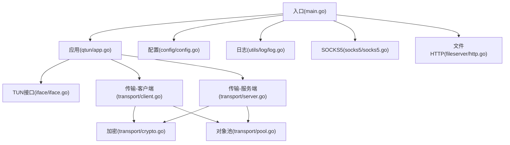
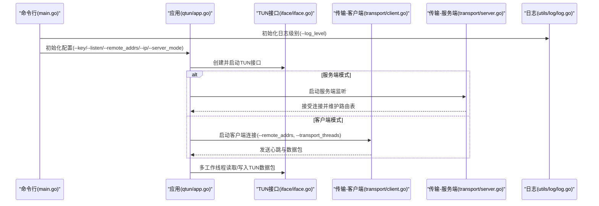
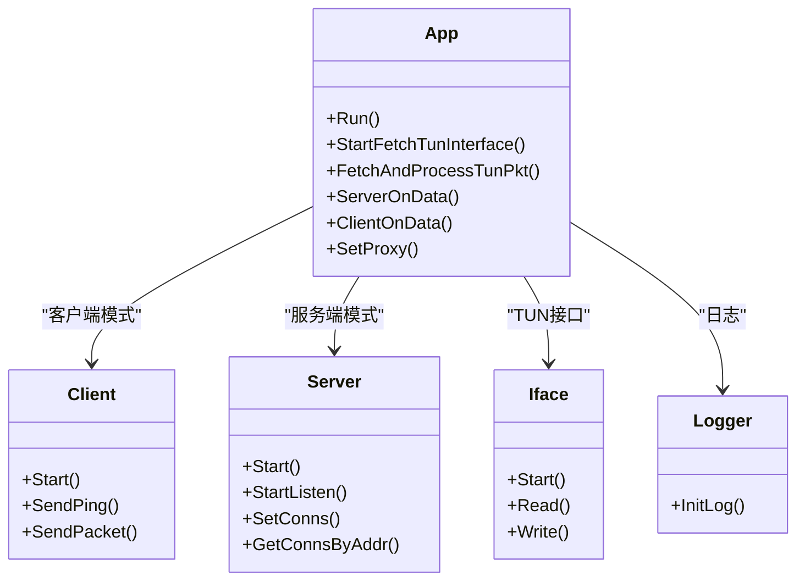

# 故障排除

<cite>
**本文引用的文件**
- [README.md](file://README.md)
- [main.go](file://main.go)
- [config/config.go](file://config/config.go)
- [utils/log/log.go](file://utils/log/log.go)
- [qtun/app.go](file://qtun/app.go)
- [transport/client.go](file://transport/client.go)
- [transport/server.go](file://transport/server.go)
- [transport/crypto.go](file://transport/crypto.go)
- [transport/pool.go](file://transport/pool.go)
- [iface/iface.go](file://iface/iface.go)
- [socks5/socks5.go](file://socks5/socks5.go)
- [fileserver/http.go](file://fileserver/http.go)
- [PERFORMANCE_TEST_GUIDE.md](file://PERFORMANCE_TEST_GUIDE.md)
</cite>

## 目录
1. [简介](#简介)
2. [项目结构](#项目结构)
3. [核心组件](#核心组件)
4. [架构总览](#架构总览)
5. [详细组件分析与排障要点](#详细组件分析与排障要点)
6. [依赖关系分析](#依赖关系分析)
7. [性能问题诊断与优化](#性能问题诊断与优化)
8. [日志分析与调试技巧](#日志分析与调试技巧)
9. [系统兼容性与环境问题排查](#系统兼容性与环境问题排查)
10. [常见问题与解决方案](#常见问题与解决方案)
11. [结论](#结论)
12. [附录：问题反馈与社区支持](#附录问题反馈与社区支持)

## 简介
本指南面向使用 qtun 的用户与运维人员，聚焦于“连接失败、网络不通、性能问题、配置错误”等常见问题的诊断与解决路径；同时提供日志分析技巧、调试工具使用方法、系统兼容性排查以及性能诊断流程与优化建议。文档基于仓库实际代码实现，确保可操作性与可追溯性。

## 项目结构
- 入口与命令行参数解析：main.go
- 全局配置：config/config.go
- 日志初始化：utils/log/log.go
- 应用主循环与TUN接口：qtun/app.go
- 传输层（客户端/服务端）：transport/client.go、transport/server.go
- 加密与对象池：transport/crypto.go、transport/pool.go
- TUN接口与系统路由：iface/iface.go
- SOCKS5服务：socks5/socks5.go
- 文件HTTP服务（PAC等）：fileserver/http.go
- 性能测试与分析指南：PERFORMANCE_TEST_GUIDE.md
- 使用说明与帮助：README.md

图表来源
- [main.go](file://main.go#L70-L103)
- [qtun/app.go](file://qtun/app.go#L37-L49)
- [config/config.go](file://config/config.go#L17-L23)
- [utils/log/log.go](file://utils/log/log.go#L10-L25)
- [transport/client.go](file://transport/client.go#L31-L83)
- [transport/server.go](file://transport/server.go#L37-L52)
- [transport/crypto.go](file://transport/crypto.go#L10-L26)
- [transport/pool.go](file://transport/pool.go#L10-L108)
- [iface/iface.go](file://iface/iface.go#L31-L74)
- [socks5/socks5.go](file://socks5/socks5.go#L99-L118)
- [fileserver/http.go](file://fileserver/http.go#L9-L16)

章节来源
- [README.md](file://README.md#L1-L99)
- [main.go](file://main.go#L22-L103)
- [config/config.go](file://config/config.go#L3-L24)

## 核心组件
- 命令行与全局参数：负责解析 --key、--listen、--remote_addrs、--ip、--log_level、--server_mode、--socks5_port、--file_svr_port、--transport_threads 等选项，并初始化日志与应用。
- 应用主循环：根据模式选择启动服务端监听或客户端连接，创建TUN接口并启动多工作线程处理数据包。
- 传输层：客户端/服务端均使用 QUIC 作为传输协议，内置连接池、心跳保活、对象池复用以提升性能。
- TUN接口：创建并配置 TUN 设备，设置IP、掩码、MTU，并在 macOS 上添加系统路由。
- 日志系统：基于 zerolog，支持 info/debug 级别输出，便于问题定位。
- SOCKS5与文件HTTP服务：服务端模式下启动本地 SOCKS5；客户端模式下启动文件HTTP服务以提供 PAC 等静态资源。

章节来源
- [main.go](file://main.go#L22-L103)
- [qtun/app.go](file://qtun/app.go#L19-L49)
- [transport/server.go](file://transport/server.go#L23-L52)
- [transport/client.go](file://transport/client.go#L20-L39)
- [iface/iface.go](file://iface/iface.go#L16-L74)
- [utils/log/log.go](file://utils/log/log.go#L10-L25)
- [socks5/socks5.go](file://socks5/socks5.go#L53-L97)
- [fileserver/http.go](file://fileserver/http.go#L9-L16)

## 架构总览

图表来源
- [main.go](file://main.go#L75-L102)
- [qtun/app.go](file://qtun/app.go#L37-L97)
- [transport/server.go](file://transport/server.go#L48-L149)
- [transport/client.go](file://transport/client.go#L41-L83)
- [iface/iface.go](file://iface/iface.go#L31-L74)
- [utils/log/log.go](file://utils/log/log.go#L10-L25)

## 详细组件分析与排障要点

### 1) 连接失败与网络不通
- 服务端监听与QUIC参数
  - 服务端监听采用 QUIC，具备较大的接收窗口与并发流限制，若监听失败需关注端口占用、权限与防火墙策略。
  - 可通过日志中的监听/接受流程定位异常。
- 客户端连接与重试
  - 客户端启动时会尝试建立多条连接，若多次重试后仍失败，需检查远端地址可达性、密钥一致性与服务端状态。
- 路由与TUN
  - TUN接口创建后会设置IP、掩码、MTU，并在 macOS 上添加系统路由；若无法访问远端网络，优先检查路由是否生效。
- 常见症状与定位
  - 无连接：确认 --server_mode、--listen、--remote_addrs 是否正确；检查日志中“连接失败/重试”提示。
  - 丢包/延迟高：检查 QUIC 窗口参数与网络链路质量；参考性能测试指南进行端到端验证。
  - 无法出网：检查 TUN 路由是否添加成功，macOS 下 route add 命令执行结果。

章节来源
- [transport/server.go](file://transport/server.go#L91-L149)
- [transport/client.go](file://transport/client.go#L41-L83)
- [iface/iface.go](file://iface/iface.go#L31-L92)
- [PERFORMANCE_TEST_GUIDE.md](file://PERFORMANCE_TEST_GUIDE.md#L286-L308)

### 2) 配置错误
- 关键配置项
  - --key：加解密密钥，必须与服务端一致。
  - --listen/--remote_addrs：服务端监听地址与客户端远端地址。
  - --ip：TUN虚拟IP段，需与客户端一致且不冲突。
  - --log_level：日志级别（info/debug），建议排障阶段临时设为 debug。
  - --server_mode：运行模式。
  - --transport_threads：客户端并发连接数。
  - --socks5_port/--file_svr_port：服务端SOCKS5与文件HTTP服务端口。
- 常见错误
  - 密钥不一致导致握手失败。
  - IP段冲突或与宿主机网络冲突。
  - 端口被占用或防火墙阻断。
  - 权限不足导致无法创建TUN或绑定端口。

章节来源
- [README.md](file://README.md#L57-L88)
- [main.go](file://main.go#L53-L66)
- [config/config.go](file://config/config.go#L3-L13)

### 3) 性能问题
- 工作线程与并发
  - TUN数据包处理线程数为 CPU 核心数的 2 倍（最小4，最大32），若线程过少会导致吞吐受限。
- 对象池与内存
  - 传输层广泛使用 sync.Pool 复用消息体与缓冲区，避免频繁分配；如内存增长异常，可通过 pprof 分析堆与分配热点。
- QUIC参数
  - 服务端配置了较大的接收窗口与并发流上限，有助于提升吞吐；若网络非瓶颈，可进一步评估链路带宽与RTT。
- 延迟与抖动
  - 可使用 ping 与 iperf3 进行端到端测量；结合 statsviz 与 pprof 观察 goroutine 与CPU占用趋势。

章节来源
- [qtun/app.go](file://qtun/app.go#L79-L97)
- [transport/pool.go](file://transport/pool.go#L10-L108)
- [transport/server.go](file://transport/server.go#L96-L103)
- [PERFORMANCE_TEST_GUIDE.md](file://PERFORMANCE_TEST_GUIDE.md#L85-L109)

### 4) 加密与对象池
- 加密算法
  - 基于 AES-GCM，密钥派生采用 MD5/SHA256；若报文异常，优先检查密钥一致性与长度。
- 对象池
  - Envelope、Ping/Packet 消息、读缓冲等均使用池化，减少GC压力；如发现内存峰值异常，可对比 pprof 的分配次数与对象存活。

章节来源
- [transport/crypto.go](file://transport/crypto.go#L10-L26)
- [transport/pool.go](file://transport/pool.go#L24-L108)

### 5) TUN接口与系统路由
- 接口创建与配置
  - 创建 TUN 设备后设置 IP、掩码、MTU，并在 macOS 上添加系统路由；失败时会记录 ifconfig/route 命令输出。
- 出网问题
  - 若客户端无法访问服务端VIP，请确认 TUN 路由已添加，且与服务端IP在同一子网。

章节来源
- [iface/iface.go](file://iface/iface.go#L31-L92)

### 6) SOCKS5与文件HTTP服务
- SOCKS5
  - 服务端模式下启动本地 SOCKS5；若无法代理，请检查端口占用与认证配置。
- 文件HTTP服务
  - 客户端模式下启动静态文件服务，提供 PAC 等资源；若浏览器无法加载PAC，请检查端口与目录权限。

章节来源
- [socks5/socks5.go](file://socks5/socks5.go#L99-L118)
- [fileserver/http.go](file://fileserver/http.go#L9-L16)
- [main.go](file://main.go#L95-L99)

## 依赖关系分析

图表来源
- [qtun/app.go](file://qtun/app.go#L19-L49)
- [transport/client.go](file://transport/client.go#L20-L39)
- [transport/server.go](file://transport/server.go#L23-L52)
- [iface/iface.go](file://iface/iface.go#L16-L29)
- [utils/log/log.go](file://utils/log/log.go#L10-L25)

章节来源
- [qtun/app.go](file://qtun/app.go#L19-L49)
- [transport/client.go](file://transport/client.go#L20-L39)
- [transport/server.go](file://transport/server.go#L23-L52)
- [iface/iface.go](file://iface/iface.go#L16-L29)
- [utils/log/log.go](file://utils/log/log.go#L10-L25)

## 性能问题诊断与优化
- 诊断步骤
  - 确认工作线程数量是否合理（CPU×2，范围4~32）。
  - 使用 statsviz 与 pprof 观察CPU、内存、goroutine趋势。
  - 使用 iperf3/ping 进行端到端吞吐与延迟测试。
  - 检查 QUIC 窗口参数与网络链路质量。
- 优化建议
  - 合理设置 --transport_threads 提升并发。
  - 利用对象池减少分配与GC压力。
  - 调整 MTU 与网络路径，避免分片。
  - 在高负载场景下评估服务端QUIC参数与客户端连接数平衡。

章节来源
- [qtun/app.go](file://qtun/app.go#L79-L97)
- [PERFORMANCE_TEST_GUIDE.md](file://PERFORMANCE_TEST_GUIDE.md#L17-L109)
- [transport/server.go](file://transport/server.go#L96-L103)

## 日志分析与调试技巧
- 日志级别
  - --log_level 支持 info/debug，默认 info；排障时建议临时设为 debug 获取更详细信息。
- 关键信息定位
  - 连接/监听：查找“server listen/accept”、“client connect/retry”相关日志。
  - TUN：查找“tun interface”、“subnet”、“ifconfig/fail”等日志。
  - 传输：查找“send ping”、“received protobuf packet”、“proto unmarshal err”等。
- 错误模式识别
  - 握手失败/密钥不一致：检查 --key 与两端一致性。
  - 读写错误：关注“FetchAndProcessTunPkt read ip pkt error”。
  - 路由缺失/连接断开：关注“no route/no connection, packet dropped”。

章节来源
- [utils/log/log.go](file://utils/log/log.go#L10-L25)
- [qtun/app.go](file://qtun/app.go#L105-L167)
- [transport/client.go](file://transport/client.go#L142-L157)
- [transport/server.go](file://transport/server.go#L118-L148)
- [iface/iface.go](file://iface/iface.go#L45-L67)

## 系统兼容性与环境问题排查
- 操作系统支持
  - README 明确支持 macOS 与 Linux，不支持 Windows；在非支持平台可能无法正常创建TUN或启动SOCKS5。
- 权限问题
  - 需要 root/sudo 权限创建/配置 TUN 接口；若 ifconfig/route 执行失败，检查权限。
- 防火墙与端口
  - 确认 --listen 与 --remote_addrs 指向的端口未被防火墙阻断；服务端模式下需开放监听端口。
- PAC与系统代理
  - 客户端模式下会尝试设置系统代理（仅 macOS），Linux/Windows 需手动配置；若浏览器无法加载 PAC，检查文件HTTP服务端口与目录。

章节来源
- [README.md](file://README.md#L94-L99)
- [main.go](file://main.go#L95-L99)
- [qtun/app.go](file://qtun/app.go#L250-L270)
- [fileserver/http.go](file://fileserver/http.go#L9-L16)
- [iface/iface.go](file://iface/iface.go#L61-L67)

## 常见问题与解决方案
- 无法建立连接
  - 检查 --key 是否一致；确认 --listen 与 --remote_addrs 正确；查看客户端“fail to connect to the server after 10 times retry”日志。
- 无法访问远端网络
  - 检查 TUN 路由是否添加（macOS route add）；确认 --ip 与服务端一致且不冲突。
- 性能不达标
  - 提升 --transport_threads；观察 statsviz 与 pprof；使用 iperf3/ping 验证链路质量。
- 日志过多/过少
  - 调整 --log_level；debug 会输出更多细节，便于定位问题。
- 系统代理未生效
  - 仅 macOS 支持自动设置代理；Linux/Windows 需手动配置；检查文件HTTP服务端口与PAC路径。

章节来源
- [transport/client.go](file://transport/client.go#L59-L68)
- [iface/iface.go](file://iface/iface.go#L69-L92)
- [PERFORMANCE_TEST_GUIDE.md](file://PERFORMANCE_TEST_GUIDE.md#L286-L308)
- [qtun/app.go](file://qtun/app.go#L250-L270)

## 结论
本指南从连接、网络、性能、配置四个维度提供了系统化的排障路径，并结合代码实现给出可操作的定位手段与优化建议。建议在排障过程中配合 debug 日志、statsviz/PPROF 与端到端测试工具，快速收敛问题根因。

## 附录：问题反馈与社区支持
- 问题反馈渠道
  - 本项目未提供官方问题跟踪系统；可在仓库内提交 Issue 描述问题。
- Bug 报告模板（建议格式）
  - 环境信息：操作系统、Go 版本、qtun 版本、内核版本。
  - 复现步骤：最小化命令行参数、操作步骤。
  - 期望行为与实际行为。
  - 日志片段（含 --log_level debug 输出）。
  - 性能测试结果（iperf3/ping 输出）。
  - 系统资源快照（statsviz/pprof）。
- 参考文档
  - README.md：使用说明与帮助。
  - PERFORMANCE_TEST_GUIDE.md：性能测试与分析指南。

章节来源
- [README.md](file://README.md#L28-L99)
- [PERFORMANCE_TEST_GUIDE.md](file://PERFORMANCE_TEST_GUIDE.md#L1-L323)