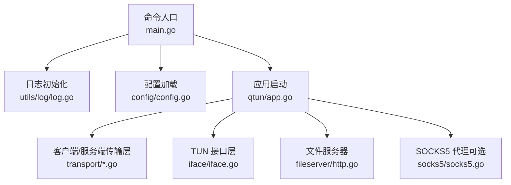
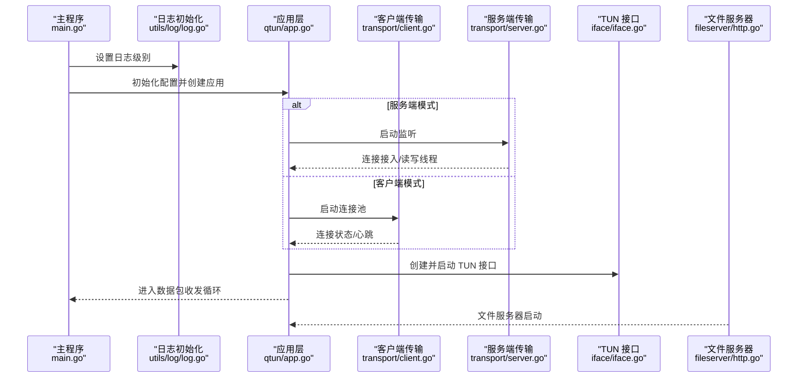
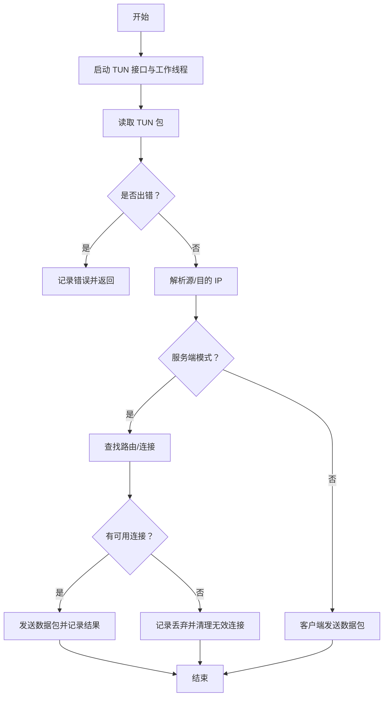
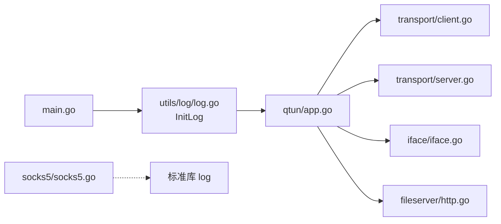

# 日志分析

<cite>
**本文引用的文件**
- [main.go](file://main.go)
- [utils/log/log.go](file://utils/log/log.go)
- [config/config.go](file://config/config.go)
- [qtun/app.go](file://qtun/app.go)
- [transport/client.go](file://transport/client.go)
- [transport/client_conn.go](file://transport/client_conn.go)
- [transport/server.go](file://transport/server.go)
- [transport/server_conn.go](file://transport/server_conn.go)
- [iface/iface.go](file://iface/iface.go)
- [fileserver/http.go](file://fileserver/http.go)
- [socks5/socks5.go](file://socks5/socks5.go)
</cite>

## 目录
1. [简介](#简介)
2. [项目结构与日志位置](#项目结构与日志位置)
3. [核心组件与日志级别](#核心组件与日志级别)
4. [架构总览与日志流](#架构总览与日志流)
5. [详细组件日志分析](#详细组件日志分析)
6. [依赖关系与日志耦合](#依赖关系与日志耦合)
7. [性能与日志开销](#性能与日志开销)
8. [故障排查与常见错误解读](#故障排查与常见错误解读)
9. [日志过滤与搜索技巧](#日志过滤与搜索技巧)
10. [日志轮转与输出管理](#日志轮转与输出管理)
11. [结论](#结论)
12. [附录：日志字段速查](#附录日志字段速查)

## 简介
本指南面向运维与开发人员，系统讲解 qtun 的日志体系与分析方法。内容涵盖：
- 如何正确设置日志级别（info、debug）
- 不同日志级别的含义与适用场景
- 关键事件日志格式与语义（连接建立、数据传输、错误处理等）
- 日志输出位置与命名规则（当前实现为控制台）
- 常见错误日志的解读与定位
- 日志过滤与搜索技巧
- 日志轮转与外部集成建议
- 自动化分析思路与脚本示例路径

## 项目结构与日志位置
- 日志初始化位于 utils/log/log.go，采用控制台输出（ConsoleWriter）并设置全局级别。
- 各模块通过统一的 zerolog 全局 logger 输出日志，便于集中管理与过滤。
- 当前未发现内置文件轮转逻辑；日志默认输出到标准错误。

图表来源
- [main.go](file://main.go#L70-L103)
- [utils/log/log.go](file://utils/log/log.go#L10-L25)
- [config/config.go](file://config/config.go#L17-L23)
- [qtun/app.go](file://qtun/app.go#L37-L49)
- [transport/client.go](file://transport/client.go#L41-L83)
- [transport/server.go](file://transport/server.go#L48-L76)
- [iface/iface.go](file://iface/iface.go#L31-L74)
- [fileserver/http.go](file://fileserver/http.go#L9-L16)
- [socks5/socks5.go](file://socks5/socks5.go#L109-L118)

章节来源
- [main.go](file://main.go#L70-L103)
- [utils/log/log.go](file://utils/log/log.go#L10-L25)

## 核心组件与日志级别
- 日志级别由命令行参数传入，支持 "info" 和 "debug" 两种模式。默认 info。
- debug 模式会输出更多信息，便于问题定位；info 模式仅输出关键运行信息。
- 日志初始化后，所有模块共享同一全局 logger，避免多实例导致的混乱。

章节来源
- [main.go](file://main.go#L57-L86)
- [utils/log/log.go](file://utils/log/log.go#L10-L25)

## 架构总览与日志流
下图展示从进程启动到各子系统运行期间的关键日志节点，帮助你快速定位问题阶段：

图表来源
- [main.go](file://main.go#L70-L103)
- [utils/log/log.go](file://utils/log/log.go#L10-L25)
- [qtun/app.go](file://qtun/app.go#L37-L49)
- [transport/client.go](file://transport/client.go#L41-L83)
- [transport/server.go](file://transport/server.go#L48-L76)
- [iface/iface.go](file://iface/iface.go#L31-L74)
- [fileserver/http.go](file://fileserver/http.go#L9-L16)

## 详细组件日志分析

### 应用层（qtun/app.go）
- 启动阶段：打印工作线程数量、CPU 核数，用于评估并发能力。
- 数据路径：记录每个工作线程收到/发送的数据包源/目的 IP、长度，便于流量观察与丢包定位。
- 路由清理：定期清理无效连接，记录移除的连接与目的地址。
- 错误处理：读取 TUN 包失败、无路由/无连接时丢弃包，均输出相应日志。
- 系统代理设置：跨平台设置系统代理，失败时输出错误与命令输出。

图表来源
- [qtun/app.go](file://qtun/app.go#L72-L167)

章节来源
- [qtun/app.go](file://qtun/app.go#L51-L97)
- [qtun/app.go](file://qtun/app.go#L99-L167)

### 客户端传输层（transport/client.go、transport/client_conn.go）
- 连接建立：尝试多次连接远端，失败时输出警告；成功后记录连接数量。
- 心跳与重连：周期性发送 ping 并输出警告提示重启；连接断开或异常时记录错误。
- 加解密：当密钥为空时记录信息提示加密关闭；连接异常时记录错误。
- 写入/读取：写入队列满或通道关闭时记录告警；读取失败时记录错误并退出。

章节来源
- [transport/client.go](file://transport/client.go#L41-L83)
- [transport/client.go](file://transport/client.go#L142-L157)
- [transport/client_conn.go](file://transport/client_conn.go#L69-L151)
- [transport/client_conn.go](file://transport/client_conn.go#L153-L188)
- [transport/client_conn.go](file://transport/client_conn.go#L204-L239)
- [transport/client_conn.go](file://transport/client_conn.go#L309-L357)

### 服务端传输层（transport/server.go、transport/server_conn.go）
- 监听与接受：监听失败/异常时记录错误；接受新连接时记录来源网络类型。
- 连接管理：删除死连接、设置/移除连接映射时记录状态；读写线程退出时记录告警。
- 解密校验：当密钥不匹配时记录错误并中断；读取失败时记录错误并退出。
- 写入流程：写通道关闭或错误时记录告警；写入完成记录信息。

章节来源
- [transport/server.go](file://transport/server.go#L48-L76)
- [transport/server.go](file://transport/server.go#L91-L149)
- [transport/server.go](file://transport/server.go#L183-L210)
- [transport/server_conn.go](file://transport/server_conn.go#L58-L115)
- [transport/server_conn.go](file://transport/server_conn.go#L117-L165)
- [transport/server_conn.go](file://transport/server_conn.go#L251-L290)

### TUN 接口层（iface/iface.go）
- 接口创建：记录 TUN 名称，便于识别具体接口。
- 配置命令：执行 ifconfig/route 等命令，失败时记录错误与命令输出。
- 子网路由：调试级别记录子网信息，辅助网络策略验证。

章节来源
- [iface/iface.go](file://iface/iface.go#L31-L74)
- [iface/iface.go](file://iface/iface.go#L76-L92)

### 文件服务器（fileserver/http.go）
- 启动日志：周期性输出启动信息，便于确认服务状态。

章节来源
- [fileserver/http.go](file://fileserver/http.go#L9-L16)

### SOCKS5 代理（socks5/socks5.go）
- 该模块使用标准库 log，未使用 zerolog；因此其日志不会被统一级别控制。
- 主要记录版本不兼容、认证失败、请求解析错误等。

章节来源
- [socks5/socks5.go](file://socks5/socks5.go#L121-L169)

## 依赖关系与日志耦合
- 日志初始化在主程序入口处调用，随后各模块直接使用全局 logger，耦合度低、一致性好。
- SOCKS5 使用标准库 log，独立于 zerolog，注意区分日志来源。

图表来源
- [main.go](file://main.go#L70-L103)
- [utils/log/log.go](file://utils/log/log.go#L10-L25)
- [socks5/socks5.go](file://socks5/socks5.go#L82-L84)

章节来源
- [main.go](file://main.go#L70-L103)
- [socks5/socks5.go](file://socks5/socks5.go#L82-L84)

## 性能与日志开销
- debug 模式会输出大量包级细节（源/目的 IP、长度、工作线程号），在高吞吐场景下可能带来可观的 I/O 开销。
- 建议在生产环境使用 info 模式，仅在问题定位时临时切换至 debug。
- 对高频路径（如数据包读写）的日志应谨慎增加字段，避免影响性能。

## 故障排查与常见错误解读

### 连接建立类
- 客户端无法连接远端：出现“连接失败”“重试多次后仍失败”等日志，检查网络连通性、目标地址与端口、防火墙策略。
- 服务端监听失败：监听报错或反复重启，检查监听地址、权限与端口占用。
- 连接断开/异常：读写线程退出、连接关闭等日志，关注最近一次错误原因。

章节来源
- [transport/client.go](file://transport/client.go#L41-L83)
- [transport/client_conn.go](file://transport/client_conn.go#L130-L151)
- [transport/server.go](file://transport/server.go#L91-L149)
- [transport/server_conn.go](file://transport/server_conn.go#L58-L115)

### 认证/加解密类
- 密钥不匹配：服务端读取到错误密文时记录错误并中断，需核对两端密钥一致。
- 加密关闭：当密钥为空时记录信息提示，确认是否预期行为。

章节来源
- [transport/server_conn.go](file://transport/server_conn.go#L98-L102)
- [transport/client_conn.go](file://transport/client_conn.go#L119-L128)

### 网络异常类
- TUN 接口配置失败：ifconfig/route 命令失败，检查权限、内核模块与系统路由表。
- 文件服务器启动失败：端口冲突或目录不可访问，检查端口与目录权限。

章节来源
- [iface/iface.go](file://iface/iface.go#L61-L67)
- [iface/iface.go](file://iface/iface.go#L86-L91)
- [fileserver/http.go](file://fileserver/http.go#L11-L12)

### 数据传输类
- 无路由/无连接：记录丢弃包并清理无效连接，检查路由表与连接状态。
- 协议解包失败：protobuf 反序列化错误，检查协议版本与数据完整性。

章节来源
- [qtun/app.go](file://qtun/app.go#L114-L161)
- [qtun/app.go](file://qtun/app.go#L169-L207)

## 日志过滤与搜索技巧
- 按级别过滤：优先使用 info；定位问题时临时切换 debug。
- 按模块过滤：
  - 客户端：搜索“client”“connect”“ping”
  - 服务端：搜索“server”“accept”“listener”
  - TUN：搜索“tun interface”“ifconfig”“route”
  - 文件服务器：搜索“start file http server”
- 按关键词过滤：错误（error）、告警（warn）、丢弃（drop）、关闭（closed）、panic
- 时间窗口：结合系统时间戳筛选特定时间段内的异常波动
- 字段提取：优先关注“src/dst”“len/workder/conn_num/server_addr/from”等字段

## 日志轮转与输出管理
- 当前实现：日志输出到控制台（stderr），未内置文件轮转逻辑。
- 建议方案（通用实践，非代码实现）：
  - 使用系统日志守护（如 systemd journald、rsyslog）接管 stderr 输出并进行轮转。
  - 使用第三方工具（如 logrotate、glances、fluent-bit）对日志文件进行轮转与归档。
  - 在容器环境中，将日志输出到 stdout/stderr 并交由容器编排系统管理。
- 注意事项：
  - 若启用 debug，日志量将显著增大，需配合轮转策略。
  - 对于 SOCKS5（标准库 log）产生的日志，需单独配置其输出与轮转。

## 结论
- qtun 的日志体系简洁统一，基于 zerolog 的全局 logger 实现，便于集中管理。
- 正确选择日志级别是高效运维的关键：生产用 info，问题定位用 debug。
- 通过模块化的日志节点与关键字段，可以快速定位连接、传输、认证、网络等层面的问题。
- 当前未内置文件轮转，建议结合系统或第三方工具完成日志归档与保留策略。

## 附录：日志字段速查
- 通用字段
  - server_addr：服务端地址
  - workder：工作线程编号
  - src/dst：源/目的 IP
  - len：数据包长度
  - conn_num：连接数量
  - from：来源网络类型
  - tun_name：TUN 接口名称
  - dir/listen_port：文件服务器目录与端口
  - cmd_output：系统命令输出
  - route：路由表快照
- 关键事件
  - 连接建立：client/server 成功连接、监听启动
  - 连接断开：读写线程退出、连接关闭
  - 传输丢弃：无路由/无连接导致的丢包
  - 错误：反序列化失败、命令执行失败、密钥不匹配
  - 调试：包读取/发送详情、路由表打印