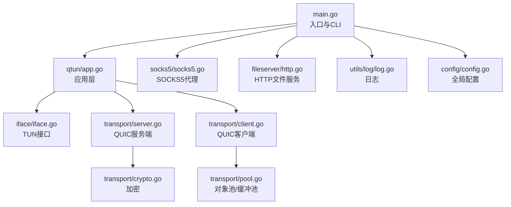
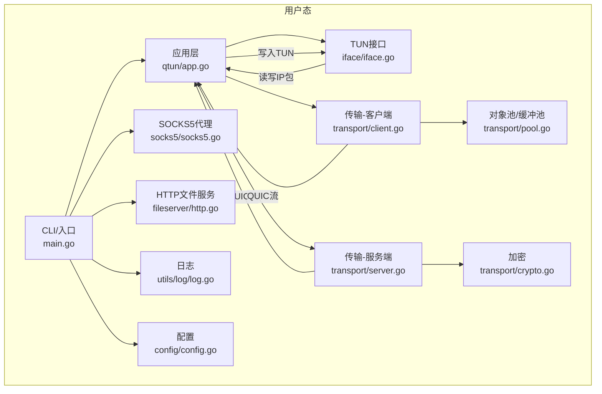
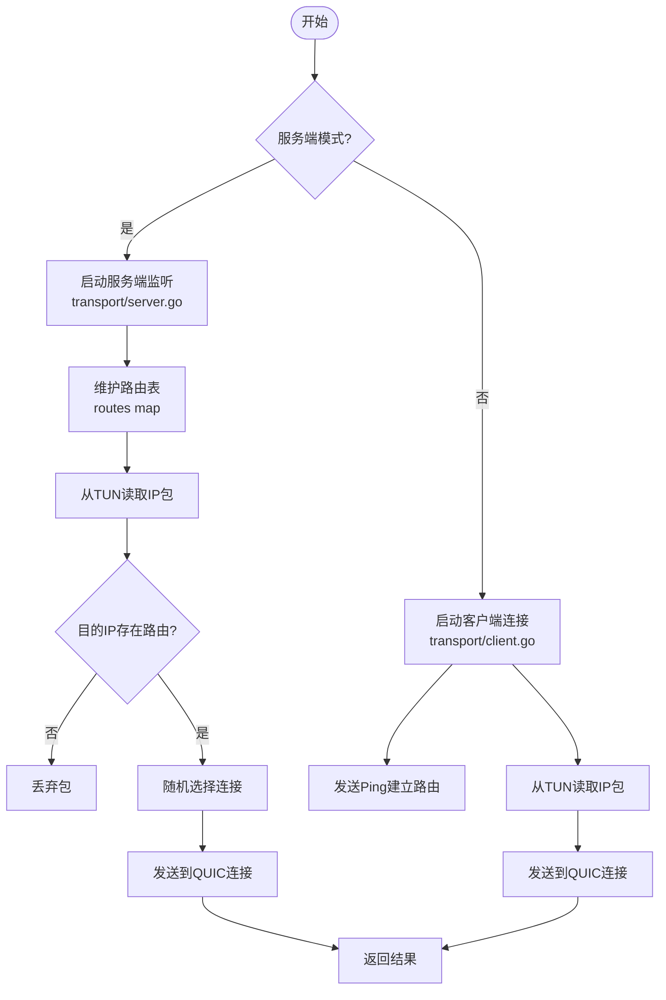
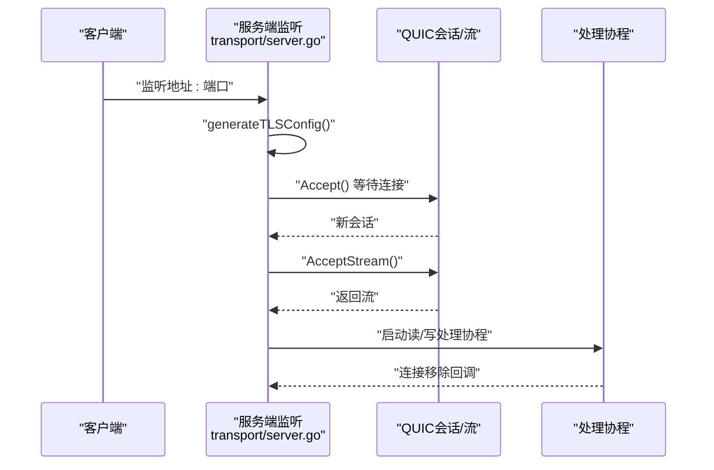
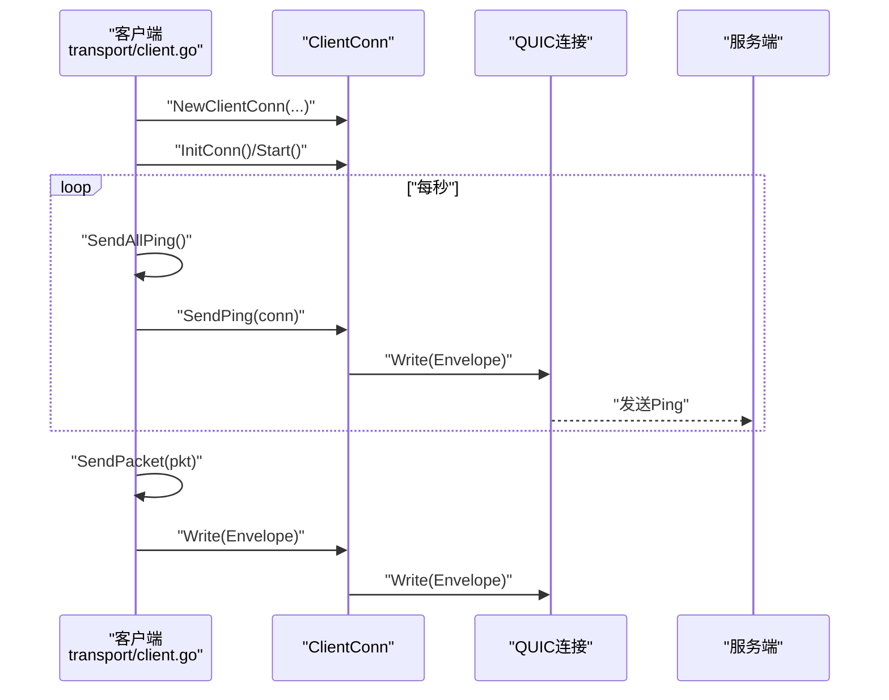
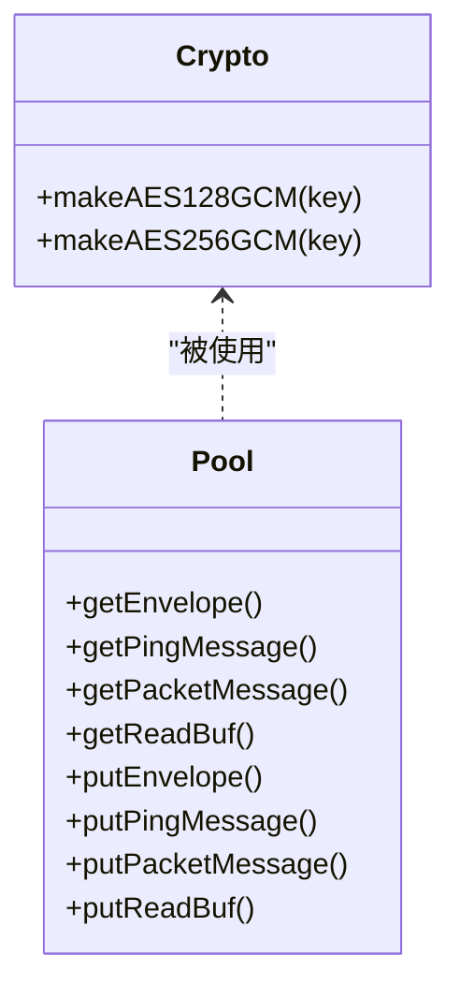
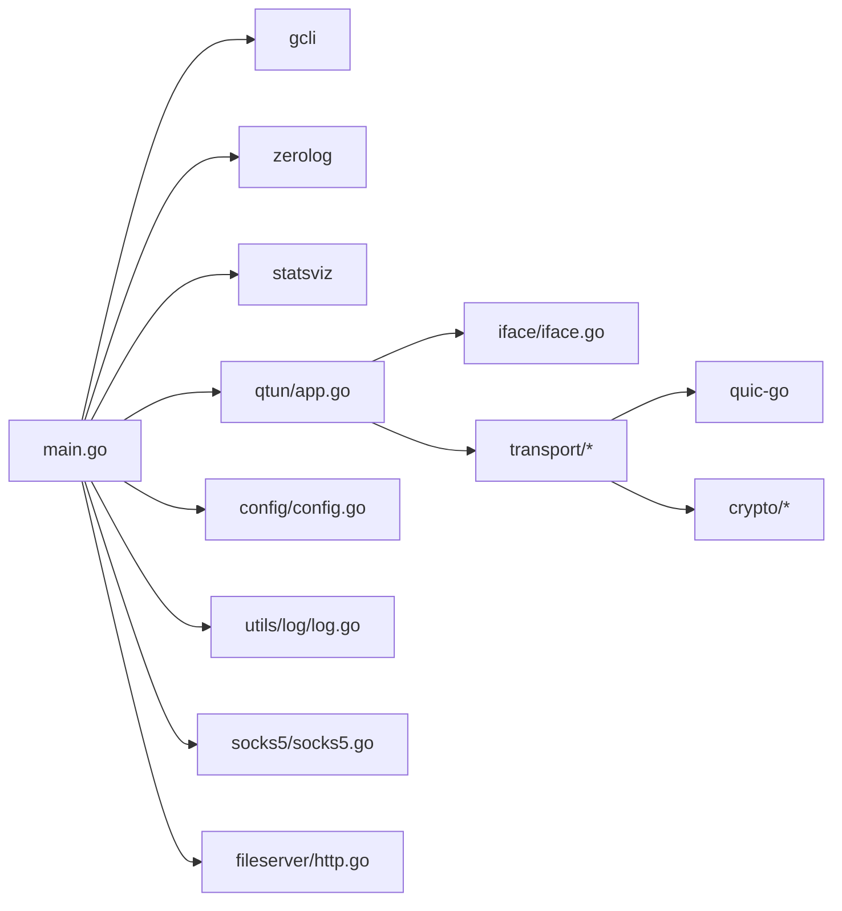

# 调试工具

<cite>
**本文引用的文件**
- [main.go](file://main.go)
- [README.md](file://README.md)
- [config/config.go](file://config/config.go)
- [qtun/app.go](file://qtun/app.go)
- [transport/server.go](file://transport/server.go)
- [transport/client.go](file://transport/client.go)
- [transport/pool.go](file://transport/pool.go)
- [transport/crypto.go](file://transport/crypto.go)
- [socks5/socks5.go](file://socks5/socks5.go)
- [fileserver/http.go](file://fileserver/http.go)
- [utils/log/log.go](file://utils/log/log.go)
- [iface/iface.go](file://iface/iface.go)
- [PERFORMANCE_TEST_GUIDE.md](file://PERFORMANCE_TEST_GUIDE.md)
- [go.mod](file://go.mod)
</cite>

## 目录
1. [简介](#简介)
2. [项目结构](#项目结构)
3. [核心组件](#核心组件)
4. [架构总览](#架构总览)
5. [详细组件分析](#详细组件分析)
6. [依赖关系分析](#依赖关系分析)
7. [性能与资源调试要点](#性能与资源调试要点)
8. [网络抓包与QUIC握手分析](#网络抓包与quic握手分析)
9. [进程监控与系统资源分析](#进程监控与系统资源分析)
10. [Go语言特有调试工具](#go语言特有调试工具)
11. [断点调试与开发调试技巧](#断点调试与开发调试技巧)
12. [自动化脚本与监控仪表板](#自动化脚本与监控仪表板)
13. [故障排查指南](#故障排查指南)
14. [结论](#结论)

## 简介
本指南围绕调试工具在qtun项目中的使用展开，重点覆盖：
- 网络抓包工具（tcpdump、Wireshark）在QUIC协议分析中的应用，包括QUIC握手过程的捕获与分析方法
- 进程监控工具的使用，包括CPU、内存、网络带宽的实时监控
- 系统资源分析方法，包括文件描述符、网络连接数、内存使用情况的检查
- Go语言特有的调试工具，如pprof性能分析、statsviz可视化监控等
- 断点调试、变量检查、调用栈分析等开发调试技巧
- 自动化调试脚本与监控仪表板的配置方法

## 项目结构
qtun是一个基于QUIC的TUN隧道实现，主要模块包括：
- 入口与CLI：命令行入口、参数解析、子命令注册
- 应用层：TUN接口管理、路由维护、数据包收发调度
- 传输层：客户端/服务端连接、QUIC监听、连接池与对象池
- 加密层：基于密钥的AEAD加密
- 代理与文件服务：SOCKS5代理、HTTP文件服务
- 日志与配置：全局配置、日志级别控制

图表来源
- [main.go](file://main.go#L1-L136)
- [qtun/app.go](file://qtun/app.go#L1-L271)
- [transport/server.go](file://transport/server.go#L1-L219)
- [transport/client.go](file://transport/client.go#L1-L223)
- [transport/pool.go](file://transport/pool.go#L1-L108)
- [transport/crypto.go](file://transport/crypto.go#L1-L27)
- [socks5/socks5.go](file://socks5/socks5.go#L1-L170)
- [fileserver/http.go](file://fileserver/http.go#L1-L17)
- [utils/log/log.go](file://utils/log/log.go#L1-L26)
- [config/config.go](file://config/config.go#L1-L24)

章节来源
- [main.go](file://main.go#L1-L136)
- [README.md](file://README.md#L1-L99)

## 核心组件
- CLI与入口
  - 定义命令行参数、子命令、默认值与帮助信息
  - 初始化日志、注册statsviz可视化监控端口
- 应用层App
  - 管理TUN接口、工作线程数量、路由表、数据包读取与转发
  - 服务端模式下启动QUIC服务端；客户端模式下启动QUIC客户端
- 传输层
  - 服务端：QUIC监听、连接管理、并发流与窗口配置
  - 客户端：多连接、心跳Ping、数据包封装与发送
- 加密与池化
  - AEAD加密（AES-GCM），对象池与读缓冲池减少GC压力
- 代理与文件服务
  - SOCKS5代理服务；HTTP文件服务（用于pac与静态资源）

章节来源
- [main.go](file://main.go#L22-L136)
- [qtun/app.go](file://qtun/app.go#L19-L271)
- [transport/server.go](file://transport/server.go#L23-L219)
- [transport/client.go](file://transport/client.go#L20-L223)
- [transport/pool.go](file://transport/pool.go#L10-L108)
- [transport/crypto.go](file://transport/crypto.go#L10-L26)
- [socks5/socks5.go](file://socks5/socks5.go#L55-L170)
- [fileserver/http.go](file://fileserver/http.go#L9-L17)
- [utils/log/log.go](file://utils/log/log.go#L10-L26)
- [config/config.go](file://config/config.go#L3-L24)

## 架构总览

图表来源
- [main.go](file://main.go#L105-L136)
- [qtun/app.go](file://qtun/app.go#L37-L97)
- [transport/server.go](file://transport/server.go#L48-L149)
- [transport/client.go](file://transport/client.go#L41-L83)
- [transport/pool.go](file://transport/pool.go#L74-L108)
- [transport/crypto.go](file://transport/crypto.go#L10-L26)
- [socks5/socks5.go](file://socks5/socks5.go#L99-L170)
- [fileserver/http.go](file://fileserver/http.go#L9-L17)
- [utils/log/log.go](file://utils/log/log.go#L10-L26)
- [config/config.go](file://config/config.go#L17-L24)

## 详细组件分析

### 应用层App（TUN与路由）
- 启动TUN接口，按CPU核心数×2动态创建工作线程（最小4，最大32）
- 服务端模式：维护路由表，按目的IP选择连接并转发；周期清理无效连接
- 客户端模式：向服务端发送Ping建立路由，接收数据包回写TUN

图表来源
- [qtun/app.go](file://qtun/app.go#L72-L167)
- [transport/server.go](file://transport/server.go#L175-L210)
- [transport/client.go](file://transport/client.go#L167-L206)

章节来源
- [qtun/app.go](file://qtun/app.go#L72-L167)

### 传输层（服务端）
- QUIC监听与接受连接，配置并发流、接收窗口、连接窗口、保活周期、datagram能力
- 使用sync.Map提升并发读写性能，提供按地址/指针双向映射的连接管理

图表来源
- [transport/server.go](file://transport/server.go#L91-L149)
- [transport/server.go](file://transport/server.go#L151-L173)

章节来源
- [transport/server.go](file://transport/server.go#L91-L173)

### 传输层（客户端）
- 多连接初始化与重试，心跳Ping周期性发送，数据包封装为Envelope并通过QUIC发送
- 使用对象池复用消息体，减少内存分配与GC压力

图表来源
- [transport/client.go](file://transport/client.go#L41-L83)
- [transport/client.go](file://transport/client.go#L167-L206)
- [transport/pool.go](file://transport/pool.go#L74-L108)

章节来源
- [transport/client.go](file://transport/client.go#L41-L83)
- [transport/client.go](file://transport/client.go#L167-L206)
- [transport/pool.go](file://transport/pool.go#L74-L108)

### 加密与池化
- 基于密钥派生的AES-GCM加密，服务端/客户端共享
- 对象池：Envelope、Ping/Packet消息、读缓冲、nonce等，显著降低GC

图表来源
- [transport/crypto.go](file://transport/crypto.go#L10-L26)
- [transport/pool.go](file://transport/pool.go#L11-L108)

章节来源
- [transport/crypto.go](file://transport/crypto.go#L10-L26)
- [transport/pool.go](file://transport/pool.go#L11-L108)

### SOCKS5代理与HTTP文件服务
- SOCKS5服务：版本协商、认证、请求处理
- HTTP文件服务：静态文件与PAC文件提供

章节来源
- [socks5/socks5.go](file://socks5/socks5.go#L99-L170)
- [fileserver/http.go](file://fileserver/http.go#L9-L17)

## 依赖关系分析
- 入口依赖CLI框架、日志库、可视化监控库
- 应用层依赖配置、TUN接口、传输层
- 传输层依赖QUIC库、加密库、对象池
- 工具与测试文档提供性能分析与自动化脚本

图表来源
- [main.go](file://main.go#L3-L20)
- [go.mod](file://go.mod#L5-L14)
- [qtun/app.go](file://qtun/app.go#L3-L17)

章节来源
- [go.mod](file://go.mod#L1-L29)
- [main.go](file://main.go#L3-L20)

## 性能与资源调试要点
- 动态工作线程：按CPU核数×2（4~32）调整，日志中可观察“Starting TUN packet workers”
- QUIC配置：并发流、接收窗口、连接窗口、保活周期、datagram能力
- 对象池：Envelope、Ping/Packet、读缓冲、nonce池化，降低GC
- 日志级别：info/debug切换以平衡可观测性与性能

章节来源
- [qtun/app.go](file://qtun/app.go#L79-L97)
- [transport/server.go](file://transport/server.go#L97-L103)
- [transport/pool.go](file://transport/pool.go#L11-L108)
- [utils/log/log.go](file://utils/log/log.go#L14-L21)

## 网络抓包与QUIC握手分析
- 抓包工具
  - tcpdump：过滤UDP端口，观察QUIC初始包、握手参数（如窗口大小）
  - Wireshark：加载QUIC解密密钥或使用已知密钥派生参数进行解密
- QUIC握手要点
  - 观察初始包（Initial）中的版本、源/目的DCID、ALPN、最大窗口
  - 关注握手完成（Handshake Done）与0-RTT/1-RTT切换
  - 检查保活（KeepAlive）、datagram（EnableDatagrams）等扩展
- 项目相关
  - 服务端监听地址与端口由配置决定
  - 客户端通过远程地址发起连接

章节来源
- [PERFORMANCE_TEST_GUIDE.md](file://PERFORMANCE_TEST_GUIDE.md#L224-L232)
- [transport/server.go](file://transport/server.go#L97-L103)
- [config/config.go](file://config/config.go#L5-L6)
- [transport/client.go](file://transport/client.go#L31-L38)

## 进程监控与系统资源分析
- 实时监控
  - top/htop：查看CPU、内存、进程状态
  - statsviz：浏览器访问本地可视化监控端口
- 系统资源
  - 文件描述符：检查fd数量与上限
  - 网络连接数：查看ESTABLISHED、TIME_WAIT等状态
  - 内存使用：RSS、VSZ、堆内存分配趋势

章节来源
- [PERFORMANCE_TEST_GUIDE.md](file://PERFORMANCE_TEST_GUIDE.md#L85-L94)
- [PERFORMANCE_TEST_GUIDE.md](file://PERFORMANCE_TEST_GUIDE.md#L175-L184)
- [main.go](file://main.go#L124-L129)

## Go语言特有调试工具
- pprof
  - CPU/内存/Goroutine分析，支持curl导出profile后用pprof查看
  - 可结合性能测试指南中的脚本自动化采集
- statsviz
  - 启动后在浏览器访问可视化界面，观察运行时指标

章节来源
- [main.go](file://main.go#L118-L129)
- [PERFORMANCE_TEST_GUIDE.md](file://PERFORMANCE_TEST_GUIDE.md#L19-L24)
- [PERFORMANCE_TEST_GUIDE.md](file://PERFORMANCE_TEST_GUIDE.md#L98-L109)

## 断点调试与开发调试技巧
- 断点与变量检查
  - 使用Delve（dlv）设置断点，检查关键变量（如routes、conns、worker数）
- 调用栈分析
  - 通过pprof/goroutine profile定位阻塞点
- 日志辅助
  - info/debug级别切换，结合zerolog输出定位路径

章节来源
- [utils/log/log.go](file://utils/log/log.go#L14-L21)
- [PERFORMANCE_TEST_GUIDE.md](file://PERFORMANCE_TEST_GUIDE.md#L106-L109)

## 自动化脚本与监控仪表板
- 性能基准脚本
  - benchmark.sh：收集系统信息、进程状态、延迟、吞吐、内存、Goroutine数
- 稳定性测试脚本
  - 24小时iperf3压力测试、记录内存与Goroutine趋势
- 监控仪表板
  - statsviz可视化端口：http://localhost:6060/debug/statsviz/

章节来源
- [PERFORMANCE_TEST_GUIDE.md](file://PERFORMANCE_TEST_GUIDE.md#L138-L187)
- [PERFORMANCE_TEST_GUIDE.md](file://PERFORMANCE_TEST_GUIDE.md#L235-L258)
- [PERFORMANCE_TEST_GUIDE.md](file://PERFORMANCE_TEST_GUIDE.md#L19-L24)
- [main.go](file://main.go#L124-L129)

## 故障排查指南
- 启动与代理
  - 确认系统代理已设置（macOS自动设置，Linux/Windows需手动）
- 连接问题
  - 检查服务端监听地址与端口、客户端远程地址
  - 查看日志中的“Starting TUN packet workers”确认工作线程数
- 性能问题
  - 使用pprof分析CPU/内存/Goroutine
  - 检查对象池使用情况与锁争用
- 稳定性
  - 长时间稳定性测试脚本记录RSS与Goroutine趋势

章节来源
- [qtun/app.go](file://qtun/app.go#L250-L270)
- [config/config.go](file://config/config.go#L5-L6)
- [qtun/app.go](file://qtun/app.go#L89-L97)
- [PERFORMANCE_TEST_GUIDE.md](file://PERFORMANCE_TEST_GUIDE.md#L288-L309)

## 结论
本指南结合qtun的实际实现，给出了从网络抓包、进程监控到Go语言特有调试工具的完整方案，并配套自动化脚本与监控仪表板配置，帮助快速定位与解决QUIC隧道在实际部署中的问题。