# 文件服务器

<cite>
**本文档引用的文件**
- [main.go](file://main.go)
- [fileserver/http.go](file://fileserver/http.go)
- [config/config.go](file://config/config.go)
- [static/proxy.pac](file://static/proxy.pac)
- [qtun/app.go](file://qtun/app.go)
- [utils/log/log.go](file://utils/log/log.go)
- [socks5/socks5.go](file://socks5/socks5.go)
- [transport/server.go](file://transport/server.go)
- [README.md](file://README.md)
- [PERFORMANCE_TEST_GUIDE.md](file://PERFORMANCE_TEST_GUIDE.md)
</cite>

## 目录
1. [简介](#简介)
2. [项目结构](#项目结构)
3. [核心组件](#核心组件)
4. [架构概览](#架构概览)
5. [详细组件分析](#详细组件分析)
6. [依赖关系分析](#依赖关系分析)
7. [性能考虑](#性能考虑)
8. [故障排除指南](#故障排除指南)
9. [结论](#结论)
10. [附录](#附录)

## 简介

文件服务器是 Qtun 项目中的一个核心组件，提供基于 HTTP 的静态文件服务功能。该项目是一个基于 QUIC 协议的安全隧道解决方案，文件服务器作为其配套功能之一，允许用户通过 HTTP 协议访问和管理静态资源。

文件服务器的主要特点包括：
- 基于 Go 标准库的简单 HTTP 文件服务器实现
- 支持自定义目录映射和端口配置
- 集成 PAC（代理自动配置）文件生成和使用
- 与主应用的无缝集成
- 完善的日志记录和错误处理机制

## 项目结构

项目采用模块化设计，文件服务器位于独立的模块中，便于维护和扩展。

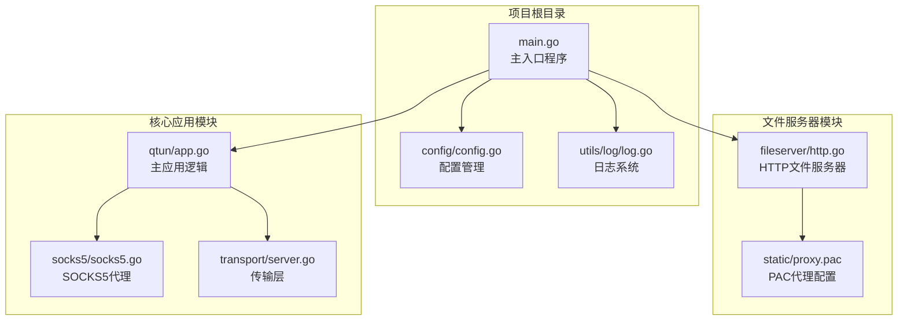

**图表来源**
- [main.go](file://main.go#L1-L136)
- [fileserver/http.go](file://fileserver/http.go#L1-L17)
- [config/config.go](file://config/config.go#L1-L24)

**章节来源**
- [main.go](file://main.go#L1-L136)
- [README.md](file://README.md#L1-L99)

## 核心组件

### HTTP 文件服务器

文件服务器的核心实现非常简洁，基于 Go 标准库的 `net/http` 包构建。

主要特性：
- **简单易用**：仅需两行核心代码即可启动
- **自动重试**：服务器崩溃时自动重启
- **日志记录**：提供详细的启动信息
- **灵活配置**：支持自定义目录和端口

### 配置管理系统

项目采用集中式配置管理模式，所有配置通过单一结构体管理。

关键配置项：
- `Key`: 加密密钥
- `Listen`: 服务器监听地址
- `Ip`: VPN 虚拟 IP 地址
- `Mtu`: 最大传输单元
- `ServerMode`: 服务器模式开关
- `TransportThreads`: 传输线程数

### 日志系统

采用 zerolog 库提供结构化日志记录，支持多种日志级别。

支持的日志级别：
- **Info**: 一般信息
- **Debug**: 调试信息
- **Error**: 错误信息
- **Warn**: 警告信息

**章节来源**
- [fileserver/http.go](file://fileserver/http.go#L1-L17)
- [config/config.go](file://config/config.go#L1-L24)
- [utils/log/log.go](file://utils/log/log.go#L1-L26)

## 架构概览

文件服务器在整个系统架构中扮演着重要角色，与主应用紧密协作。

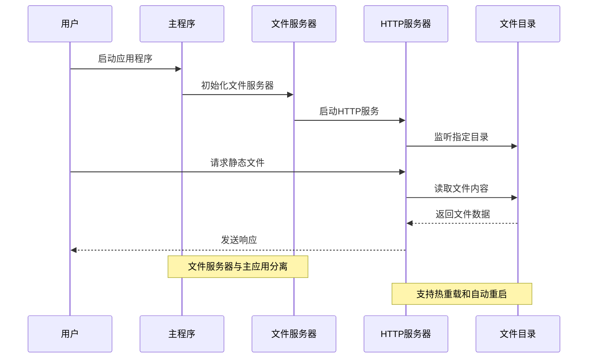

**图表来源**
- [main.go](file://main.go#L70-L103)
- [fileserver/http.go](file://fileserver/http.go#L9-L16)

### 系统集成架构

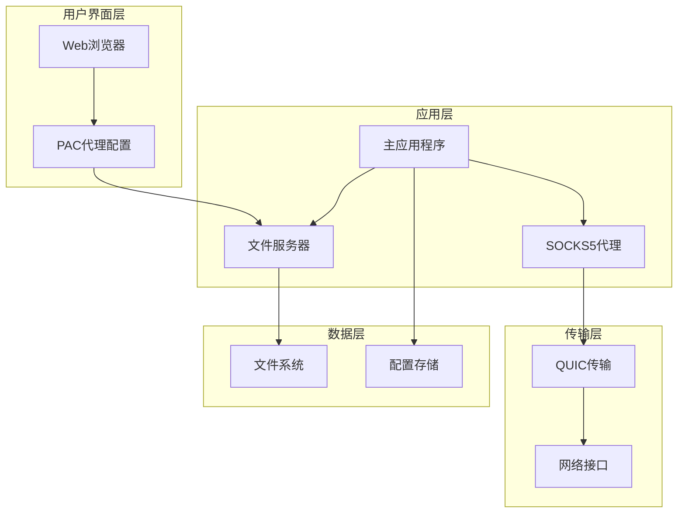

**图表来源**
- [qtun/app.go](file://qtun/app.go#L19-L35)
- [transport/server.go](file://transport/server.go#L23-L46)

**章节来源**
- [qtun/app.go](file://qtun/app.go#L1-L271)
- [transport/server.go](file://transport/server.go#L1-L219)

## 详细组件分析

### 文件服务器实现分析

文件服务器采用极简的设计理念，核心实现极其精炼。

#### 核心实现流程

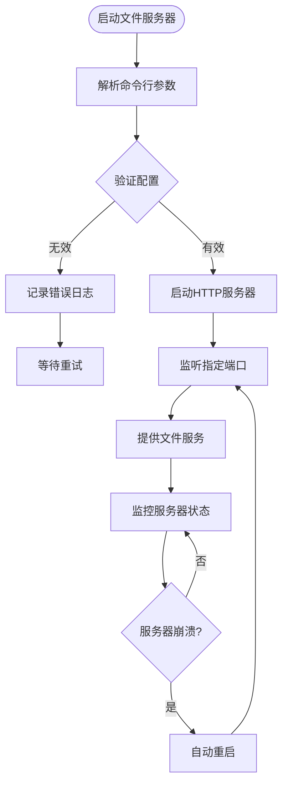

**图表来源**
- [fileserver/http.go](file://fileserver/http.go#L9-L16)

#### 配置参数详解

| 参数名称 | 类型 | 默认值 | 描述 |
|---------|------|--------|------|
| `file_dir` | string | `../static` | HTTP文件服务器目录 |
| `file_svr_port` | int | `6061` | HTTP文件服务器端口 |
| `log_level` | string | `info` | 日志级别 |

**章节来源**
- [fileserver/http.go](file://fileserver/http.go#L1-L17)
- [main.go](file://main.go#L58-L65)

### PAC（代理自动配置）系统

PAC 文件是现代浏览器代理配置的重要组成部分，文件服务器集成了完整的 PAC 功能。

#### PAC 文件生成机制

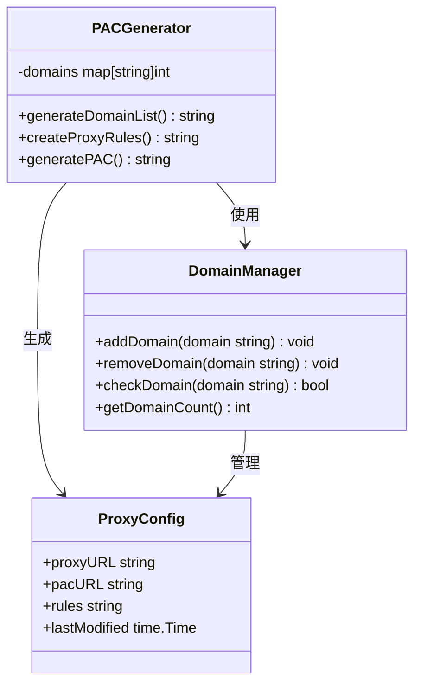

**图表来源**
- [static/proxy.pac](file://static/proxy.pac#L1-L50)

#### PAC 文件使用流程

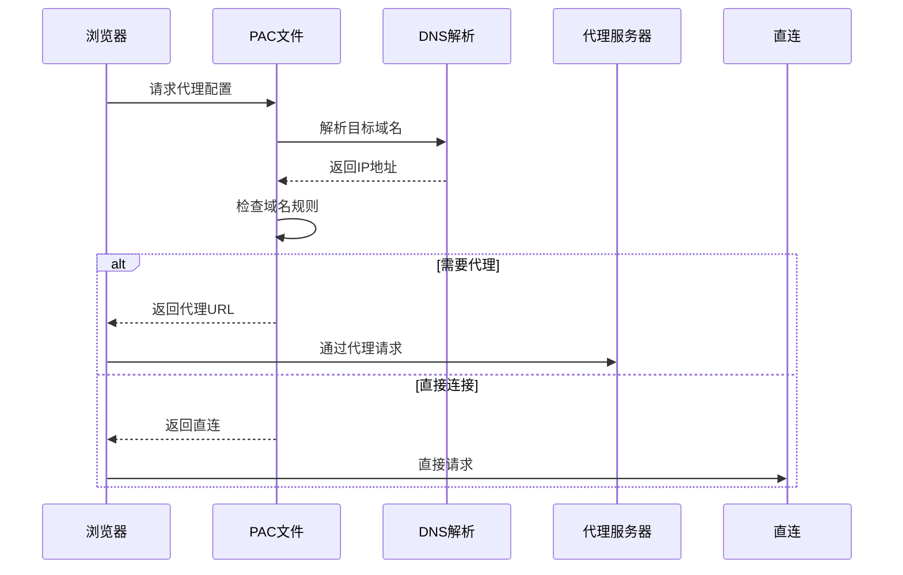

**图表来源**
- [qtun/app.go](file://qtun/app.go#L250-L270)

**章节来源**
- [static/proxy.pac](file://static/proxy.pac#L1-L800)
- [qtun/app.go](file://qtun/app.go#L250-L270)

### 日志系统分析

日志系统采用结构化日志记录，提供丰富的调试信息。

#### 日志级别体系

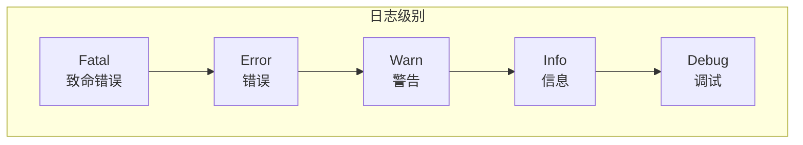

#### 日志输出配置

| 配置项 | 可选值 | 描述 |
|--------|--------|------|
| `log_level` | `info`, `debug` | 设置全局日志级别 |
| 输出格式 | 控制台彩色输出 | 结构化 JSON 格式 |
| 时间戳 | 自动添加 | ISO 8601 格式 |

**章节来源**
- [utils/log/log.go](file://utils/log/log.go#L1-L26)

## 依赖关系分析

文件服务器的依赖关系相对简单，主要依赖于标准库和少量外部库。

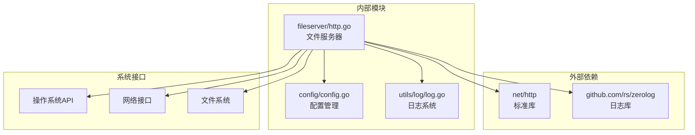

**图表来源**
- [fileserver/http.go](file://fileserver/http.go#L3-L7)
- [utils/log/log.go](file://utils/log/log.go#L3-L8)

### 模块间交互

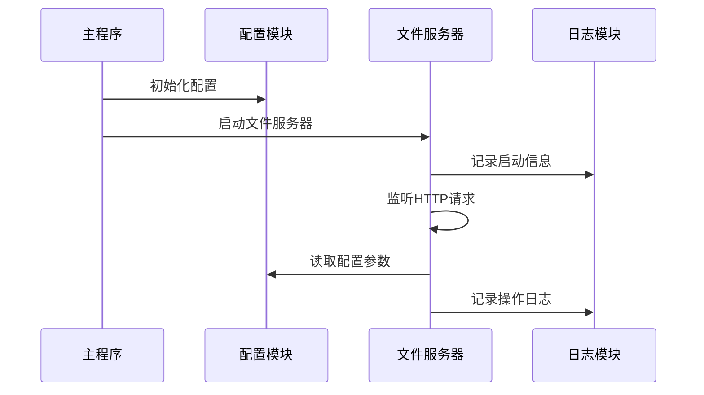

**图表来源**
- [main.go](file://main.go#L75-L99)
- [config/config.go](file://config/config.go#L17-L23)

**章节来源**
- [main.go](file://main.go#L1-L136)
- [config/config.go](file://config/config.go#L1-L24)

## 性能考虑

虽然文件服务器相对简单，但在实际部署中仍需考虑多个性能方面。

### 并发处理能力

文件服务器基于 Go 标准库实现，天然具备良好的并发处理能力：

- **内置并发模型**: Go 的 HTTP 服务器自动处理并发连接
- **协程管理**: 每个请求使用独立协程处理
- **内存管理**: Go 的垃圾回收器自动管理内存

### 缓存策略

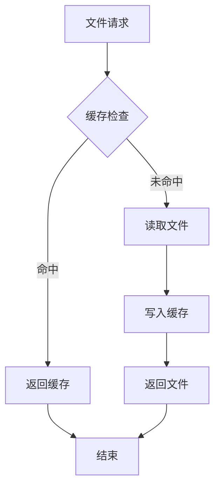

### 压缩传输

虽然当前实现未包含压缩功能，但可以轻松集成：

- **Gzip压缩**: 可通过中间件实现
- **Brotli压缩**: 现代浏览器支持
- **条件请求**: 支持 ETag 和 Last-Modified

### 监控和诊断

系统集成了多种监控工具：

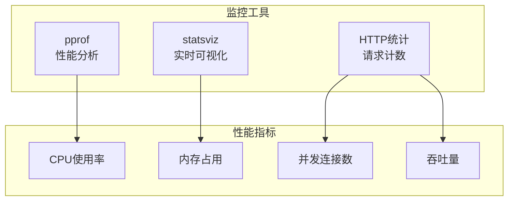

**章节来源**
- [PERFORMANCE_TEST_GUIDE.md](file://PERFORMANCE_TEST_GUIDE.md#L1-L323)
- [main.go](file://main.go#L118-L129)

## 故障排除指南

### 常见问题及解决方案

#### 服务器启动失败

**症状**: 文件服务器无法启动或立即退出

**可能原因**:
1. 端口被占用
2. 目录权限不足
3. 配置参数错误

**解决步骤**:
1. 检查端口占用情况
2. 验证目录存在性和权限
3. 确认配置参数格式正确

#### 文件访问权限问题

**症状**: 用户无法访问某些文件或目录

**可能原因**:
1. 文件权限设置不当
2. 目录遍历保护
3. 路径解析错误

**解决方法**:
1. 检查文件和目录权限
2. 确保路径在允许范围内
3. 验证相对路径解析

#### PAC 文件配置问题

**症状**: 浏览器无法正确使用代理

**排查步骤**:
1. 验证 PAC 文件 URL 正确性
2. 检查 PAC 文件语法
3. 确认浏览器代理设置

**章节来源**
- [fileserver/http.go](file://fileserver/http.go#L9-L16)
- [qtun/app.go](file://qtun/app.go#L250-L270)

### 调试技巧

#### 启用详细日志

```bash
# 设置调试级别
./qtun qt --log_level debug

# 查看详细启动信息
./qtun qt --file_svr_port 6061 --file_dir ../static
```

#### 性能分析

```bash
# 启动性能监控
go tool pprof http://localhost:6060/debug/pprof/profile

# 分析内存使用
curl http://localhost:6060/debug/pprof/heap > heap.prof
```

## 结论

文件服务器作为 Qtun 项目的重要组成部分，展现了简洁而强大的设计理念。通过极简的实现方式，它提供了稳定可靠的静态文件服务功能，同时与整个系统的其他组件无缝集成。

### 主要优势

1. **实现简洁**: 核心代码极少，易于理解和维护
2. **功能完整**: 提供了文件服务器所需的所有基本功能
3. **集成良好**: 与主应用和其他组件协同工作
4. **配置灵活**: 支持多种配置选项和自定义参数
5. **监控完善**: 内置日志系统和性能监控工具

### 扩展建议

虽然当前实现已经相当完善，但仍有一些改进空间：

1. **安全增强**: 添加访问控制和身份验证
2. **性能优化**: 实现文件缓存和压缩功能
3. **功能扩展**: 支持文件上传和下载 API
4. **监控增强**: 添加更详细的性能指标和告警功能

文件服务器为整个 Qtun 项目提供了坚实的基础设施支持，是实现复杂网络功能的重要基础组件。

## 附录

### 配置参考

#### 基本配置选项

| 选项 | 类型 | 默认值 | 描述 |
|------|------|--------|------|
| `--file_dir` | string | `../static` | 文件服务器目录 |
| `--file_svr_port` | int | `6061` | 服务器端口号 |
| `--log_level` | string | `info` | 日志级别 |

#### 高级配置

```bash
# 自定义文件目录
./qtun qt --file_dir /var/www/html

# 自定义端口
./qtun qt --file_svr_port 8080

# 调试模式
./qtun qt --log_level debug
```

### API 接口

文件服务器提供简单的 HTTP 接口：

- **GET /**: 返回目录列表
- **GET /filename**: 下载指定文件
- **HEAD /**: 获取文件元数据

### 集成示例

#### 浏览器集成

```javascript
// PAC文件示例
function FindProxyForURL(url, host) {
    // 自动代理配置逻辑
    return "DIRECT";
}
```

#### 系统集成

```bash
# macOS 系统代理设置
networksetup -setautoproxyurl "Wi-Fi" "http://127.0.0.1:6061/proxy.pac"
```