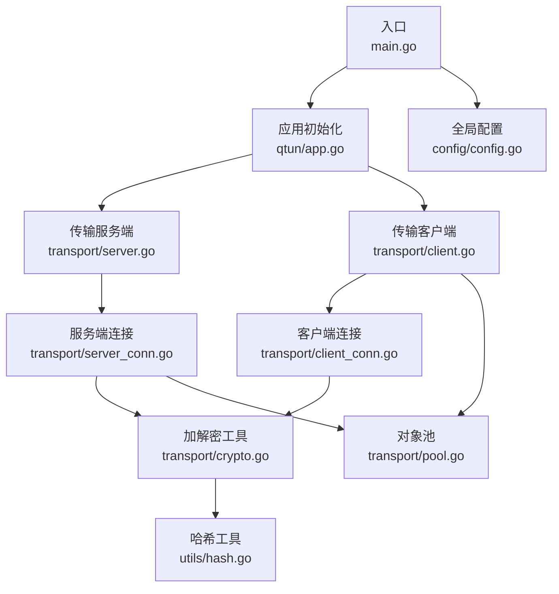
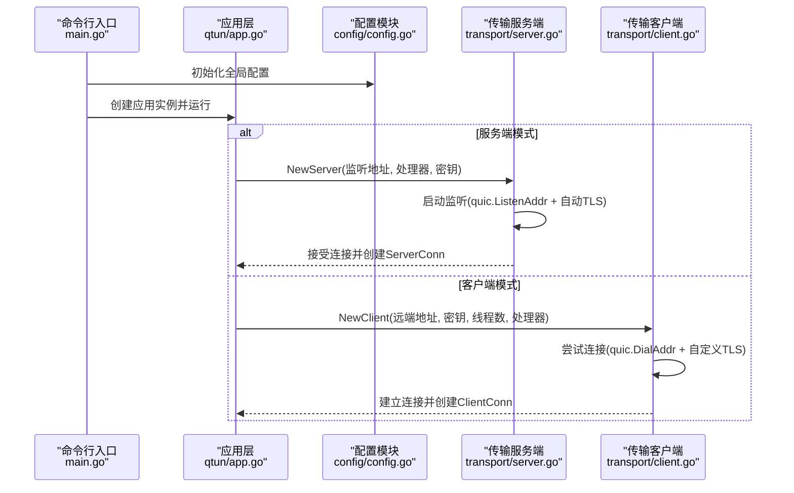
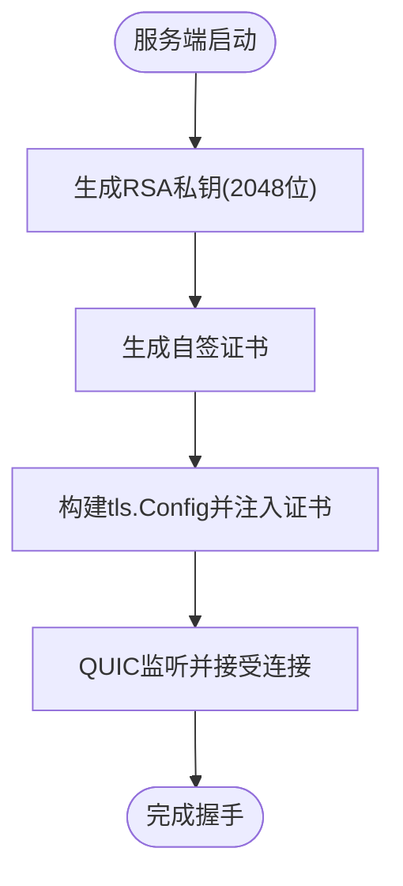
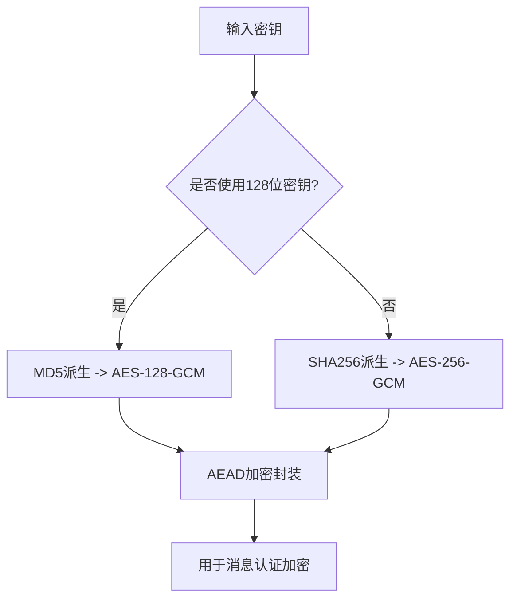
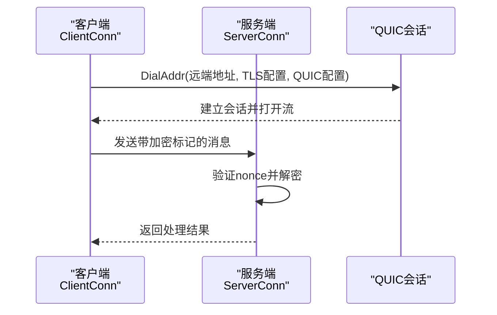
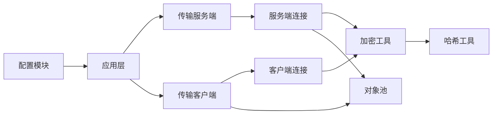

# 安全配置

<cite>
**本文引用的文件**
- [main.go](file://main.go)
- [config/config.go](file://config/config.go)
- [qtun/app.go](file://qtun/app.go)
- [transport/server.go](file://transport/server.go)
- [transport/server_conn.go](file://transport/server_conn.go)
- [transport/client.go](file://transport/client.go)
- [transport/client_conn.go](file://transport/client_conn.go)
- [transport/crypto.go](file://transport/crypto.go)
- [transport/pool.go](file://transport/pool.go)
- [utils/hash.go](file://utils/hash.go)
- [README.md](file://README.md)
</cite>

## 目录
1. [简介](#简介)
2. [项目结构](#项目结构)
3. [核心组件](#核心组件)
4. [架构总览](#架构总览)
5. [详细组件分析](#详细组件分析)
6. [依赖关系分析](#依赖关系分析)
7. [性能与安全权衡](#性能与安全权衡)
8. [故障排查指南](#故障排查指南)
9. [结论](#结论)
10. [附录：安全配置清单](#附录安全配置清单)

## 简介
本指南面向Qtun服务器的安全配置，聚焦以下主题：
- TLS证书生成与管理：自动证书生成与手动证书配置路径
- 密钥管理最佳实践：密钥长度、轮换策略与存储安全
- 防火墙与网络安全加固：监听地址、协议参数与访问控制
- QUIC协议安全特性与加密参数：握手、传输安全与抗重放
- 常见威胁防护与安全审计要点：日志、异常处理与监控

## 项目结构
从入口到传输层的关键文件组织如下：
- 入口与命令行参数解析：main.go
- 全局配置：config/config.go
- 应用生命周期与TUN数据面：qtun/app.go
- 传输层（服务端/客户端）：transport/server.go、transport/client.go
- 连接与加解密：transport/server_conn.go、transport/client_conn.go、transport/crypto.go
- 对象池与缓冲复用：transport/pool.go
- 工具函数（哈希等）：utils/hash.go
- 使用说明与示例：README.md

图表来源
- [main.go](file://main.go#L75-L102)
- [config/config.go](file://config/config.go#L17-L23)
- [qtun/app.go](file://qtun/app.go#L37-L48)
- [transport/server.go](file://transport/server.go#L37-L46)
- [transport/client.go](file://transport/client.go#L31-L38)
- [transport/server_conn.go](file://transport/server_conn.go#L39-L50)
- [transport/client_conn.go](file://transport/client_conn.go#L44-L55)
- [transport/crypto.go](file://transport/crypto.go#L10-L17)
- [utils/hash.go](file://utils/hash.go#L11-L27)
- [transport/pool.go](file://transport/pool.go#L11-L50)

章节来源
- [main.go](file://main.go#L75-L102)
- [config/config.go](file://config/config.go#L17-L23)
- [qtun/app.go](file://qtun/app.go#L37-L48)
- [transport/server.go](file://transport/server.go#L37-L46)
- [transport/client.go](file://transport/client.go#L31-L38)
- [transport/server_conn.go](file://transport/server_conn.go#L39-L50)
- [transport/client_conn.go](file://transport/client_conn.go#L44-L55)
- [transport/crypto.go](file://transport/crypto.go#L10-L17)
- [utils/hash.go](file://utils/hash.go#L11-L27)
- [transport/pool.go](file://transport/pool.go#L11-L50)

## 核心组件
- 全局配置：集中存放密钥、监听地址、远端地址、线程数、MTU、运行模式与NoDelay等关键参数
- 应用层：根据配置决定服务端或客户端模式，启动TUN接口与数据转发
- 传输层：基于QUIC的Server/Client，负责连接建立、流管理与数据读写
- 连接层：ServerConn/ClientConn封装QUIC流，实现加解密、缓冲与并发写队列
- 加密工具：基于用户提供的密钥派生对称密钥，使用AEAD进行消息认证加密
- 对象池：复用nonce、缓冲区与protobuf消息，降低GC压力并提升吞吐

章节来源
- [config/config.go](file://config/config.go#L3-L13)
- [qtun/app.go](file://qtun/app.go#L37-L48)
- [transport/server.go](file://transport/server.go#L23-L46)
- [transport/client.go](file://transport/client.go#L20-L29)
- [transport/server_conn.go](file://transport/server_conn.go#L24-L37)
- [transport/client_conn.go](file://transport/client_conn.go#L24-L42)
- [transport/crypto.go](file://transport/crypto.go#L10-L17)
- [transport/pool.go](file://transport/pool.go#L11-L50)

## 架构总览
下图展示从入口到传输层的调用链与职责划分。

图表来源
- [main.go](file://main.go#L75-L102)
- [config/config.go](file://config/config.go#L17-L23)
- [qtun/app.go](file://qtun/app.go#L37-L48)
- [transport/server.go](file://transport/server.go#L91-L148)
- [transport/client.go](file://transport/client.go#L31-L38)

## 详细组件分析

### TLS证书生成与管理
- 自动生成证书
  - 服务端在启动时动态生成RSA私钥与自签证书，并以TLS形式提供给QUIC握手
  - 该流程在服务端监听前完成，确保每次启动均使用新的证书
- 手动配置证书
  - 当前代码未提供直接加载外部证书的选项；如需使用固定证书，可在服务端逻辑中扩展TLS配置，将外部证书与私钥注入到tls.Config
- 安全建议
  - 使用强RSA密钥（当前为2048位），建议在生产环境采用更高强度密钥
  - 限制证书用途与过期时间，定期轮换
  - 仅暴露必要端口，避免将证书文件直接对外公开

图表来源
- [transport/server.go](file://transport/server.go#L151-L173)

章节来源
- [transport/server.go](file://transport/server.go#L151-L173)

### 密钥管理最佳实践
- 密钥来源与派生
  - 客户端与服务端均通过用户提供的密钥派生对称密钥（AES-GCM）
  - 128位密钥通过MD5派生，256位密钥通过SHA256派生
- 密钥长度与算法
  - 默认使用128位密钥（MD5派生），可扩展至256位（SHA256派生）
  - 建议在生产环境优先使用256位密钥以增强安全性
- 轮换策略
  - 建议在维护窗口内滚动更新密钥，确保新旧两端同时支持过渡期
  - 通过配置热更新或重启应用的方式下发新密钥
- 存储安全
  - 密钥应仅保存在受控环境中，避免明文落盘
  - 使用系统密钥管理服务或硬件安全模块（HSM）进行密钥保护
  - 严格控制密钥文件权限，最小化可见范围

图表来源
- [transport/crypto.go](file://transport/crypto.go#L10-L17)
- [utils/hash.go](file://utils/hash.go#L11-L27)

章节来源
- [transport/crypto.go](file://transport/crypto.go#L10-L17)
- [utils/hash.go](file://utils/hash.go#L11-L27)

### 防火墙与网络安全加固
- 监听地址与端口
  - 服务端默认监听在指定地址与端口，客户端通过远端地址连接
  - 建议仅绑定到受信网卡地址，避免暴露于公网
- 协议与参数
  - QUIC配置包含最大并发流、接收窗口、连接窗口与保活周期
  - 启用datagram能力，便于低延迟数据传输
- 访问控制
  - 结合系统防火墙策略，仅允许来自可信源的连接
  - 在反向代理或负载均衡器上启用TLS终止与访问控制
- 日志与审计
  - 开启详细日志以便追踪异常连接与解密失败事件
  - 定期审查日志，识别潜在攻击迹象

章节来源
- [transport/server.go](file://transport/server.go#L96-L103)
- [transport/client_conn.go](file://transport/client_conn.go#L84-L91)
- [config/config.go](file://config/config.go#L4-L13)

### QUIC协议安全特性与加密参数
- 握手与传输安全
  - 服务端使用TLS配置进行QUIC握手，客户端使用自定义TLS配置（跳过主机名校验）
  - 建议在生产环境启用严格的证书校验，避免InsecureSkipVerify
- 加密与完整性
  - 消息体采用AEAD进行加密与认证，包含随机nonce
  - 解密失败将返回错误，防止伪造或篡改流量
- 参数优化
  - 合理设置并发流与窗口大小，平衡吞吐与资源占用
  - 保活周期有助于维持长连接稳定性

图表来源
- [transport/client_conn.go](file://transport/client_conn.go#L79-L117)
- [transport/server_conn.go](file://transport/server_conn.go#L117-L165)

章节来源
- [transport/client_conn.go](file://transport/client_conn.go#L79-L117)
- [transport/server_conn.go](file://transport/server_conn.go#L117-L165)

### 常见安全威胁与防护
- 中间人攻击（MITM）
  - 防护：启用严格的证书校验，避免InsecureSkipVerify；在客户端侧验证证书指纹
- 重放攻击
  - 防护：使用随机nonce并结合时间戳；服务端拒绝过期或重复的nonce
- 异常解密
  - 防护：解密失败立即断开连接，记录告警日志
- 连接滥用
  - 防护：限制并发连接数与流数量；启用保活与超时策略

章节来源
- [transport/server_conn.go](file://transport/server_conn.go#L98-L102)
- [transport/server_conn.go](file://transport/server_conn.go#L158-L164)
- [transport/client_conn.go](file://transport/client_conn.go#L388-L394)

## 依赖关系分析
- 组件耦合
  - 应用层依赖配置模块；传输层依赖连接层与加密工具
  - 连接层共享对象池以减少内存分配
- 外部依赖
  - QUIC库负责底层传输与握手
  - 标准库crypto用于密钥派生与AEAD

图表来源
- [config/config.go](file://config/config.go#L17-L23)
- [qtun/app.go](file://qtun/app.go#L37-L48)
- [transport/server.go](file://transport/server.go#L37-L46)
- [transport/client.go](file://transport/client.go#L31-L38)
- [transport/server_conn.go](file://transport/server_conn.go#L39-L50)
- [transport/client_conn.go](file://transport/client_conn.go#L44-L55)
- [transport/crypto.go](file://transport/crypto.go#L10-L17)
- [utils/hash.go](file://utils/hash.go#L11-L27)
- [transport/pool.go](file://transport/pool.go#L11-L50)

章节来源
- [config/config.go](file://config/config.go#L17-L23)
- [qtun/app.go](file://qtun/app.go#L37-L48)
- [transport/server.go](file://transport/server.go#L37-L46)
- [transport/client.go](file://transport/client.go#L31-L38)
- [transport/server_conn.go](file://transport/server_conn.go#L39-L50)
- [transport/client_conn.go](file://transport/client_conn.go#L44-L55)
- [transport/crypto.go](file://transport/crypto.go#L10-L17)
- [utils/hash.go](file://utils/hash.go#L11-L27)
- [transport/pool.go](file://transport/pool.go#L11-L50)

## 性能与安全权衡
- 并发与窗口
  - 提高并发流与接收窗口可提升吞吐，但会增加内存与CPU消耗
  - 建议按业务场景调整参数，并配合限速与拥塞控制
- 缓冲与对象池
  - 使用对象池减少GC压力，提高高频加解密场景下的稳定性
- NoDelay与保活
  - 关闭NoDelay可能提升带宽利用率，但会增加延迟抖动
  - 保活周期影响长连接存活，需在能耗与稳定性之间权衡

章节来源
- [transport/server.go](file://transport/server.go#L96-L103)
- [transport/client_conn.go](file://transport/client_conn.go#L84-L91)
- [transport/pool.go](file://transport/pool.go#L11-L50)

## 故障排查指南
- TLS握手失败
  - 检查证书生成与注入流程；确认客户端TLS配置是否正确
- 解密失败
  - 查看解密错误日志；核对密钥一致性与nonce有效性
- 连接频繁断开
  - 检查保活与超时设置；确认网络质量与防火墙策略
- 日志定位
  - 提升日志级别以捕获更多上下文信息；关注panic与recover日志

章节来源
- [transport/server_conn.go](file://transport/server_conn.go#L58-L115)
- [transport/client_conn.go](file://transport/client_conn.go#L130-L151)

## 结论
Qtun在QUIC之上实现了轻量级的安全隧道，具备自动证书生成与AEAD加解密能力。为满足生产安全要求，建议：
- 使用强密钥与2048位以上RSA密钥
- 启用严格的证书校验与访问控制
- 合理配置QUIC参数并结合防火墙策略
- 建立密钥轮换与审计机制，持续监控异常行为

## 附录：安全配置清单
- TLS证书
  - 自动生成：由服务端启动时生成RSA私钥与自签证书
  - 手动配置：扩展服务端逻辑以加载外部证书与私钥
- 密钥管理
  - 建议使用256位密钥（SHA256派生）
  - 制定密钥轮换计划并最小化密钥可见范围
- 网络安全
  - 仅暴露必要端口；限制监听地址；启用防火墙规则
  - 在反向代理或LB上启用TLS终止与访问控制
- QUIC参数
  - 根据业务场景调整并发流与窗口大小
  - 启用保活与合理超时，避免资源泄露
- 审计与监控
  - 开启详细日志；定期审查异常与解密失败事件
  - 建立告警机制，快速响应安全事件

章节来源
- [transport/server.go](file://transport/server.go#L151-L173)
- [transport/crypto.go](file://transport/crypto.go#L10-L17)
- [transport/server.go](file://transport/server.go#L96-L103)
- [transport/client_conn.go](file://transport/client_conn.go#L79-L82)
- [README.md](file://README.md#L13-L26)