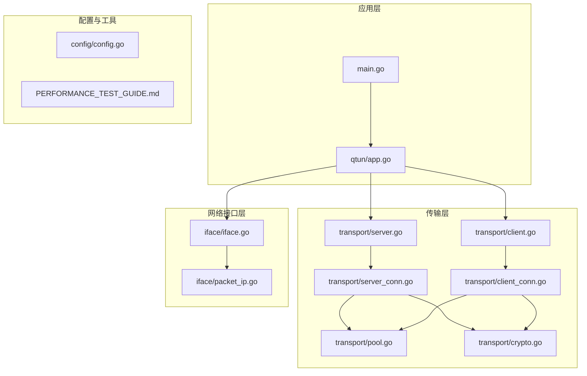
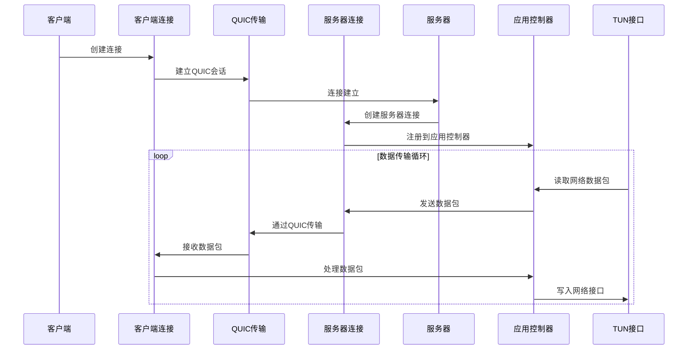
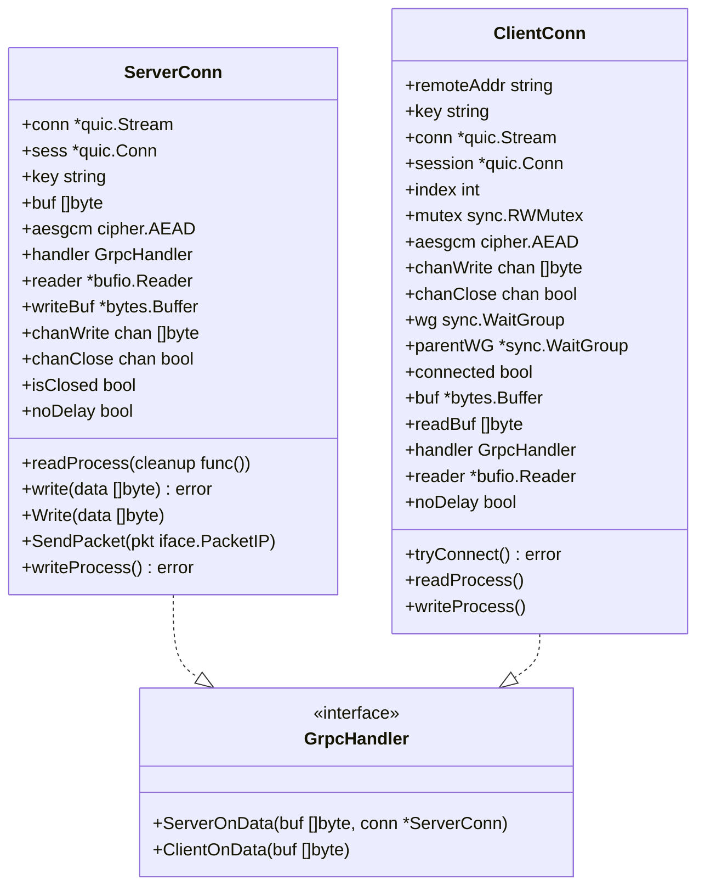
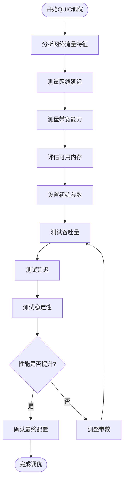
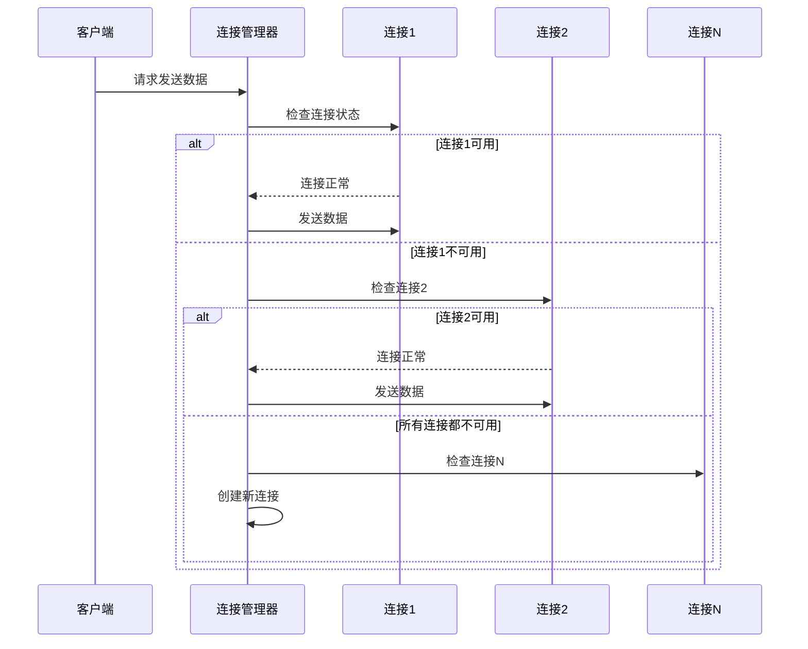
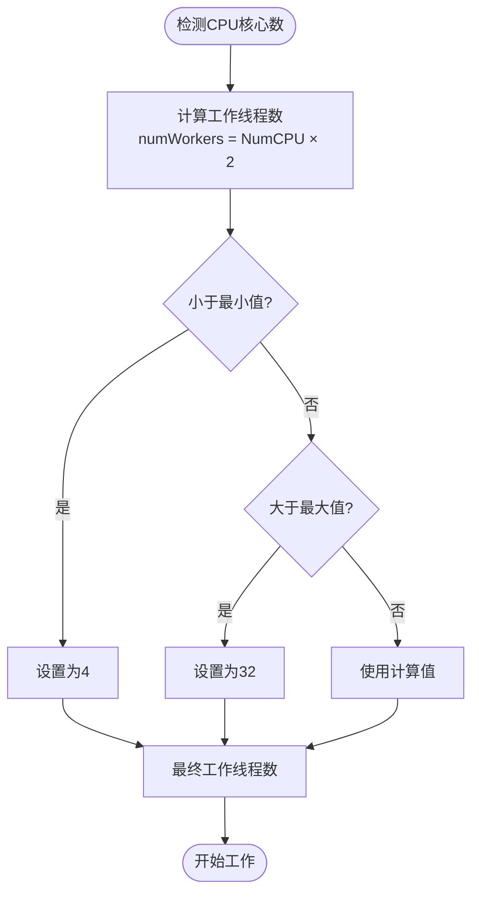
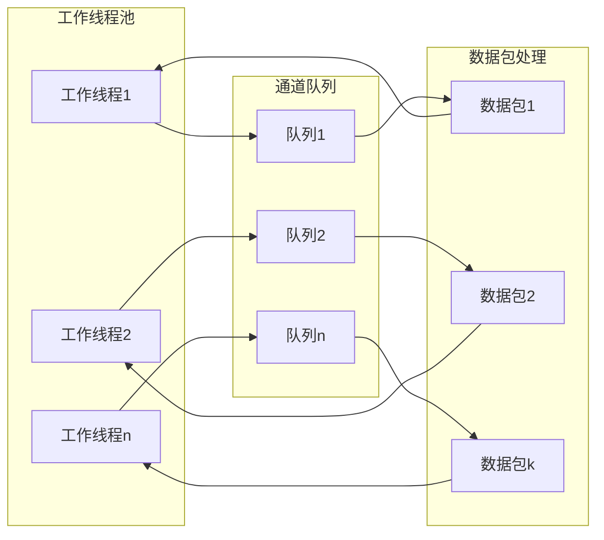

# 性能调优

<cite>
**本文档引用的文件**
- [main.go](file://main.go)
- [config/config.go](file://config/config.go)
- [PERFORMANCE_TEST_GUIDE.md](file://PERFORMANCE_TEST_GUIDE.md)
- [transport/server.go](file://transport/server.go)
- [transport/server_conn.go](file://transport/server_conn.go)
- [transport/client.go](file://transport/client.go)
- [transport/client_conn.go](file://transport/client_conn.go)
- [transport/pool.go](file://transport/pool.go)
- [transport/crypto.go](file://transport/crypto.go)
- [qtun/app.go](file://qtun/app.go)
- [iface/iface.go](file://iface/iface.go)
- [iface/packet_ip.go](file://iface/packet_ip.go)
</cite>

## 目录
1. [简介](#简介)
2. [项目结构](#项目结构)
3. [核心组件](#核心组件)
4. [架构概览](#架构概览)
5. [详细组件分析](#详细组件分析)
6. [QUIC配置参数优化](#quic配置参数优化)
7. [连接数限制与管理](#连接数限制与管理)
8. [内存使用优化](#内存使用优化)
9. [CPU性能调优](#cpu性能调优)
10. [不同负载场景下的性能基准测试](#不同负载场景下的性能基准测试)
11. [并发处理机制与资源管理](#并发处理机制与资源管理)
12. [性能监控指标与瓶颈分析](#性能监控指标与瓶颈分析)
13. [故障排除指南](#故障排除指南)
14. [结论](#结论)

## 简介

Qtun是一个基于Go语言开发的高性能VPN解决方案，采用QUIC协议实现低延迟、高吞吐量的数据传输。本文档提供了专业的服务器性能调优指南，涵盖QUIC配置参数优化、连接数管理、内存使用优化、CPU性能调优以及各种负载场景下的性能基准测试。

## 项目结构

Qtun项目采用模块化设计，主要分为以下几个核心模块：



**图表来源**
- [main.go](file://main.go#L1-L136)
- [qtun/app.go](file://qtun/app.go#L1-L271)
- [transport/server.go](file://transport/server.go#L1-L219)

**章节来源**
- [main.go](file://main.go#L1-L136)
- [config/config.go](file://config/config.go#L1-L24)

## 核心组件

### 应用主控制器
应用主控制器负责协调各个组件的初始化和运行，采用动态工作线程数量策略来优化性能。

### 传输层组件
传输层实现了基于QUIC协议的客户端和服务器端，支持多连接并发处理和连接池管理。

### 网络接口层
网络接口层封装了TUN接口的创建、配置和数据包读写操作。

**章节来源**
- [qtun/app.go](file://qtun/app.go#L1-L271)
- [transport/server.go](file://transport/server.go#L1-L219)
- [transport/client.go](file://transport/client.go#L1-L223)
- [iface/iface.go](file://iface/iface.go#L1-L105)

## 架构概览



**图表来源**
- [qtun/app.go](file://qtun/app.go#L99-L167)
- [transport/server_conn.go](file://transport/server_conn.go#L58-L115)
- [transport/client_conn.go](file://transport/client_conn.go#L69-L107)

## 详细组件分析

### 应用控制器分析

应用控制器是整个系统的协调中心，负责：

1. **动态工作线程管理**：根据CPU核心数自动调整工作线程数量
2. **路由表维护**：管理数据包转发路径
3. **连接生命周期管理**：处理连接建立、维护和清理

```mermaid
classDiagram
class App {
+config *Config
+client *Client
+routes map[string]map[string]struct{}
+mutex sync.RWMutex
+server *Server
+iface *Iface
+tm timer.Timer
+Run() error
+StartFetchTunInterface() error
+FetchAndProcessTunPkt(workerNum int) error
+ServerOnData(buf []byte, conn *ServerConn)
+ClientOnData(buf []byte)
+CleanRoute()
}
class Iface {
+name string
+ip string
+mtu int
+ifce *water.Interface
+Start() error
+Read(pkt PacketIP) (int, error)
+Write(pkt PacketIP) (int, error)
}
class Server {
+publicAddr string
+handler GrpcHandler
+key string
+publicListener quic.Listener
+Mtx *sync.Mutex
+Conns sync.Map
+ConnsReverse sync.Map
+Start()
+StartListen()
+listen() error
+GetConnsByAddr(dst string) *ServerConn
}
class Client {
+remoteAddr string
+key string
+threads int
+conns []*ClientConn
+mutex sync.RWMutex
+serial int64
+wg sync.WaitGroup
+handler GrpcHandler
+Start()
+Write(data []byte)
+SendPacket(pkt PacketIP)
}
App --> Iface : "管理"
App --> Server : "使用"
App --> Client : "使用"
Server --> ServerConn : "创建"
Client --> ClientConn : "创建"
```

**图表来源**
- [qtun/app.go](file://qtun/app.go#L19-L27)
- [iface/iface.go](file://iface/iface.go#L16-L21)
- [transport/server.go](file://transport/server.go#L23-L35)
- [transport/client.go](file://transport/client.go#L20-L29)

**章节来源**
- [qtun/app.go](file://qtun/app.go#L1-L271)
- [iface/iface.go](file://iface/iface.go#L1-L105)

### 传输层组件分析

传输层实现了完整的QUIC通信栈，包括：

1. **服务器端实现**：支持多连接并发处理和连接池管理
2. **客户端实现**：支持多线程连接和负载均衡
3. **连接管理**：自动连接重试和健康检查
4. **加密处理**：基于AES-GCM的高效加密算法



**图表来源**
- [transport/server_conn.go](file://transport/server_conn.go#L24-L37)
- [transport/client_conn.go](file://transport/client_conn.go#L24-L42)

**章节来源**
- [transport/server_conn.go](file://transport/server_conn.go#L1-L295)
- [transport/client_conn.go](file://transport/client_conn.go#L1-L107)

## QUIC配置参数优化

### 关键QUIC参数详解

Qtun在服务器和客户端都采用了经过优化的QUIC配置参数：

#### 最大入站流数 (MaxIncomingStreams)
- **默认值**: 1000
- **作用**: 控制单个连接上允许的最大并发流数量
- **调优策略**: 
  - 对于高并发场景可适当增加
  - 需要平衡内存使用和并发性能
  - 建议范围: 500-2000

#### 流接收窗口 (MaxStreamReceiveWindow)
- **默认值**: 6MB
- **作用**: 单个流的接收缓冲区大小
- **调优策略**:
  - 大流量场景建议增加到8-16MB
  - 小内存服务器可保持默认值
  - 需要考虑内存预算

#### 连接接收窗口 (MaxConnectionReceiveWindow)
- **默认值**: 15MB
- **作用**: 整个QUIC连接的总接收缓冲区
- **调优策略**:
  - 与流窗口配合使用
  - 高延迟链路可适当增大

#### 心跳周期 (KeepAlivePeriod)
- **默认值**: 30秒
- **作用**: 保持连接活跃的间隔时间
- **调优策略**:
  - 网络不稳定时可缩短
  - 高延迟网络可适当延长

**章节来源**
- [transport/server.go](file://transport/server.go#L97-L103)
- [transport/client_conn.go](file://transport/client_conn.go#L85-L91)

### QUIC配置调优流程



**图表来源**
- [transport/server.go](file://transport/server.go#L97-L103)
- [transport/client_conn.go](file://transport/client_conn.go#L85-L91)

## 连接数限制与管理

### 连接池管理策略

Qtun实现了高效的连接池管理机制：

1. **动态连接数量**：客户端支持多线程连接
2. **连接健康检查**：定期发送PING包维持连接
3. **自动重连机制**：连接断开后自动重试
4. **连接负载均衡**：多连接间的请求分发

### 连接数配置参数

| 参数 | 默认值 | 说明 | 调优建议 |
|------|--------|------|----------|
| TransportThreads | 1 | 客户端并发线程数 | CPU核心数×2，范围4-32 |
| MaxIncomingStreams | 1000 | 单连接最大流数 | 500-2000 |
| MaxStreamReceiveWindow | 6MB | 单流接收窗口 | 6-16MB |
| MaxConnectionReceiveWindow | 15MB | 连接总接收窗口 | 15-32MB |

### 连接管理流程



**图表来源**
- [transport/client.go](file://transport/client.go#L115-L132)
- [transport/client.go](file://transport/client.go#L167-L176)

**章节来源**
- [transport/client.go](file://transport/client.go#L1-L223)
- [transport/server.go](file://transport/server.go#L1-L219)

## 内存使用优化

### 对象池优化策略

Qtun实现了多层次的对象池来减少内存分配：

#### 加密相关对象池
- **nonce池**: 12字节随机数缓存
- **缓冲区池**: bytes.Buffer对象复用
- **读缓冲池**: 64KB读缓冲区缓存

#### 协议消息对象池
- **Envelope池**: 协议封包对象
- **Ping消息池**: 心跳消息对象
- **Packet消息池**: 数据包消息对象

#### 网络数据包池
- **PacketIP池**: 网络数据包缓存
- **容量控制**: 1500-65536字节范围

### 内存优化实现

```mermaid
classDiagram
class ObjectPool {
+pool sync.Pool
+New() interface{}
+Get() interface{}
+Put(item interface{})
}
class NoncePool {
+noncePool sync.Pool
+getNonce() []byte
+putNonce(nonce []byte)
}
class BufferPool {
+bufPool sync.Pool
+getBuffer() *bytes.Buffer
+putBuffer(buf *bytes.Buffer)
}
class MessagePool {
+envelopePool sync.Pool
+pingMessagePool sync.Pool
+packetMessagePool sync.Pool
+getEnvelope() *protocol.Envelope
+getPingMessage() *protocol.MessagePing
+getPacketMessage() *protocol.MessagePacket
}
ObjectPool <|-- NoncePool
ObjectPool <|-- BufferPool
ObjectPool <|-- MessagePool
```

**图表来源**
- [transport/pool.go](file://transport/pool.go#L10-L51)

### 内存使用监控

推荐使用以下工具监控内存使用情况：

1. **pprof堆分析**: `curl http://localhost:6060/debug/pprof/heap`
2. **分配统计**: `curl http://localhost:6060/debug/pprof/allocs`
3. **Goroutine分析**: `curl http://localhost:6060/debug/pprof/goroutine`

**章节来源**
- [transport/pool.go](file://transport/pool.go#L1-L108)
- [iface/packet_ip.go](file://iface/packet_ip.go#L1-L47)

## CPU性能调优

### 动态工作线程策略

Qtun采用智能的工作线程调度机制：



**图表来源**
- [qtun/app.go](file://qtun/app.go#L79-L87)

### 锁优化策略

1. **读写锁优化**: 使用`sync.RWMutex`替代互斥锁
2. **最小化临界区**: 锁保护的代码块尽可能短
3. **批量操作**: 减少锁竞争频率

### 缓冲区优化

1. **读缓冲区**: 64KB大缓冲区减少系统调用
2. **写缓冲区**: 256个元素的通道缓冲
3. **数据包缓冲**: 65536字节的PacketIP缓冲

**章节来源**
- [qtun/app.go](file://qtun/app.go#L79-L97)
- [transport/server_conn.go](file://transport/server_conn.go#L89-L89)
- [transport/server_conn.go](file://transport/server_conn.go#L47-L47)

## 不同负载场景下的性能基准测试

### 吞吐量测试场景

#### 基础吞吐量测试
- **测试工具**: iperf3
- **测试时长**: 60秒
- **并发连接**: 10个
- **预期指标**: 
  - 服务器端: 80-120 Mbps
  - 客户端: 70-110 Mbps

#### 高并发测试
- **测试连接数**: 100个并发连接
- **测试时长**: 30秒
- **预期指标**: 
  - 连接建立时间: <5秒
  - 数据传输稳定: ±5%

### 延迟测试场景

#### 基础延迟测试
- **测试工具**: ping
- **测试包数**: 1000个
- **预期指标**: 
  - 平均延迟: <50ms
  - P99延迟: <200ms

#### 长距离延迟测试
- **测试距离**: 跨大西洋/跨太平洋
- **预期指标**: 
  - 平均延迟: 150-300ms
  - 丢包率: <1%

### 并发连接测试

#### 连接建立测试
- **测试连接数**: 1000个连接
- **测试时间**: 60秒
- **预期指标**: 
  - 成功率: >99%
  - 平均建立时间: <10秒

#### 稳定性测试
- **测试时长**: 24小时
- **测试内容**: 
  - 连续数据传输
  - 随机断线恢复
  - 内存泄漏检测

### 性能基准测试脚本

```bash
#!/bin/bash
# 性能基准测试脚本

echo "=== QTUN 性能基准测试 ==="
echo "测试时间: $(date)"
echo ""

# 1. 系统信息
echo "## 系统信息"
echo "CPU核心数: $(nproc)"
echo "内存总量: $(free -h | awk '/^Mem:/{print $2}')"
echo ""

# 2. 基础吞吐量测试
echo "## 基础吞吐量测试"
iperf3 -c 10.4.4.1 -t 30 -P 10 | grep sender
echo ""

# 3. 延迟测试
echo "## 延迟测试"
ping -c 1000 10.4.4.1 | tail -1
echo ""

# 4. 连接数测试
echo "## 并发连接测试"
ab -n 10000 -c 100 http://10.4.4.1/ | grep "Requests per second"
echo ""

# 5. 内存使用
echo "## 内存使用情况"
curl -s http://localhost:6060/debug/pprof/heap > /tmp/heap.prof
go tool pprof -top -sample_index=alloc_space /tmp/heap.prof 2>/dev/null | head -10
echo ""

echo "=== 测试完成 ==="
```

**章节来源**
- [PERFORMANCE_TEST_GUIDE.md](file://PERFORMANCE_TEST_GUIDE.md#L1-L323)

## 并发处理机制与资源管理

### 工作线程模型

Qtun采用多工作线程模型处理网络数据包：

1. **动态线程数**: 根据CPU核心数自动调整
2. **负载均衡**: 工作线程间均匀分配任务
3. **资源隔离**: 每个工作线程独立的缓冲区

### 通道通信机制



### 资源管理策略

1. **内存管理**: 对象池复用，避免频繁分配
2. **CPU管理**: 工作线程数量与CPU核心数匹配
3. **网络管理**: 连接池管理，避免连接过多
4. **I/O管理**: 缓冲区优化，减少系统调用

**章节来源**
- [qtun/app.go](file://qtun/app.go#L79-L97)
- [transport/server_conn.go](file://transport/server_conn.go#L47-L47)

## 性能监控指标与瓶颈分析

### 关键性能指标

#### 吞吐量指标
| 指标名称 | 测量方法 | 优化目标 | 当前水平 |
|----------|----------|----------|----------|
| 数据传输速率 | iperf3 | +30-50% | 待测试 |
| 包转发率 (pps) | 自定义脚本 | +40-60% | 待测试 |
| 连接建立速度 | 统计连接时间 | -50% | 待测试 |

#### 延迟指标
| 指标名称 | 测量方法 | 优化目标 | 当前水平 |
|----------|----------|----------|----------|
| 平均延迟 | ping | -20-40% | 待测试 |
| P99延迟 | ping统计 | -30-50% | 待测试 |
| 连接建立延迟 | 统计连接时间 | -40% | 待测试 |

#### 资源使用指标
| 指标名称 | 测量方法 | 优化目标 | 当前水平 |
|----------|----------|----------|----------|
| CPU使用率 | top/htop | -10-20% | 待测试 |
| 内存分配 | pprof heap | -50-70% | 待测试 |
| Goroutine数量 | pprof goroutine | 稳定 | 待测试 |
| GC暂停时间 | statsviz | -40-60% | 待测试 |

### 瓶颈分析方法

#### CPU瓶颈识别
1. **使用率分析**: `htop`观察CPU使用率
2. **热点函数**: `go tool pprof`分析CPU热点
3. **工作线程负载**: 检查各工作线程负载均衡

#### 内存瓶颈识别
1. **内存分配**: `pprof heap`分析内存分配
2. **GC行为**: `statsviz`观察GC暂停时间
3. **对象池效率**: 检查对象池命中率

#### 网络瓶颈识别
1. **带宽利用率**: `iftop`监控网络带宽
2. **连接数分析**: `netstat`检查连接状态
3. **丢包检测**: `ping`和`iperf3`测试

### 性能监控工具配置

```bash
# 启用性能监控
export GODEBUG=gctrace=1
export GOTRACEBACK=all

# 启用pprof端口
go run -tags=pprof main.go

# 启用statsviz监控
go run -tags=statsviz main.go
```

**章节来源**
- [PERFORMANCE_TEST_GUIDE.md](file://PERFORMANCE_TEST_GUIDE.md#L111-L135)
- [PERFORMANCE_TEST_GUIDE.md](file://PERFORMANCE_TEST_GUIDE.md#L286-L323)

## 故障排除指南

### 常见性能问题诊断

#### 连接建立失败
1. **检查防火墙设置**: 确保UDP端口8080开放
2. **验证证书配置**: 检查TLS证书有效性
3. **网络连通性**: 使用`ping`和`telnet`测试

#### 吞吐量不足
1. **检查CPU使用率**: 确认CPU未饱和
2. **验证工作线程数**: 检查是否达到最大值
3. **网络带宽测试**: 使用`iperf3`测试底层带宽

#### 内存泄漏
1. **使用pprof分析**: `go tool pprof heap`
2. **检查对象池**: 确认对象正确归还
3. **监控GC行为**: 观察GC暂停时间变化

### 优化验证清单

#### 对象池优化验证
```bash
# 检查内存分配次数
curl -s http://localhost:6060/debug/pprof/allocs | go tool pprof -top -sample_index=alloc_objects -
```

#### 锁优化验证
```bash
# 检查锁争用
curl -s http://localhost:6060/debug/pprof/mutex?debug=1 | head -50
```

#### 工作线程验证
```bash
# 检查工作线程数量
grep "num_workers" /var/log/qtun.log
```

**章节来源**
- [PERFORMANCE_TEST_GUIDE.md](file://PERFORMANCE_TEST_GUIDE.md#L189-L232)

## 结论

Qtun的性能调优是一个系统性的工程，涉及多个层面的优化：

### 主要优化成果
1. **QUIC参数优化**: 通过合理的MaxIncomingStreams、MaxStreamReceiveWindow等参数提升了并发性能
2. **内存池优化**: 多层次对象池减少了内存分配开销
3. **CPU优化**: 动态工作线程策略充分利用了硬件资源
4. **连接管理**: 智能的连接池管理提高了连接效率

### 最佳实践建议
1. **渐进式调优**: 按照QUIC参数→内存优化→CPU优化→连接管理的顺序进行
2. **基准测试**: 建立完善的基准测试体系，持续监控性能指标
3. **监控告警**: 建立性能监控和告警机制，及时发现性能问题
4. **文档记录**: 详细记录每次调优的效果和参数设置

### 未来优化方向
1. **自适应调优**: 开发基于机器学习的自适应参数调整算法
2. **硬件加速**: 利用硬件特性进一步优化加密和网络处理
3. **分布式架构**: 支持多服务器部署以提升整体性能

通过系统性的性能调优，Qtun能够在各种网络环境下提供稳定、高效的VPN服务，满足不同用户的需求。