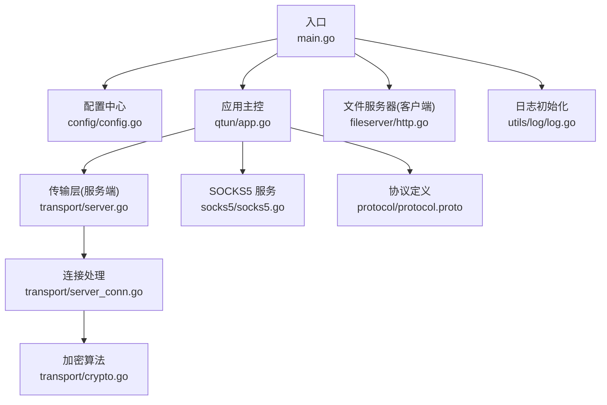
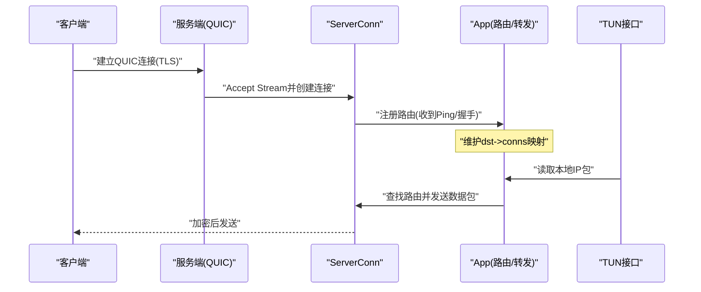
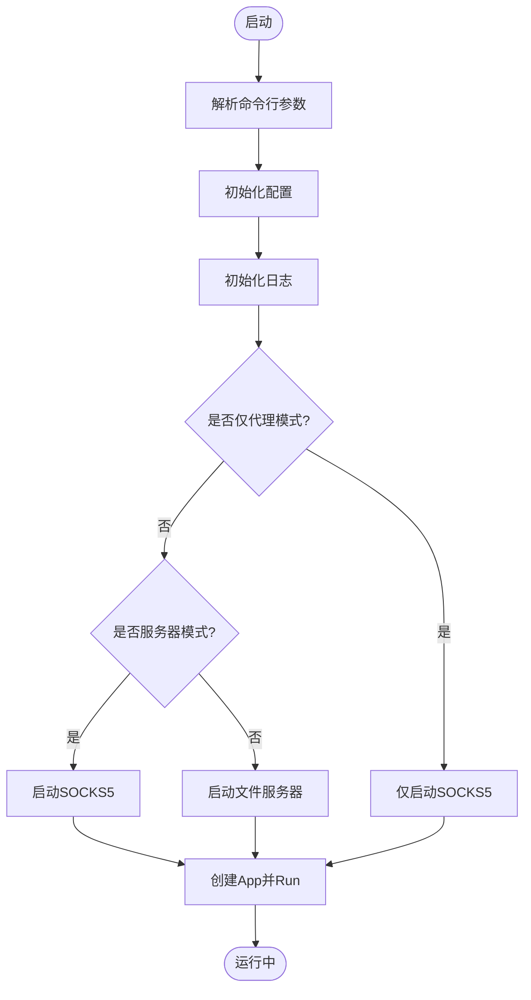
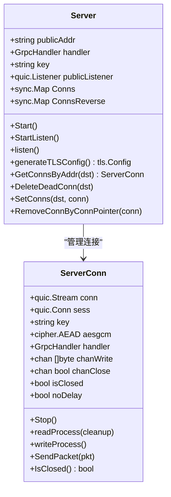
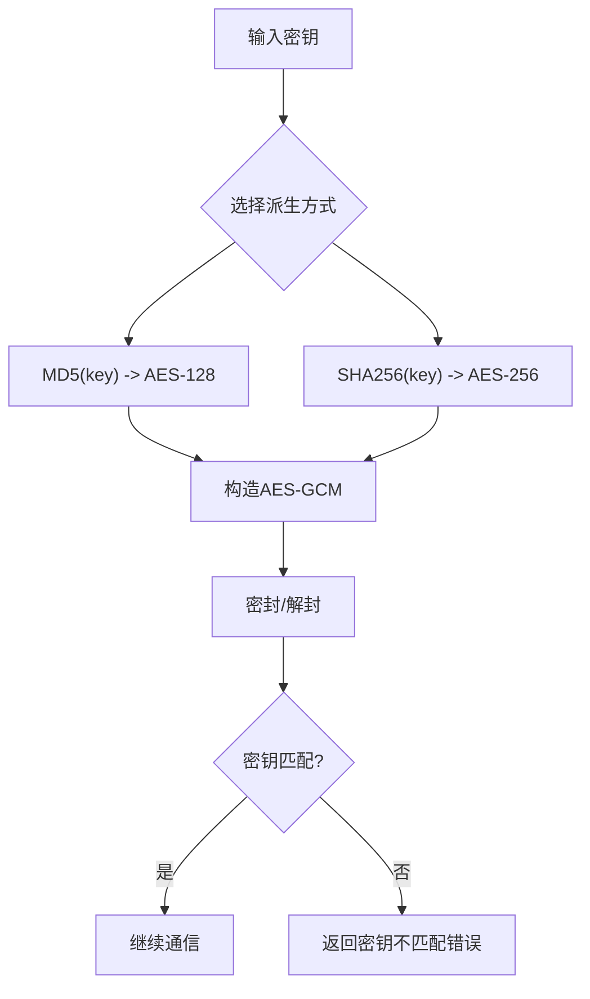
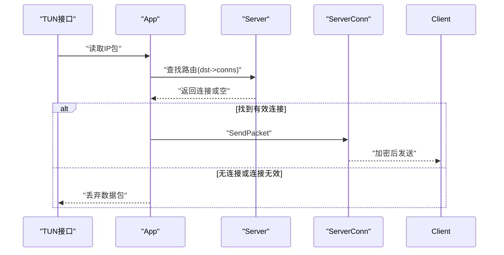
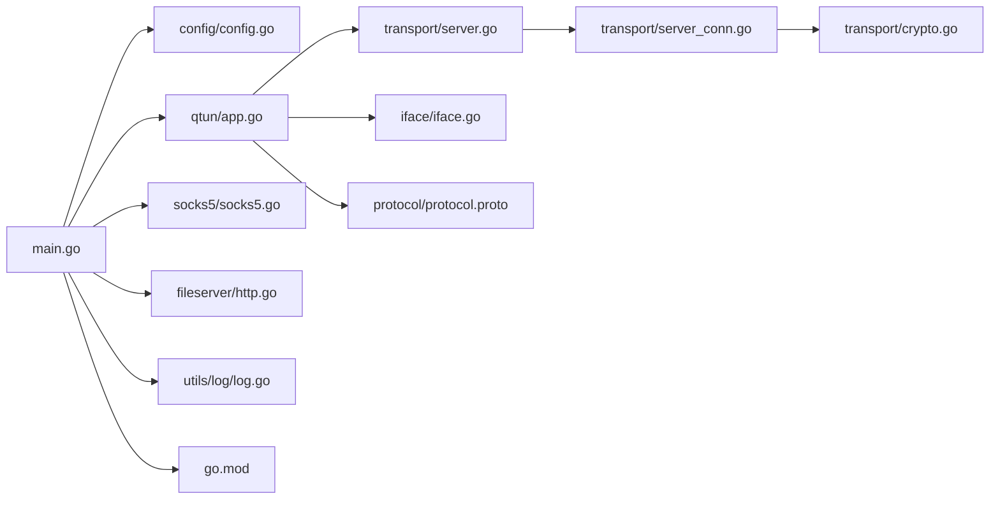

# 服务器部署

<cite>
**本文引用的文件**
- [main.go](file://main.go)
- [config/config.go](file://config/config.go)
- [qtun/app.go](file://qtun/app.go)
- [transport/server.go](file://transport/server.go)
- [transport/server_conn.go](file://transport/server_conn.go)
- [transport/crypto.go](file://transport/crypto.go)
- [socks5/socks5.go](file://socks5/socks5.go)
- [fileserver/http.go](file://fileserver/http.go)
- [utils/log/log.go](file://utils/log/log.go)
- [README.md](file://README.md)
- [PERFORMANCE_TEST_GUIDE.md](file://PERFORMANCE_TEST_GUIDE.md)
- [Makefile](file://Makefile)
- [go.mod](file://go.mod)
- [protocol/protocol.proto](file://protocol/protocol.proto)
</cite>

## 目录
1. [简介](#简介)
2. [项目结构](#项目结构)
3. [核心组件](#核心组件)
4. [架构总览](#架构总览)
5. [详细组件分析](#详细组件分析)
6. [依赖关系分析](#依赖关系分析)
7. [性能与调优](#性能与调优)
8. [安全配置](#安全配置)
9. [部署场景与示例](#部署场景与示例)
10. [监控、日志与故障排除](#监控日志与故障排除)
11. [容器化与自动化部署](#容器化与自动化部署)
12. [结论](#结论)

## 简介
本指南面向在生产环境中部署 Qtun 服务器的工程师，系统讲解服务器模式下的配置项、网络与安全策略、性能调优、监控与日志、以及多场景部署方案（单机、负载均衡、高可用）。文档基于仓库源码进行深入解析，确保读者能够准确理解各模块职责、数据流与控制流，并据此制定可落地的部署策略。

## 项目结构
- 入口与命令行参数解析：main.go 定义了命令行选项、初始化配置与应用生命周期。
- 配置中心：config/config.go 提供全局配置结构与初始化接口。
- 应用主控：qtun/app.go 负责 TUN 接口、客户端/服务端角色切换、工作线程调度与路由维护。
- 传输层（服务端）：transport/server.go 以 QUIC 为基础实现服务端监听、TLS 配置与连接管理；transport/server_conn.go 实现加密读写、消息编解码与发送队列。
- 加密算法：transport/crypto.go 提供基于密钥的 AEAD 构造。
- SOCKS5 代理：socks5/socks5.go 提供 SOCKS5 服务端能力（在服务器模式下默认启动）。
- 文件服务器：fileserver/http.go 提供静态文件 HTTP 服务（客户端模式下启动）。
- 日志：utils/log/log.go 提供日志级别初始化。
- 文档与构建：README.md、PERFORMANCE_TEST_GUIDE.md、Makefile、go.mod、protocol/protocol.proto。

图表来源
- [main.go](file://main.go#L70-L103)
- [config/config.go](file://config/config.go#L17-L23)
- [qtun/app.go](file://qtun/app.go#L37-L49)
- [transport/server.go](file://transport/server.go#L37-L52)
- [transport/server_conn.go](file://transport/server_conn.go#L39-L51)
- [transport/crypto.go](file://transport/crypto.go#L10-L26)
- [socks5/socks5.go](file://socks5/socks5.go#L55-L97)
- [fileserver/http.go](file://fileserver/http.go#L9-L16)
- [utils/log/log.go](file://utils/log/log.go#L10-L25)
- [protocol/protocol.proto](file://protocol/protocol.proto#L5-L22)

章节来源
- [main.go](file://main.go#L22-L103)
- [config/config.go](file://config/config.go#L3-L23)
- [README.md](file://README.md#L9-L26)

## 核心组件
- 命令行与运行时参数
  - 关键参数：密钥、监听地址、远端地址、IP 段、MTU、日志级别、SOCKS5 端口、文件服务器端口、是否仅代理模式、是否服务器模式、是否启用 Nagle。
  - 示例路径：[命令行参数定义与默认值](file://main.go#L53-L66)
- 配置中心
  - 全局配置结构体包含密钥、监听地址、远端地址、传输线程数、IP、MTU、服务器模式、Nagle 开关等。
  - 初始化与获取：[初始化与获取](file://config/config.go#L17-L23)
- 应用主控
  - 服务器模式：启动 QUIC 服务端、定时清理路由、启动 TUN 接口与多工作线程处理数据包。
  - 客户端模式：启动客户端、启动文件服务器、设置系统代理。
  - 示例路径：[Run 逻辑与模式分支](file://qtun/app.go#L37-L49)、[启动 TUN 与工作线程](file://qtun/app.go#L72-L97)
- 传输层（服务端）
  - QUIC 监听、TLS 配置、连接表管理、读写协程、连接生命周期回调。
  - 示例路径：[监听与 QUIC 配置](file://transport/server.go#L96-L103)、[TLS 证书生成](file://transport/server.go#L151-L173)
- 连接处理
  - 加密读写、消息编解码、发送通道、关闭流程。
  - 示例路径：[读写与加密](file://transport/server_conn.go#L117-L165)、[发送数据包](file://transport/server_conn.go#L235-L249)
- 加密算法
  - 基于密钥派生的 AEAD（AES-GCM），支持 128/256 位派生方式。
  - 示例路径：[密钥派生与 AEAD](file://transport/crypto.go#L10-L26)
- SOCKS5 服务
  - 支持认证、规则集、DNS 解析器、绑定 IP、日志与自定义拨号。
  - 示例路径：[服务端结构与构造](file://socks5/socks5.go#L55-L97)
- 文件服务器
  - 客户端模式下启动静态文件 HTTP 服务。
  - 示例路径：[启动文件服务器](file://fileserver/http.go#L9-L16)
- 日志
  - 控制台输出、Info/Debug 级别切换。
  - 示例路径：[日志初始化](file://utils/log/log.go#L10-L25)

章节来源
- [main.go](file://main.go#L22-L103)
- [config/config.go](file://config/config.go#L3-L23)
- [qtun/app.go](file://qtun/app.go#L37-L97)
- [transport/server.go](file://transport/server.go#L96-L173)
- [transport/server_conn.go](file://transport/server_conn.go#L117-L249)
- [transport/crypto.go](file://transport/crypto.go#L10-L26)
- [socks5/socks5.go](file://socks5/socks5.go#L55-L97)
- [fileserver/http.go](file://fileserver/http.go#L9-L16)
- [utils/log/log.go](file://utils/log/log.go#L10-L25)

## 架构总览
服务器模式下，Qtun 作为服务端：
- 监听指定地址与端口（默认 QUIC），建立 TLS 通道；
- 接收来自客户端的数据包，按目的 IP 查找路由并转发；
- 通过 TUN 接口读取本地 IP 包，按路由转发到对应客户端；
- 默认同时启动 SOCKS5 代理服务，便于调试与辅助场景。

图表来源
- [transport/server.go](file://transport/server.go#L112-L148)
- [transport/server_conn.go](file://transport/server_conn.go#L117-L165)
- [qtun/app.go](file://qtun/app.go#L169-L207)

章节来源
- [transport/server.go](file://transport/server.go#L48-L148)
- [qtun/app.go](file://qtun/app.go#L37-L97)

## 详细组件分析

### 服务器模式配置与启动流程
- 参数要点
  - 密钥：用于连接加密与匹配，影响连接读写加密与错误处理。
  - 监听地址：服务端监听地址与端口，QUIC 监听。
  - 服务器模式开关：决定是否启动服务端与 SOCKS5。
  - MTU/IP：TUN 接口 MTU 与子网段。
  - Nagle：Nagle 开关（NoDelay）。
- 启动流程
  - 初始化配置与日志；
  - 若仅代理模式：仅启动 SOCKS5；
  - 服务器模式：启动 SOCKS5；
  - 客户端模式：启动文件服务器；
  - 创建 App 并 Run，按模式启动服务端或客户端。

图表来源
- [main.go](file://main.go#L75-L103)
- [utils/log/log.go](file://utils/log/log.go#L10-L25)

章节来源
- [main.go](file://main.go#L75-L103)
- [utils/log/log.go](file://utils/log/log.go#L10-L25)

### 传输层（服务端）与连接管理
- QUIC 监听与 TLS
  - QUIC 配置包含最大入站流数、接收窗口、连接窗口、保活周期与 DATAGRAM 支持。
  - TLS 证书由程序动态生成，使用 2048 位 RSA 私钥与 DER/CRT 片段组合。
- 连接表与路由
  - 使用并发安全的 map 存储连接与反向映射，支持按地址快速查找与删除死连接。
  - 定时清理任务移除断开或无效连接，避免内存泄漏与路由污染。
- 读写协程
  - 读协程负责解密与分发到上层处理；
  - 写协程从通道取数据，统一序列化与加密后写出。

图表来源
- [transport/server.go](file://transport/server.go#L23-L52)
- [transport/server.go](file://transport/server.go#L151-L173)
- [transport/server_conn.go](file://transport/server_conn.go#L24-L51)
- [transport/server_conn.go](file://transport/server_conn.go#L251-L290)

章节来源
- [transport/server.go](file://transport/server.go#L96-L173)
- [transport/server_conn.go](file://transport/server_conn.go#L117-L249)

### 加密与密钥管理
- 密钥派生
  - 128 位：MD5(key) 作为 AES 密钥；
  - 256 位：SHA256(key) 作为 AES 密钥；
  - 采用 AES-GCM 进行密封与解封，附带认证标签。
- 错误处理
  - 当密文与密钥不匹配时返回特定错误，触发连接清理与关闭。

图表来源
- [transport/crypto.go](file://transport/crypto.go#L10-L26)
- [transport/server_conn.go](file://transport/server_conn.go#L117-L165)

章节来源
- [transport/crypto.go](file://transport/crypto.go#L10-L26)
- [transport/server_conn.go](file://transport/server_conn.go#L117-L165)

### TUN 接口与数据包处理
- TUN 接口
  - 创建 TUN 设备、配置 IP 与 MTU、在 macOS 下添加系统路由。
- 工作线程
  - 根据 CPU 核心数动态计算工作线程数量（最小 4，最大 32），提升 I/O 并行度。
- 路由与转发
  - 服务器模式下按目的 IP 查找连接并发送；客户端模式下直接转发给上游。

图表来源
- [qtun/app.go](file://qtun/app.go#L99-L167)
- [transport/server.go](file://transport/server.go#L175-L210)

章节来源
- [qtun/app.go](file://qtun/app.go#L72-L167)
- [iface/iface.go](file://iface/iface.go#L31-L74)

## 依赖关系分析
- 外部依赖
  - QUIC：传输层基础；
  - water：TUN 接口；
  - zerolog：日志；
  - gcli：命令行框架；
  - statsviz/pprof：性能监控；
  - protobuf：消息编解码。
- 内部耦合
  - main.go 依赖 config、qtun、socks5、fileserver、utils/log；
  - qtun/app.go 依赖 config、transport、iface、protocol；
  - transport/server.go 依赖 config、quic、zerolog；
  - transport/server_conn.go 依赖 quic、proto、utils、zerolog。

图表来源
- [go.mod](file://go.mod#L5-L14)
- [main.go](file://main.go#L3-L20)
- [qtun/app.go](file://qtun/app.go#L3-L17)

章节来源
- [go.mod](file://go.mod#L5-L14)
- [main.go](file://main.go#L3-L20)

## 性能与调优
- 运行时参数
  - 传输线程数（仅客户端）：并发发送能力；
  - MTU：影响单包大小与链路效率；
  - Nagle：NoDelay 可减少小包延迟但可能增加 CPU。
- 代码级优化
  - 动态工作线程：CPU×2（4~32），提升 I/O 并行；
  - QUIC 配置：增大窗口与流数，提高吞吐；
  - 连接表：使用并发安全 map，减少锁竞争；
  - 对象池：复用 protobuf、缓冲区与 nonce，降低 GC 压力。
- 监控与分析
  - pprof 与 statsviz：CPU/内存/Goroutine 分析；
  - iperf3/ping：吞吐与延迟测试；
  - Makefile 提供多平台编译。

章节来源
- [qtun/app.go](file://qtun/app.go#L79-L97)
- [transport/server.go](file://transport/server.go#L96-L103)
- [PERFORMANCE_TEST_GUIDE.md](file://PERFORMANCE_TEST_GUIDE.md#L17-L109)
- [Makefile](file://Makefile#L3-L22)

## 安全配置
- 密钥管理
  - 通过命令行参数传入密钥，用于 AES-GCM 加密与解密；
  - 建议在生产环境使用强密钥并妥善保管，避免泄露。
- 网络安全
  - 服务端默认启用 TLS（动态生成证书），建议结合防火墙与网络 ACL 限制访问源；
  - QUIC 协议具备抗拥塞特性，但仍需配合网络策略与 WAF。
- 访问控制
  - SOCKS5 服务端支持多种认证与规则集，可在服务器模式下启用；
  - 如需更强控制，建议在前置网关或反向代理层加入鉴权与限流。

章节来源
- [transport/server.go](file://transport/server.go#L151-L173)
- [transport/crypto.go](file://transport/crypto.go#L10-L26)
- [socks5/socks5.go](file://socks5/socks5.go#L18-L51)

## 部署场景与示例

### 单机部署（服务器模式）
- 步骤
  - 以服务器模式启动，设置监听地址与端口；
  - 配置密钥、IP 段与 MTU；
  - 启动后默认开启 SOCKS5 代理，便于调试。
- 示例路径
  - [服务器示例命令](file://README.md#L16-L19)

章节来源
- [README.md](file://README.md#L13-L26)

### 客户端接入
- 步骤
  - 设置远端地址为服务器监听地址；
  - 配置密钥、IP 段与 MTU；
  - 启动后自动配置系统代理 PAC。
- 示例路径
  - [客户端示例命令](file://README.md#L23-L26)

章节来源
- [README.md](file://README.md#L21-L26)
- [qtun/app.go](file://qtun/app.go#L250-L270)

### 负载均衡与高可用
- 说明
  - 服务端基于 QUIC，可通过多实例横向扩展；
  - 客户端通过路由表选择连接，建议在前置 L4/L7 负载均衡器后挂载多实例；
  - 保持密钥一致，确保连接加密一致性。
- 注意
  - 路由清理任务会定期移除断连，有助于在实例切换时快速收敛。

章节来源
- [transport/server.go](file://transport/server.go#L51-L76)
- [qtun/app.go](file://qtun/app.go#L51-L70)

## 监控、日志与故障排除
- 日志
  - 支持 Info/Debug 级别，控制台输出；
  - 示例路径：[日志初始化](file://utils/log/log.go#L10-L25)
- 性能监控
  - pprof 与 statsviz：CPU/内存/Goroutine 可视化；
  - 示例路径：[性能测试指南](file://PERFORMANCE_TEST_GUIDE.md#L17-L24)
- 故障排除
  - 检查 QUIC 连接参数与窗口大小；
  - 核对密钥一致性与加密错误；
  - 观察路由表清理日志与连接状态。

章节来源
- [utils/log/log.go](file://utils/log/log.go#L10-L25)
- [PERFORMANCE_TEST_GUIDE.md](file://PERFORMANCE_TEST_GUIDE.md#L286-L323)

## 容器化与自动化部署
- Docker 容器化
  - 建议基于官方 Go 镜像构建二进制，再复制到精简镜像中运行；
  - 暴露监听端口与 SOCKS5 端口，挂载必要的设备与权限（TUN）；
  - 使用环境变量注入密钥与网络参数。
- 自动化部署
  - Makefile 提供多平台编译目标；
  - 结合 CI/CD 在流水线中完成构建、测试与打包。
- 示例路径
  - [多平台编译](file://Makefile#L3-L22)

章节来源
- [Makefile](file://Makefile#L3-L22)

## 结论
Qtun 的服务器模式以 QUIC 为核心，结合 TUN 接口与路由机制，提供稳定高效的隧道能力。通过合理的密钥管理、网络与安全策略、性能参数调优与完善的监控体系，可在单机、负载均衡与高可用等多种场景下可靠运行。建议在生产部署前完成充分的性能与安全评估，并持续监控运行状态以保障稳定性。