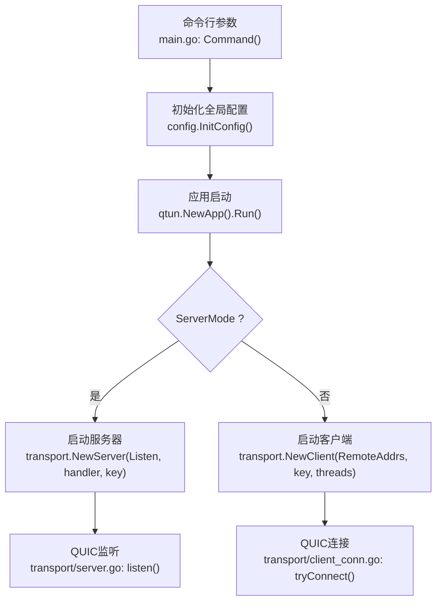
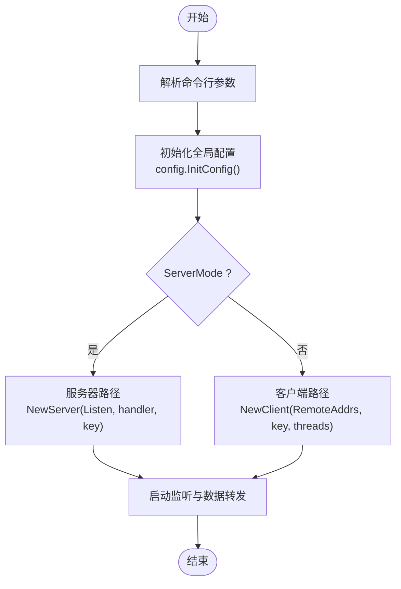
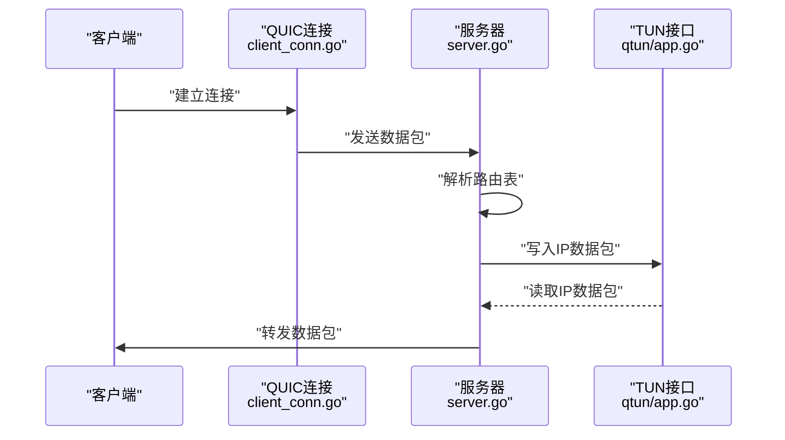

# 服务器配置

<cite>
**本文引用的文件**
- [main.go](file://main.go)
- [config/config.go](file://config/config.go)
- [qtun/app.go](file://qtun/app.go)
- [transport/server.go](file://transport/server.go)
- [transport/client.go](file://transport/client.go)
- [transport/server_conn.go](file://transport/server_conn.go)
- [transport/client_conn.go](file://transport/client_conn.go)
- [fileserver/http.go](file://fileserver/http.go)
- [README.md](file://README.md)
</cite>

## 目录
1. [简介](#简介)
2. [项目结构与配置入口](#项目结构与配置入口)
3. [核心配置项与默认值](#核心配置项与默认值)
4. [服务器模式配置详解](#服务器模式配置详解)
5. [网络接口与监听地址](#网络接口与监听地址)
6. [配置优先级与加载流程](#配置优先级与加载流程)
7. [不同网络环境下的配置示例](#不同网络环境下的配置示例)
8. [配置验证与错误处理](#配置验证与错误处理)
9. [架构概览与数据流](#架构概览与数据流)
10. [性能与优化建议](#性能与优化建议)
11. [故障排查指南](#故障排查指南)
12. [结论](#结论)

## 简介
本文件面向Qtun服务器配置，系统性说明服务器模式下的配置选项、监听地址与端口设置、网络接口绑定方式，以及关键参数（如publicAddr、key等）的含义与默认值。同时提供内网部署、公网部署与容器化部署的实践示例，解释配置文件格式与命令行参数的优先级关系，并给出配置验证与错误处理机制的说明，帮助用户在不同网络环境下正确部署与运行Qtun服务器。

## 项目结构与配置入口
Qtun通过命令行参数初始化全局配置，随后在应用运行时读取该配置进行服务器或客户端模式的启动。核心流程如下：
- 命令行解析：定义并注册所有可配置参数
- 初始化配置：将命令行参数写入全局配置实例
- 应用启动：根据ServerMode选择服务器或客户端路径
- 服务器启动：基于Listen参数启动QUIC监听，等待客户端连接
- 客户端启动：基于RemoteAddrs建立到服务器的连接

图表来源
- [main.go](file://main.go#L42-L103)
- [config/config.go](file://config/config.go#L17-L23)
- [qtun/app.go](file://qtun/app.go#L37-L49)
- [transport/server.go](file://transport/server.go#L37-L149)
- [transport/client_conn.go](file://transport/client_conn.go#L69-L117)

章节来源
- [main.go](file://main.go#L42-L103)
- [config/config.go](file://config/config.go#L17-L23)
- [qtun/app.go](file://qtun/app.go#L37-L49)

## 核心配置项与默认值
以下为服务器模式下与网络配置直接相关的核心参数及其默认值（来源于命令行定义与配置结构体）：

- key
  - 含义：加密密钥，用于对传输数据进行加解密
  - 默认值：hello-world
  - 作用范围：服务器与客户端均需一致
- listen
  - 含义：服务器监听地址与端口
  - 默认值：0.0.0.0:8080
  - 作用范围：仅服务器模式有效
- ip
  - 含义：虚拟IP段（CIDR），用于TUN接口分配
  - 默认值：10.237.0.1/16
  - 作用范围：服务器与客户端均需一致
- mtu
  - 含义：最大传输单元大小
  - 默认值：1500
  - 作用范围：TUN接口配置
- transport_threads
  - 含义：客户端并发线程数（仅客户端）
  - 默认值：1
- server_mode
  - 含义：是否启用服务器模式
  - 默认值：false
- nodelay
  - 含义：是否禁用Nagle算法（TCP/QUIC相关）
  - 默认值：false
- socks5_port
  - 含义：SOCKS5代理端口（仅服务器模式下启动）
  - 默认值：2080
- file_svr_port
  - 含义：HTTP文件服务器端口（仅客户端模式下启动）
  - 默认值：6061
- file_dir
  - 含义：HTTP文件服务器目录
  - 默认值：../static

章节来源
- [main.go](file://main.go#L22-L66)
- [config/config.go](file://config/config.go#L3-L13)

## 服务器模式配置详解
服务器模式通过命令行参数开启，主要涉及以下配置点：
- 监听地址与端口：listen
- 加密密钥：key
- 虚拟IP段：ip
- MTU：mtu
- NoDelay：nodelay
- SOCKS5端口：socks5_port（服务器模式下启动）

服务器启动流程要点：
- 当ServerMode为true时，应用创建并启动服务器实例，监听指定地址
- 服务器内部使用QUIC协议监听，接受来自客户端的连接
- 服务器维护连接表与路由表，实现数据包转发

章节来源
- [qtun/app.go](file://qtun/app.go#L37-L49)
- [transport/server.go](file://transport/server.go#L37-L149)

## 网络接口与监听地址
- 监听地址格式
  - listen参数采用“主机:端口”的形式，例如0.0.0.0:8080
  - 服务器将在此地址上启动QUIC监听
- 绑定策略
  - 0.0.0.0表示绑定到所有网络接口
  - 若需限制到特定网卡，可使用具体IP地址（如192.168.x.x）
- 端口占用
  - 监听端口需确保未被其他进程占用
  - 需要管理员权限以绑定1024以下端口
- QUIC与TLS
  - 服务器使用QUIC协议监听，并生成自签名证书
  - 客户端通过TLS握手建立连接

章节来源
- [transport/server.go](file://transport/server.go#L91-L149)
- [transport/server_conn.go](file://transport/server_conn.go#L117-L127)

## 配置优先级与加载流程
- 命令行参数优先级最高
  - 在命令行中显式提供的参数会覆盖默认值
- 全局配置实例
  - 初始化时将命令行参数写入全局配置实例
  - 应用运行期间各模块通过GetInstance()读取当前配置
- 模式分支
  - ServerMode=true：进入服务器路径，忽略RemoteAddrs
  - ServerMode=false：进入客户端路径，忽略Listen

图表来源
- [main.go](file://main.go#L75-L103)
- [config/config.go](file://config/config.go#L17-L23)
- [qtun/app.go](file://qtun/app.go#L37-L49)

章节来源
- [main.go](file://main.go#L75-L103)
- [config/config.go](file://config/config.go#L17-L23)

## 不同网络环境下的配置示例
以下示例展示在不同网络环境中的典型配置思路（请根据实际网络调整参数）：

- 内网部署（仅本地访问）
  - 监听地址：127.0.0.1:8080（仅本机可访问）
  - 加密密钥：自定义强密钥
  - 虚拟IP段：10.237.0.0/24
  - MTU：1500
  - 启动命令示例（服务器模式）：
    - sudo ./qtun qt --key "<你的密钥>" --listen "127.0.0.1:8080" --ip "10.237.0.0/24" --server_mode
- 公网部署（对外提供服务）
  - 监听地址：0.0.0.0:8080（对外可访问）
  - 加密密钥：自定义强密钥
  - 虚拟IP段：10.237.0.0/24
  - MTU：1500
  - 防火墙：开放8080端口
  - 启动命令示例（服务器模式）：
    - sudo ./qtun qt --key "<你的密钥>" --listen "0.0.0.0:8080" --ip "10.237.0.0/24" --server_mode
- 容器化部署（Docker/Kubernetes）
  - 监听地址：0.0.0.0:8080（容器内暴露端口）
  - 加密密钥：通过环境变量注入
  - 虚拟IP段：10.237.0.0/24
  - MTU：1500
  - Docker示例（映射宿主8080端口到容器8080）：
    - docker run -d --name qtun-server --privileged -p 8080:8080 qtun:latest qt --key "<你的密钥>" --listen "0.0.0.0:8080" --ip "10.237.0.0/24" --server_mode
  - Kubernetes示例（Service暴露8080端口）：
    - 创建Service类型为ClusterIP或LoadBalancer，端口映射8080
    - Pod中以相同参数启动服务器模式

说明
- 上述示例中的“--key”、“--listen”、“--ip”等均为命令行参数，不直接展示具体值
- 实际部署时请确保密钥一致且安全存储

章节来源
- [README.md](file://README.md#L13-L26)
- [main.go](file://main.go#L53-L66)

## 配置验证与错误处理
- 参数校验
  - listen必须为有效的“主机:端口”格式
  - ip必须为合法的CIDR格式
  - mtu需为合理数值（通常1500）
  - key需保持服务器与客户端一致
- 错误处理
  - 监听失败：记录错误日志并持续重试
  - 连接失败：客户端多次重试后记录警告
  - 解密失败：当密钥不匹配时返回错误并断开连接
  - 日志级别：可通过log_level控制输出详细程度
- 建议
  - 使用强密钥并妥善保管
  - 在公网部署时确保防火墙策略与证书配置正确
  - 定期检查日志以发现潜在问题

章节来源
- [transport/server.go](file://transport/server.go#L91-L149)
- [transport/server_conn.go](file://transport/server_conn.go#L98-L107)
- [transport/client_conn.go](file://transport/client_conn.go#L142-L147)

## 架构概览与数据流
服务器模式的数据流如下：
- 客户端通过QUIC连接到服务器
- 服务器接收数据包并根据路由表转发至TUN接口
- TUN接口读取IP数据包并通过QUIC发送给对应客户端
- 服务器维护连接表与路由表，清理无效连接

图表来源
- [transport/client_conn.go](file://transport/client_conn.go#L130-L151)
- [transport/server.go](file://transport/server.go#L112-L148)
- [qtun/app.go](file://qtun/app.go#L99-L167)

章节来源
- [qtun/app.go](file://qtun/app.go#L99-L167)
- [transport/server.go](file://transport/server.go#L112-L148)

## 性能与优化建议
- 并发线程数：客户端可通过transport_threads增加并发连接数
- NoDelay：根据网络情况决定是否启用NoDelay
- MTU：根据网络环境调整MTU以减少分片
- QUIC参数：服务器与客户端已内置优化的QUIC配置，可根据需求进一步调优
- 路由清理：服务器定期清理无效连接，降低内存占用

章节来源
- [transport/client.go](file://transport/client.go#L41-L83)
- [transport/server.go](file://transport/server.go#L97-L103)
- [qtun/app.go](file://qtun/app.go#L51-L70)

## 故障排查指南
- 无法监听端口
  - 检查端口是否被占用
  - 确认是否具有管理员权限
  - 查看日志中的监听错误信息
- 连接失败
  - 确认服务器地址与端口正确
  - 检查防火墙策略
  - 对比客户端与服务器的key是否一致
- 数据包无法转发
  - 检查路由表与连接状态
  - 确认虚拟IP段配置一致
  - 查看TUN接口状态与MTU设置
- 日志查看
  - 使用log_level调整日志详细度
  - 关注服务器与客户端的关键错误日志

章节来源
- [transport/server.go](file://transport/server.go#L91-L149)
- [transport/server_conn.go](file://transport/server_conn.go#L98-L107)
- [transport/client_conn.go](file://transport/client_conn.go#L142-L147)

## 结论
Qtun的服务器配置以命令行参数为核心入口，通过全局配置实例在运行时生效。服务器模式的关键在于正确设置监听地址与端口、保持密钥一致、合理规划虚拟IP段与MTU，并结合NoDelay等参数优化网络性能。通过本文档提供的配置示例与排障建议，可在内网、公网与容器化等多种环境中稳定部署Qtun服务器。