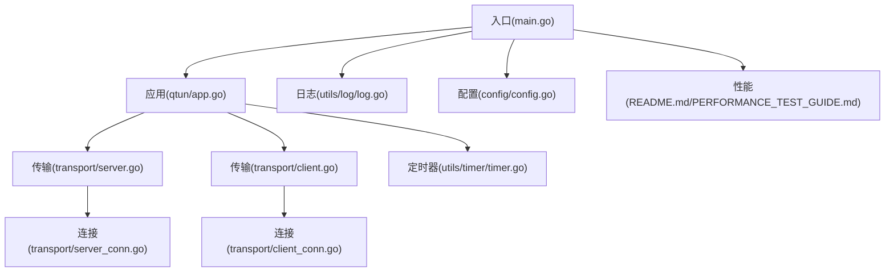
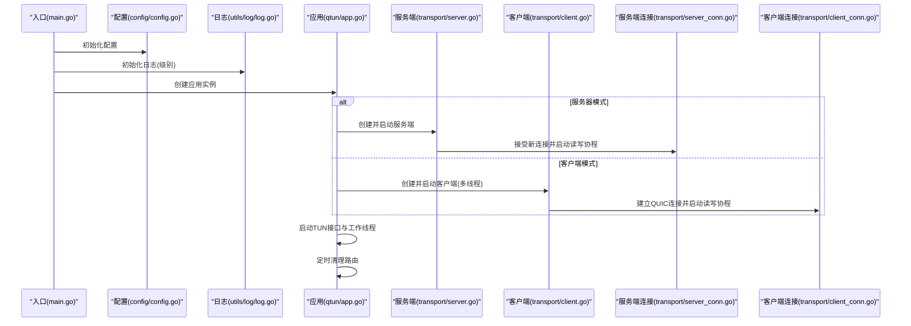
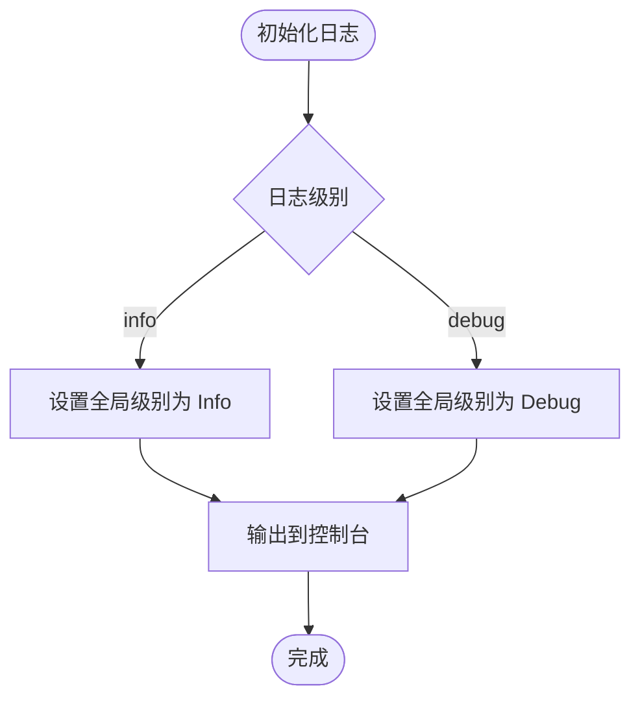
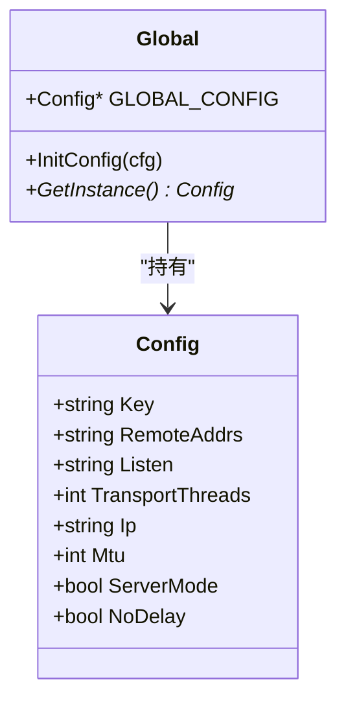
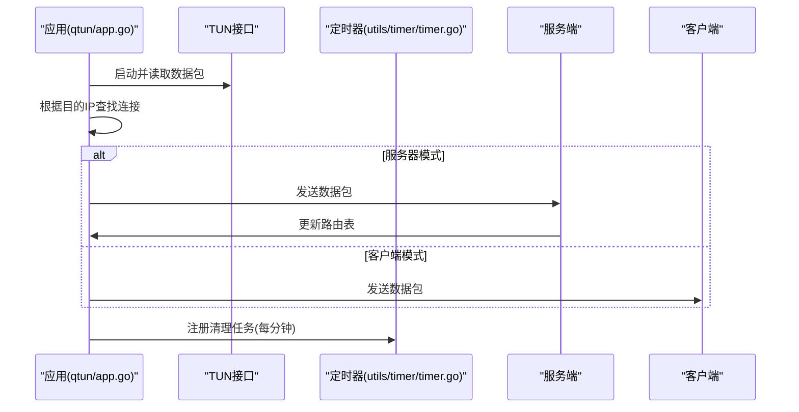
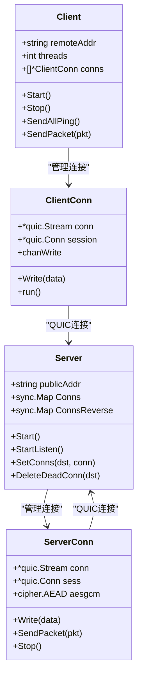
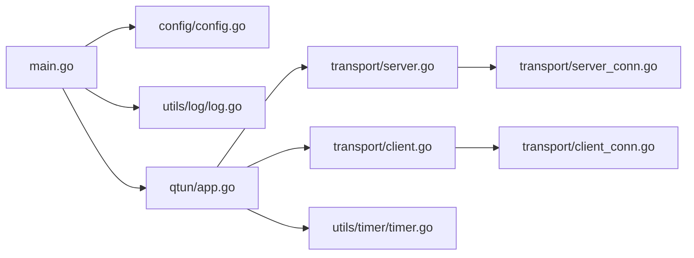
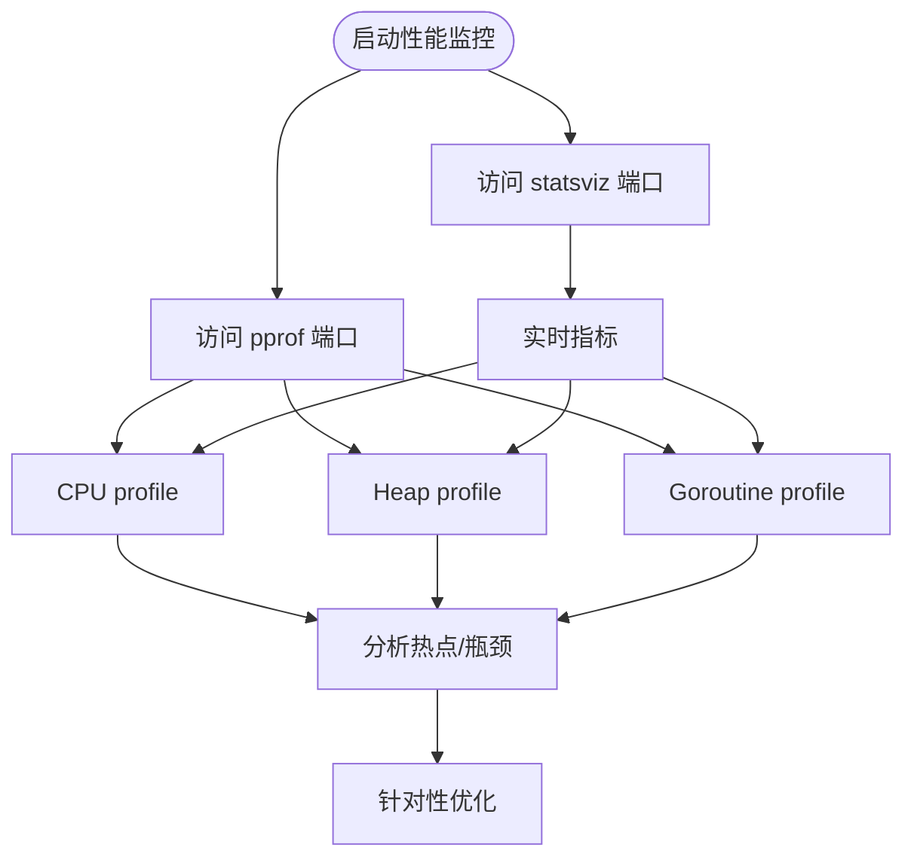
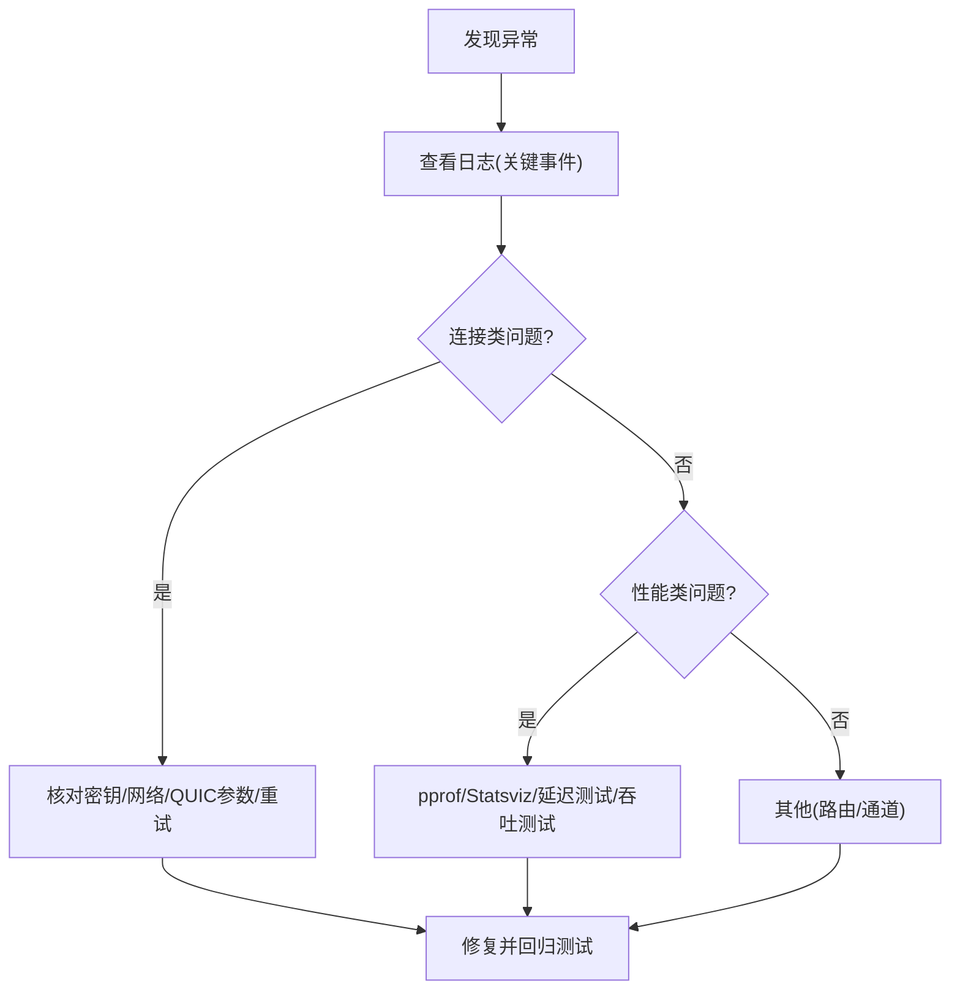

# 监控与日志

<cite>
**本文引用的文件**
- [main.go](file://main.go)
- [README.md](file://README.md)
- [utils/log/log.go](file://utils/log/log.go)
- [config/config.go](file://config/config.go)
- [qtun/app.go](file://qtun/app.go)
- [transport/server.go](file://transport/server.go)
- [transport/client.go](file://transport/client.go)
- [transport/server_conn.go](file://transport/server_conn.go)
- [transport/client_conn.go](file://transport/client_conn.go)
- [utils/timer/timer.go](file://utils/timer/timer.go)
- [PERFORMANCE_TEST_GUIDE.md](file://PERFORMANCE_TEST_GUIDE.md)
</cite>

## 目录
1. [简介](#简介)
2. [项目结构](#项目结构)
3. [核心组件](#核心组件)
4. [架构总览](#架构总览)
5. [组件详解](#组件详解)
6. [依赖关系分析](#依赖关系分析)
7. [性能与监控指标](#性能与监控指标)
8. [故障诊断与排错](#故障诊断与排错)
9. [结论](#结论)

## 简介
本指南围绕 Qtun 的服务器监控与日志管理展开，覆盖以下主题：
- 日志系统配置与输出格式：日志级别、输出位置、可扩展性
- 运行状态监控指标：连接数、带宽使用、延迟统计
- 告警机制与通知：当前实现与建议
- 性能指标采集与分析：pprof、statsviz、自定义指标
- 故障诊断技巧：日志分析、常见问题定位

## 项目结构
- 入口程序负责解析命令行参数、初始化配置与日志，并启动应用与辅助服务
- 应用层封装了 TUN 接口读写、路由清理、QUIC 传输等核心逻辑
- 传输层基于 QUIC 实现客户端与服务端连接、读写与加密
- 工具层提供定时器与日志基础能力
- README 提供运行示例与帮助信息
- 性能测试指南提供 pprof、statsviz、延迟与吞吐测试方法

**图示来源**
- [main.go](file://main.go#L1-L136)
- [qtun/app.go](file://qtun/app.go#L1-L271)
- [utils/log/log.go](file://utils/log/log.go#L1-L26)
- [config/config.go](file://config/config.go#L1-L24)
- [transport/server.go](file://transport/server.go#L1-L219)
- [transport/client.go](file://transport/client.go#L1-L223)
- [transport/server_conn.go](file://transport/server_conn.go#L1-L295)
- [transport/client_conn.go](file://transport/client_conn.go#L1-L408)
- [utils/timer/timer.go](file://utils/timer/timer.go#L1-L55)
- [README.md](file://README.md#L1-L99)
- [PERFORMANCE_TEST_GUIDE.md](file://PERFORMANCE_TEST_GUIDE.md#L1-L323)

**章节来源**
- [main.go](file://main.go#L1-L136)
- [README.md](file://README.md#L1-L99)

## 核心组件
- 日志模块：基于 zerolog，控制台输出，支持 info/debug 两级日志级别
- 配置模块：集中保存运行参数（监听地址、远端地址、MTU、线程数、模式等）
- 应用模块：封装 TUN 接口、路由表、工作线程、连接生命周期
- 传输模块：基于 QUIC 的客户端/服务端，含连接管理、加解密、通道写入
- 定时器模块：周期任务调度，用于路由清理等后台维护

**章节来源**
- [utils/log/log.go](file://utils/log/log.go#L1-L26)
- [config/config.go](file://config/config.go#L1-L24)
- [qtun/app.go](file://qtun/app.go#L1-L271)
- [transport/server.go](file://transport/server.go#L1-L219)
- [transport/client.go](file://transport/client.go#L1-L223)
- [utils/timer/timer.go](file://utils/timer/timer.go#L1-L55)

## 架构总览
下图展示从入口到应用、再到传输层的整体交互流程。

**图示来源**
- [main.go](file://main.go#L70-L103)
- [config/config.go](file://config/config.go#L17-L23)
- [utils/log/log.go](file://utils/log/log.go#L10-L25)
- [qtun/app.go](file://qtun/app.go#L37-L97)
- [transport/server.go](file://transport/server.go#L48-L149)
- [transport/client.go](file://transport/client.go#L41-L83)
- [transport/server_conn.go](file://transport/server_conn.go#L58-L115)
- [transport/client_conn.go](file://transport/client_conn.go#L153-L188)

## 组件详解

### 日志系统
- 初始化与级别
  - 控制台输出，支持 info/debug 两级
  - 默认 info；设置为 debug 时输出更详细信息
- 输出位置
  - 当前为标准错误输出，便于与业务输出分离
- 可扩展性
  - 可替换为文件输出或结构化 JSON 输出
  - 可增加字段（如模块名、进程 ID、时间戳格式）

**图示来源**
- [utils/log/log.go](file://utils/log/log.go#L10-L25)

**章节来源**
- [utils/log/log.go](file://utils/log/log.go#L1-L26)
- [main.go](file://main.go#L86-L86)

### 配置系统
- 关键参数
  - 密钥、监听地址、远端地址、IP 段、MTU、线程数、模式、NoDelay
- 生命周期
  - 启动时初始化，运行期由各模块读取

**图示来源**
- [config/config.go](file://config/config.go#L3-L23)

**章节来源**
- [config/config.go](file://config/config.go#L1-L24)
- [main.go](file://main.go#L75-L84)

### 应用层（TUN 与路由）
- 启动流程
  - 服务器模式：创建并启动服务端，注册清理任务
  - 客户端模式：创建并启动客户端，设置系统代理
- TUN 接口
  - 动态工作线程数量（CPU 核心数×2，范围 4~32），提升 I/O 并行
  - 读取 TUN 包，按路由表选择连接发送
- 路由管理
  - 定时清理无效连接，避免僵尸连接占用资源

**图示来源**
- [qtun/app.go](file://qtun/app.go#L37-L97)
- [qtun/app.go](file://qtun/app.go#L51-L70)
- [utils/timer/timer.go](file://utils/timer/timer.go#L21-L47)

**章节来源**
- [qtun/app.go](file://qtun/app.go#L1-L271)
- [utils/timer/timer.go](file://utils/timer/timer.go#L1-L55)

### 传输层（QUIC 客户端/服务端）
- 服务端
  - 监听指定地址，接受 QUIC 连接，启动读写协程
  - 连接管理：按目的地址映射连接，支持删除死连接
- 客户端
  - 多线程连接，自动重连，定期发送 Ping
  - 写入通道缓冲，避免阻塞

**图示来源**
- [transport/server.go](file://transport/server.go#L23-L219)
- [transport/client.go](file://transport/client.go#L20-L223)
- [transport/server_conn.go](file://transport/server_conn.go#L24-L295)
- [transport/client_conn.go](file://transport/client_conn.go#L24-L408)

**章节来源**
- [transport/server.go](file://transport/server.go#L1-L219)
- [transport/client.go](file://transport/client.go#L1-L223)
- [transport/server_conn.go](file://transport/server_conn.go#L1-L295)
- [transport/client_conn.go](file://transport/client_conn.go#L1-L408)

## 依赖关系分析
- 入口依赖配置、日志、应用与传输模块
- 应用依赖配置、传输、定时器与 TUN 接口
- 传输层相互独立，通过接口回调与应用交互
- 日志统一由入口初始化，贯穿全链路

**图示来源**
- [main.go](file://main.go#L1-L136)
- [config/config.go](file://config/config.go#L1-L24)
- [utils/log/log.go](file://utils/log/log.go#L1-L26)
- [qtun/app.go](file://qtun/app.go#L1-L271)
- [transport/server.go](file://transport/server.go#L1-L219)
- [transport/client.go](file://transport/client.go#L1-L223)
- [transport/server_conn.go](file://transport/server_conn.go#L1-L295)
- [transport/client_conn.go](file://transport/client_conn.go#L1-L408)
- [utils/timer/timer.go](file://utils/timer/timer.go#L1-L55)

**章节来源**
- [main.go](file://main.go#L1-L136)
- [qtun/app.go](file://qtun/app.go#L1-L271)

## 性能与监控指标
- 内置监控端点
  - pprof：CPU、内存、Goroutine 分析
  - statsviz：实时可视化（CPU、内存、Goroutine、GC 等）
- 性能测试场景
  - 吞吐量：iperf3
  - 延迟：ping
  - 并发：ab/wrk
- 指标采集与分析
  - 使用性能测试指南提供的脚本与命令进行自动化采集
  - 结合日志中的工作线程数量、连接数、丢包/重试等信息进行综合分析

**图示来源**
- [PERFORMANCE_TEST_GUIDE.md](file://PERFORMANCE_TEST_GUIDE.md#L17-L24)
- [PERFORMANCE_TEST_GUIDE.md](file://PERFORMANCE_TEST_GUIDE.md#L96-L134)

**章节来源**
- [PERFORMANCE_TEST_GUIDE.md](file://PERFORMANCE_TEST_GUIDE.md#L1-L323)
- [README.md](file://README.md#L13-L26)

## 故障诊断与排错
- 日志分析
  - 关注连接建立/断开、读写失败、加密不匹配、路由更新、丢包/重试等关键事件
  - 利用 info/debug 级别区分常规与调试信息
- 常见问题定位
  - 无法建立连接：检查密钥、网络连通性、QUIC 参数、重试逻辑
  - 丢包/延迟高：检查工作线程数量、通道缓冲、加密开销、网络质量
  - 路由异常：确认定时清理任务是否正常执行，连接是否被误删
- 工具与命令
  - pprof、statsviz、ping、iperf3、htop/top
  - 性能测试指南中的基准脚本与验证清单

**图示来源**
- [transport/client_conn.go](file://transport/client_conn.go#L173-L188)
- [transport/server_conn.go](file://transport/server_conn.go#L98-L115)
- [qtun/app.go](file://qtun/app.go#L51-L70)
- [PERFORMANCE_TEST_GUIDE.md](file://PERFORMANCE_TEST_GUIDE.md#L286-L323)

**章节来源**
- [transport/client_conn.go](file://transport/client_conn.go#L1-L408)
- [transport/server_conn.go](file://transport/server_conn.go#L1-L295)
- [qtun/app.go](file://qtun/app.go#L1-L271)
- [PERFORMANCE_TEST_GUIDE.md](file://PERFORMANCE_TEST_GUIDE.md#L286-L323)

## 结论
- 日志系统简洁可靠，支持两级日志级别与控制台输出，满足日常运维与调试需求
- 应用层通过动态工作线程与定时清理任务保障稳定与性能
- 传输层基于 QUIC，具备良好的并发与容错能力
- 建议结合 pprof、statsviz 与性能测试指南进行持续监控与优化
- 如需更强的告警能力，可在现有日志基础上接入外部监控平台或自建规则引擎