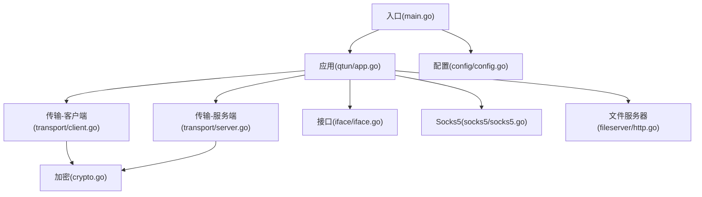
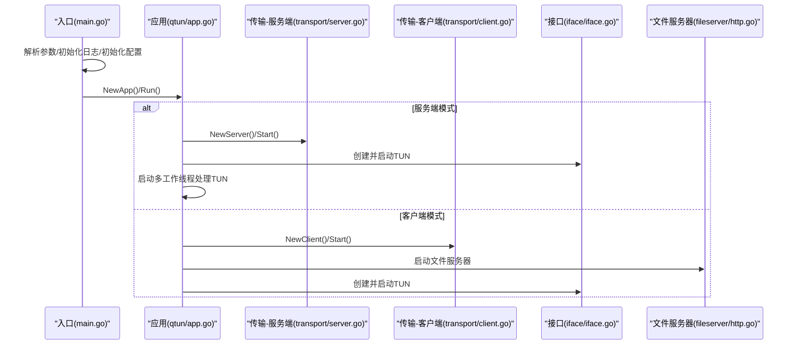
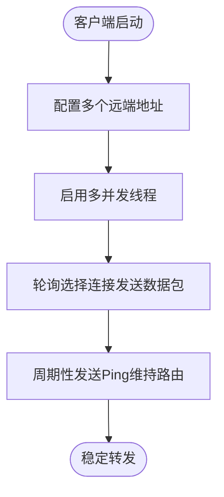
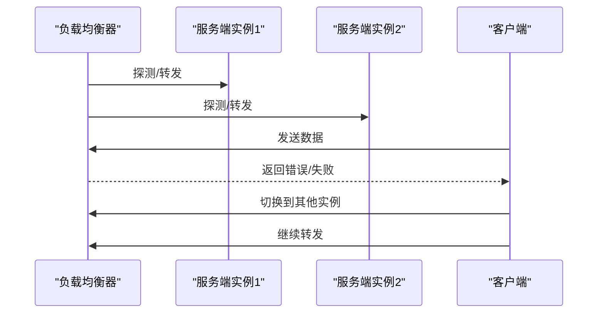
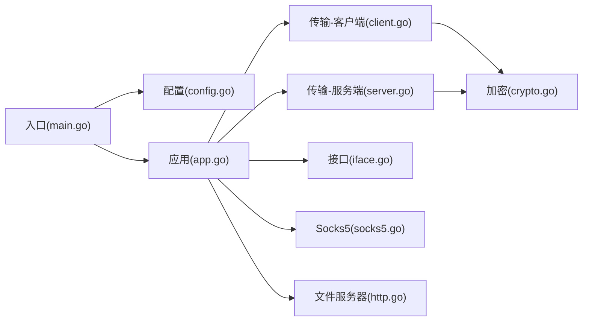

# 部署场景

<cite>
**本文引用的文件**
- [README.md](file://README.md)
- [main.go](file://main.go)
- [config/config.go](file://config/config.go)
- [qtun/app.go](file://qtun/app.go)
- [transport/server.go](file://transport/server.go)
- [transport/client.go](file://transport/client.go)
- [transport/crypto.go](file://transport/crypto.go)
- [socks5/socks5.go](file://socks5/socks5.go)
- [fileserver/http.go](file://fileserver/http.go)
- [iface/iface.go](file://iface/iface.go)
- [PERFORMANCE_TEST_GUIDE.md](file://PERFORMANCE_TEST_GUIDE.md)
- [go.mod](file://go.mod)
- [Makefile](file://Makefile)
</cite>

## 目录
1. [简介](#简介)
2. [项目结构](#项目结构)
3. [核心组件](#核心组件)
4. [架构总览](#架构总览)
5. [详细组件分析](#详细组件分析)
6. [依赖关系分析](#依赖关系分析)
7. [性能考量](#性能考量)
8. [故障排查指南](#故障排查指南)
9. [结论](#结论)
10. [附录](#附录)

## 简介
本指南面向在生产环境中部署 Qtun 服务器的工程团队，覆盖单机部署、负载均衡与多实例部署、高可用与故障转移、Docker 容器化与编排、以及云平台最佳实践与成本优化建议。文档以仓库现有代码为依据，结合命令行参数、配置项与运行时行为，给出可落地的部署步骤与运维要点。

## 项目结构
- 入口程序负责解析命令行参数、初始化日志与配置，并按模式启动服务或客户端。
- 应用层封装 TUN 接口读写、QUIC 传输层收发、路由表维护与 Socks5 文件服务器。
- 传输层基于 QUIC，提供服务端监听与客户端连接管理。
- Socks5 代理模块提供本地 SOCKS5 服务（仅服务端模式下启动）。
- 文件服务器提供 PAC 与静态资源服务（仅客户端模式下启动）。
- 接口层封装 TUN 设备创建、配置与读写。

图表来源
- [main.go](file://main.go#L70-L103)
- [config/config.go](file://config/config.go#L17-L23)
- [qtun/app.go](file://qtun/app.go#L37-L49)
- [transport/server.go](file://transport/server.go#L37-L46)
- [transport/client.go](file://transport/client.go#L31-L39)
- [transport/crypto.go](file://transport/crypto.go#L10-L26)
- [socks5/socks5.go](file://socks5/socks5.go#L55-L97)
- [fileserver/http.go](file://fileserver/http.go#L9-L16)
- [iface/iface.go](file://iface/iface.go#L23-L29)

章节来源
- [main.go](file://main.go#L22-L103)
- [config/config.go](file://config/config.go#L3-L23)
- [qtun/app.go](file://qtun/app.go#L19-L49)
- [transport/server.go](file://transport/server.go#L23-L46)
- [transport/client.go](file://transport/client.go#L20-L39)
- [transport/crypto.go](file://transport/crypto.go#L10-L26)
- [socks5/socks5.go](file://socks5/socks5.go#L55-L97)
- [fileserver/http.go](file://fileserver/http.go#L9-L16)
- [iface/iface.go](file://iface/iface.go#L16-L29)

## 核心组件
- 命令行与配置
  - 入口解析参数并初始化全局配置；支持服务端模式与客户端模式切换。
  - 关键参数：监听地址、远端地址、密钥、VPN 虚拟 IP、MTU、Socks5 端口、文件服务器端口、并发线程数等。
- 应用层
  - 服务端：启动 QUIC 服务端监听，维护路由表，多工作线程处理 TUN 数据包。
  - 客户端：建立多连接，周期性发送 Ping，向服务端注册自身路由。
  - TUN 接口：创建 TUN 设备，配置 IP 与 MTU，读写原始 IP 数据包。
  - Socks5：仅服务端模式下启动本地 SOCKS5 代理（便于系统级代理）。
  - 文件服务器：仅客户端模式下启动，提供 PAC 与静态资源。
- 传输层
  - 服务端：QUIC 监听、连接接受、并发读写、连接映射与清理。
  - 客户端：多连接管理、重连与健康心跳、数据包发送。
  - 加密：基于密钥派生的 AEAD 加密算法。
- 外部依赖
  - QUIC、水线驱动（TUN）、零依赖日志库等。

章节来源
- [main.go](file://main.go#L22-L103)
- [config/config.go](file://config/config.go#L3-L23)
- [qtun/app.go](file://qtun/app.go#L37-L97)
- [transport/server.go](file://transport/server.go#L48-L149)
- [transport/client.go](file://transport/client.go#L41-L83)
- [transport/crypto.go](file://transport/crypto.go#L10-L26)
- [socks5/socks5.go](file://socks5/socks5.go#L99-L118)
- [fileserver/http.go](file://fileserver/http.go#L9-L16)
- [iface/iface.go](file://iface/iface.go#L31-L74)

## 架构总览
下图展示服务端与客户端在不同模式下的启动流程与交互路径。

图表来源
- [main.go](file://main.go#L75-L102)
- [qtun/app.go](file://qtun/app.go#L37-L49)
- [transport/server.go](file://transport/server.go#L37-L52)
- [transport/client.go](file://transport/client.go#L31-L83)
- [fileserver/http.go](file://fileserver/http.go#L9-L16)
- [iface/iface.go](file://iface/iface.go#L31-L74)

## 详细组件分析

### 单机部署（标准流程与配置示例）
- 服务端
  - 启动参数要点：监听地址、密钥、虚拟 IP、服务端模式开关。
  - 日志级别、Socks5 端口、文件服务器端口等可选。
  - 启动后同时提供：TUN 接口与本地 SOCKS5 代理（仅服务端模式）。
- 客户端
  - 启动参数要点：远端地址、密钥、虚拟 IP、文件服务器目录与端口。
  - 启动后提供：TUN 接口与本地 PAC 文件服务器（仅客户端模式）。
- 系统代理
  - 客户端在 macOS 下可自动设置系统代理指向本地 PAC。
- 示例参考
  - 参考仓库提供的命令行示例与帮助输出，确保以管理员权限运行并正确配置网络参数。

章节来源
- [README.md](file://README.md#L13-L26)
- [README.md](file://README.md#L51-L88)
- [main.go](file://main.go#L75-L102)
- [qtun/app.go](file://qtun/app.go#L250-L270)

### 负载均衡部署（多实例与会话保持）
- 多实例部署
  - 服务端可横向扩展：多个实例监听同一密钥与虚拟网段，客户端通过多远端地址连接。
  - 客户端支持多并发线程连接，内部采用轮询策略选择连接发送数据包。
- 会话保持策略
  - 当前实现未内置基于源 IP 的会话亲和性；路由表更新由客户端 Ping 触发，服务端按目的 IP 查找连接。
  - 若需会话保持，可在上游负载均衡器层面引入粘性会话或基于连接标识的亲和性策略（需结合业务与网络拓扑评估）。

图表来源
- [transport/client.go](file://transport/client.go#L41-L83)
- [transport/client.go](file://transport/client.go#L114-L132)
- [transport/client.go](file://transport/client.go#L167-L206)

章节来源
- [transport/client.go](file://transport/client.go#L41-L83)
- [transport/client.go](file://transport/client.go#L114-L132)
- [transport/client.go](file://transport/client.go#L167-L206)

### 高可用部署（故障转移与健康检查）
- 故障转移
  - 服务端实例异常退出时，客户端会重试连接；若配置了多个远端地址，可实现实例级故障切换。
  - 服务端内部维护连接映射与死连接清理任务，有助于快速剔除不可用连接。
- 健康检查
  - 客户端定期发送 Ping，服务端接收后更新路由表；可作为基本“心跳”健康信号。
  - 建议在上游 LB 层增加 TCP/HTTP 健康探针，结合连接状态与丢包率进行更全面的健康判定。

图表来源
- [transport/server.go](file://transport/server.go#L54-L76)
- [transport/server.go](file://transport/server.go#L175-L210)
- [transport/client.go](file://transport/client.go#L142-L157)

章节来源
- [transport/server.go](file://transport/server.go#L54-L76)
- [transport/server.go](file://transport/server.go#L175-L210)
- [transport/client.go](file://transport/client.go#L142-L157)

### Docker 容器化部署（镜像构建、编排与网络）
- 镜像构建
  - 使用仓库提供的多平台构建目标，生成适用于 Linux/amd64/arm 等架构的二进制。
  - 建议在容器内以非 root 用户运行，挂载必要的设备与网络命名空间。
- 容器编排
  - 服务端：暴露监听端口，挂载 TUN 设备，设置合适的网络模式（如 host）以便 QUIC 通信。
  - 客户端：通过环境变量或配置文件注入远端地址、密钥与虚拟 IP。
- 网络配置
  - 服务端需保证监听端口可达；客户端需正确配置虚拟网段与路由。
  - 如需系统代理，可在客户端容器内执行 PAC 设置逻辑（参考应用层自动设置逻辑）。

章节来源
- [Makefile](file://Makefile#L3-L22)
- [qtun/app.go](file://qtun/app.go#L250-L270)
- [iface/iface.go](file://iface/iface.go#L31-L74)

### 云平台部署最佳实践与成本优化
- 最佳实践
  - 使用弹性网络与安全组开放 QUIC 端口；在云厂商 LB 层开启四层/七层转发。
  - 将服务端与客户端置于同一可用区或跨可用区部署，结合健康检查与自动扩缩容。
  - 使用托管容器服务（如 Kubernetes/ECS）简化滚动升级与故障恢复。
- 成本优化
  - 选择按流量计费的网络产品，结合压缩与缓存减少带宽消耗。
  - 合理设置 MTU 与并发线程数，避免过度占用 CPU 与内存。
  - 利用性能测试指南中的基准脚本持续评估与调优。

章节来源
- [PERFORMANCE_TEST_GUIDE.md](file://PERFORMANCE_TEST_GUIDE.md#L26-L109)
- [PERFORMANCE_TEST_GUIDE.md](file://PERFORMANCE_TEST_GUIDE.md#L136-L187)
- [PERFORMANCE_TEST_GUIDE.md](file://PERFORMANCE_TEST_GUIDE.md#L233-L258)

## 依赖关系分析
- 组件耦合
  - 入口与应用层通过配置模块解耦；应用层与传输层通过接口回调解耦。
  - 传输层内部使用 QUIC 与 AEAD 加密，接口层依赖水线驱动创建 TUN。
- 外部依赖
  - 主要依赖包括 QUIC、水线驱动、日志库与 CLI 框架。

图表来源
- [main.go](file://main.go#L75-L102)
- [config/config.go](file://config/config.go#L17-L23)
- [qtun/app.go](file://qtun/app.go#L37-L49)
- [transport/server.go](file://transport/server.go#L37-L46)
- [transport/client.go](file://transport/client.go#L31-L39)
- [transport/crypto.go](file://transport/crypto.go#L10-L26)
- [socks5/socks5.go](file://socks5/socks5.go#L55-L97)
- [fileserver/http.go](file://fileserver/http.go#L9-L16)
- [iface/iface.go](file://iface/iface.go#L23-L29)

章节来源
- [go.mod](file://go.mod#L5-L28)

## 性能考量
- 工作线程与 I/O 并行
  - 应用层根据 CPU 核心数动态计算工作线程数量，范围在 4–32 之间，提升 TUN 数据包处理并发能力。
- QUIC 参数优化
  - 服务端配置较大的流与连接接收窗口、启用 datagram、设置保活周期，提升吞吐与稳定性。
- 对象池与锁优化
  - 客户端对 Protobuf 消息与 Ping/Packet 消息使用对象池复用，减少 GC 压力；读写路径采用 RWMutex 降低锁竞争。
- 监控与分析
  - 内置性能监控端口，支持 pprof 与 statsviz，便于 CPU、内存、Goroutine 分析与可视化。

章节来源
- [qtun/app.go](file://qtun/app.go#L72-L97)
- [transport/server.go](file://transport/server.go#L97-L103)
- [transport/client.go](file://transport/client.go#L184-L206)
- [PERFORMANCE_TEST_GUIDE.md](file://PERFORMANCE_TEST_GUIDE.md#L17-L24)
- [PERFORMANCE_TEST_GUIDE.md](file://PERFORMANCE_TEST_GUIDE.md#L85-L109)

## 故障排查指南
- 启动失败
  - 检查是否以管理员权限运行；确认监听端口未被占用；核对密钥与虚拟 IP 是否一致。
- 连接不稳定
  - 查看客户端重试日志与服务端连接清理日志；确认网络延迟与丢包情况。
- 无法访问系统代理
  - 客户端仅在 macOS 下自动设置系统代理；Linux/Windows 需手动配置 PAC。
- 性能不达预期
  - 使用性能测试指南中的基准脚本与 pprof 工具定位瓶颈；调整并发线程数与 MTU。

章节来源
- [qtun/app.go](file://qtun/app.go#L250-L270)
- [PERFORMANCE_TEST_GUIDE.md](file://PERFORMANCE_TEST_GUIDE.md#L286-L309)

## 结论
Qtun 提供了基于 QUIC 的隧道实现，具备服务端与客户端双模式、TUN 接口与本地代理能力。结合多实例与负载均衡、健康检查与故障转移策略，可在云平台上实现高可用与低成本的部署方案。建议在生产环境中配合容器化与监控体系，持续进行性能评估与优化。

## 附录
- 命令行帮助与示例
  - 参考帮助输出与示例命令，确保参数与环境满足要求。
- 构建产物
  - 使用 Makefile 生成多平台二进制，便于分发与部署。

章节来源
- [README.md](file://README.md#L51-L88)
- [Makefile](file://Makefile#L3-L22)