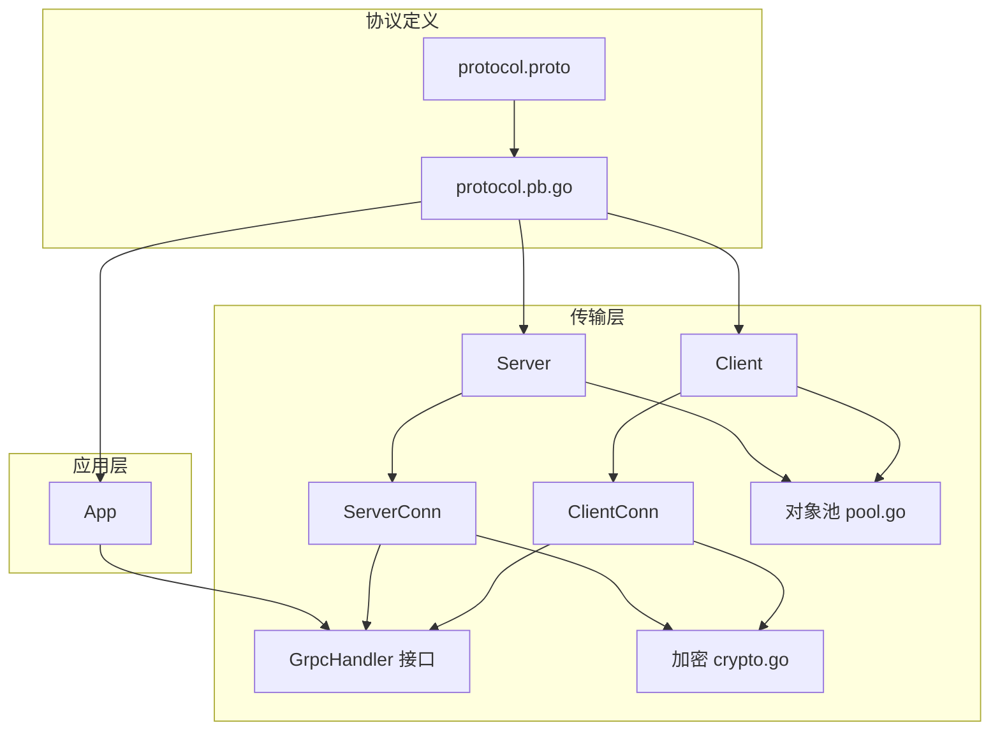
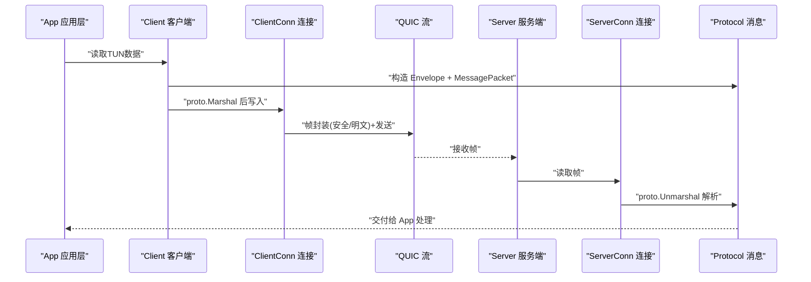
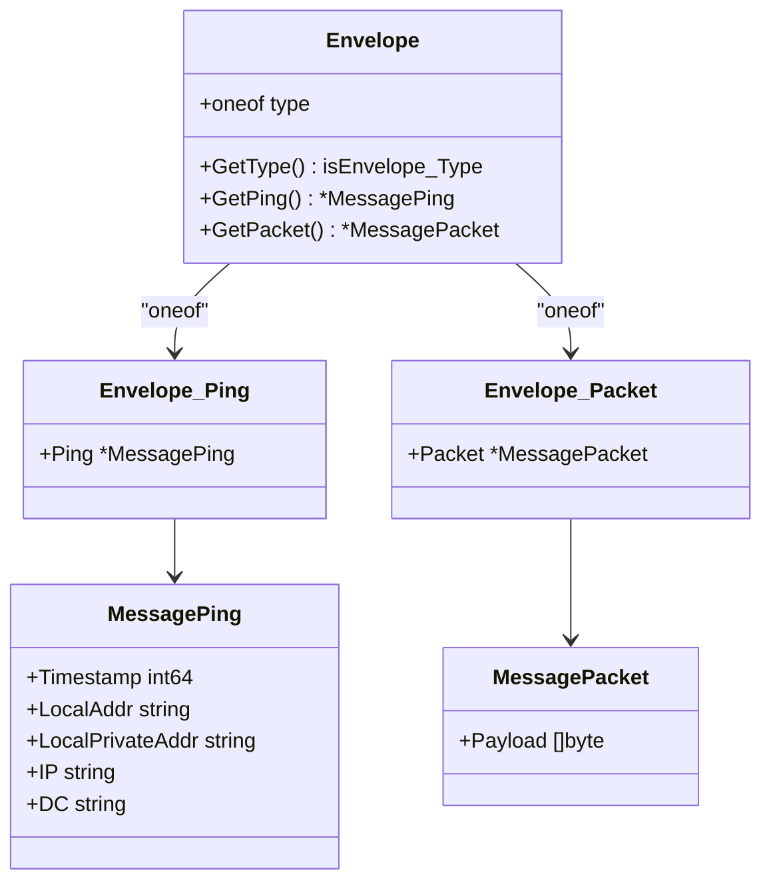
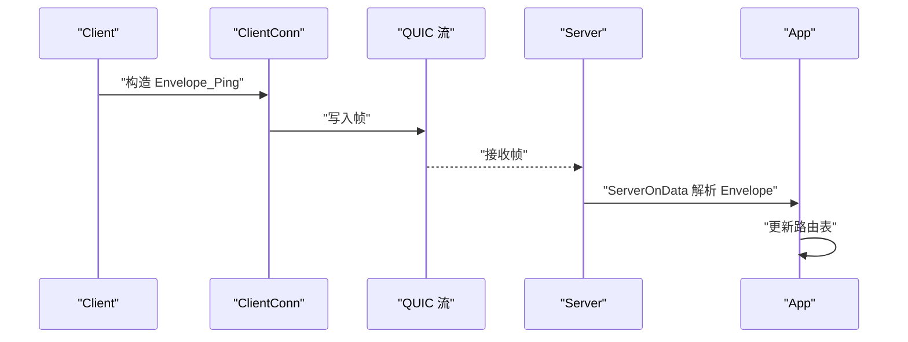
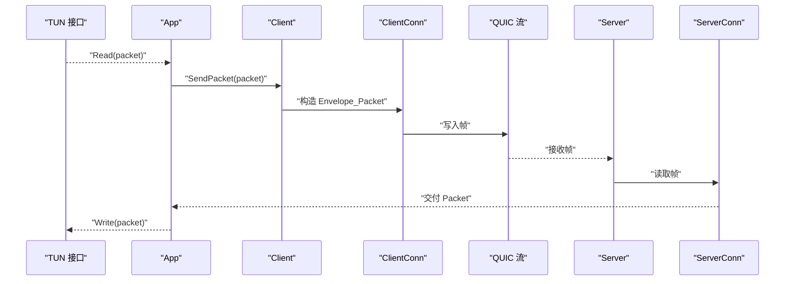
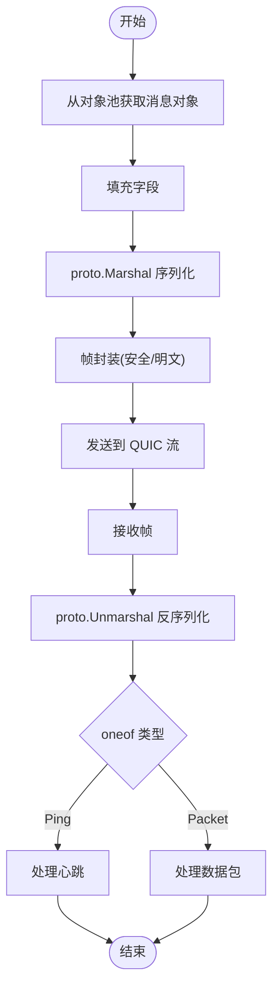
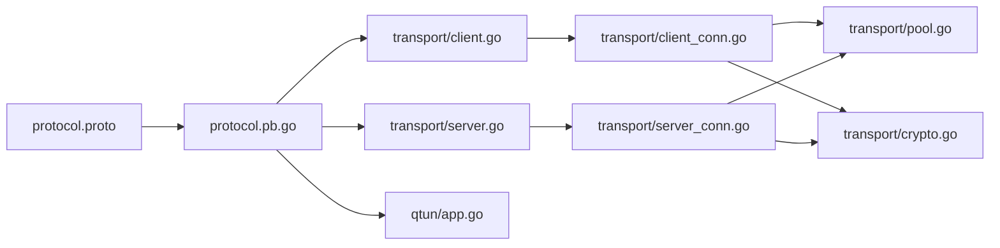

# Protocol Buffer协议

<cite>
**本文引用的文件**
- [protocol.proto](file://protocol/protocol.proto)
- [protocol.pb.go](file://protocol/protocol.pb.go)
- [Makefile](file://protocol/Makefile)
- [app.go](file://qtun/app.go)
- [client.go](file://transport/client.go)
- [client_conn.go](file://transport/client_conn.go)
- [server.go](file://transport/server.go)
- [server_conn.go](file://transport/server_conn.go)
- [pool.go](file://transport/pool.go)
- [crypto.go](file://transport/crypto.go)
- [grpc_handler.go](file://transport/grpc_handler.go)
</cite>

## 目录
1. [简介](#简介)
2. [项目结构](#项目结构)
3. [核心组件](#核心组件)
4. [架构总览](#架构总览)
5. [详细组件分析](#详细组件分析)
6. [依赖关系分析](#依赖关系分析)
7. [性能考量](#性能考量)
8. [故障排查指南](#故障排查指南)
9. [结论](#结论)
10. [附录](#附录)

## 简介
本文件系统性阐述 Qtun 中基于 Protocol Buffer 的消息协议与实现，重点覆盖：
- 协议消息格式设计：Envelope、MessagePing、MessagePacket 的结构与用途
- 字段类型选择与编码特性：varint、bytes、oneof 的语义与序列化行为
- 版本兼容性与扩展策略：向后兼容、新增字段与未知字段处理
- Go 代码生成与使用：proto.Marshal/Unmarshal 的调用流程与最佳实践
- 在传输层的实际应用：QUIC 流上的数据帧封装、加解密与协议交互

## 项目结构
协议相关的核心文件位于 protocol 目录，传输层在 transport 目录，应用入口在 qtun 目录。下图给出与协议直接相关的模块关系概览。

图表来源
- [protocol.proto](file://protocol/protocol.proto#L1-L22)
- [protocol.pb.go](file://protocol/protocol.pb.go#L1-L303)
- [client.go](file://transport/client.go#L1-L223)
- [client_conn.go](file://transport/client_conn.go#L1-L408)
- [server.go](file://transport/server.go#L1-L219)
- [server_conn.go](file://transport/server_conn.go#L1-L295)
- [pool.go](file://transport/pool.go#L1-L108)
- [crypto.go](file://transport/crypto.go#L1-L27)
- [app.go](file://qtun/app.go#L1-L271)
- [grpc_handler.go](file://transport/grpc_handler.go#L1-L7)

章节来源
- [protocol.proto](file://protocol/protocol.proto#L1-L22)
- [protocol.pb.go](file://protocol/protocol.pb.go#L1-L303)
- [client.go](file://transport/client.go#L1-L223)
- [server.go](file://transport/server.go#L1-L219)
- [app.go](file://qtun/app.go#L1-L271)

## 核心组件
- Envelope：协议消息的顶层容器，采用 oneof 包含两类子消息：MessagePing 和 MessagePacket。用于区分心跳与数据载荷。
- MessagePing：心跳消息，携带时间戳、本地地址、私有地址、公网IP、数据中心标识等元信息，用于建立与维护路由表。
- MessagePacket：数据载荷消息，承载原始网络包字节流，作为二进制透明传输单元。
- 对象池：在传输层广泛复用 Envelope、MessagePing、MessagePacket 实例，降低 GC 压力。
- 加密：可选的 AES-GCM 加密，对帧内容进行认证加密，非加密时以明文传输。

章节来源
- [protocol.proto](file://protocol/protocol.proto#L5-L22)
- [protocol.pb.go](file://protocol/protocol.pb.go#L23-L92)
- [pool.go](file://transport/pool.go#L23-L50)

## 架构总览
下图展示从应用层到传输层再到网络栈的数据通路，以及协议消息在其中的流转。

图表来源
- [app.go](file://qtun/app.go#L99-L167)
- [client.go](file://transport/client.go#L208-L222)
- [client_conn.go](file://transport/client_conn.go#L241-L294)
- [server_conn.go](file://transport/server_conn.go#L129-L165)
- [protocol.pb.go](file://protocol/protocol.pb.go#L102-L145)

## 详细组件分析

### Envelope 与 oneof 设计
- Envelope 使用 oneof 将 MessagePing 与 MessagePacket 互斥绑定，确保每帧只承载一种消息类型。
- 编码时会写入字段编号与长度前缀，解码时按标签分派到对应子消息，未识别标签会被丢弃或保留为未知字段。
- 该设计简化了上层分支逻辑，避免冗余判断。

图表来源
- [protocol.pb.go](file://protocol/protocol.pb.go#L23-L92)
- [protocol.pb.go](file://protocol/protocol.pb.go#L168-L177)
- [protocol.pb.go](file://protocol/protocol.pb.go#L238-L243)

章节来源
- [protocol.proto](file://protocol/protocol.proto#L5-L22)
- [protocol.pb.go](file://protocol/protocol.pb.go#L23-L92)

### MessagePing：心跳与路由建立
- 字段含义
  - Timestamp：纳秒级时间戳，用于检测链路健康与排序
  - LocalAddr：客户端连接的本地地址（唯一标识某条连接）
  - LocalPrivateAddr：客户端私有地址占位
  - IP：客户端公网IP
  - DC：数据中心标识
- 使用场景
  - 客户端周期性发送，服务端据此建立/更新路由表
  - 服务端收到后记录映射：目标IP -> 连接标识，便于后续转发

图表来源
- [client.go](file://transport/client.go#L178-L206)
- [app.go](file://qtun/app.go#L169-L207)

章节来源
- [protocol.proto](file://protocol/protocol.proto#L12-L18)
- [client.go](file://transport/client.go#L178-L206)
- [app.go](file://qtun/app.go#L169-L207)

### MessagePacket：数据载荷
- Payload：承载任意网络包字节流，作为二进制透明传输单元
- 发送路径：应用层从 TUN 读取数据，封装为 Envelope_Packet 后发送
- 接收路径：服务端解析后写回 TUN

图表来源
- [app.go](file://qtun/app.go#L99-L167)
- [client.go](file://transport/client.go#L208-L222)
- [server_conn.go](file://transport/server_conn.go#L235-L249)

章节来源
- [protocol.proto](file://protocol/protocol.proto#L20-L22)
- [client.go](file://transport/client.go#L208-L222)
- [server_conn.go](file://transport/server_conn.go#L235-L249)

### 序列化与反序列化流程
- 序列化（客户端/服务端）
  - 从对象池获取 Envelope/MessagePing/MessagePacket
  - 填充字段，proto.Marshal 生成字节流
  - 写入帧头（安全标志、长度）后发送
- 反序列化（服务端/客户端）
  - 读取帧头与负载
  - proto.Unmarshal 到 Envelope
  - 根据 oneof 类型分支处理 Ping 或 Packet

图表来源
- [pool.go](file://transport/pool.go#L74-L99)
- [client.go](file://transport/client.go#L184-L206)
- [server_conn.go](file://transport/server_conn.go#L129-L165)
- [app.go](file://qtun/app.go#L169-L207)

章节来源
- [pool.go](file://transport/pool.go#L1-L108)
- [client.go](file://transport/client.go#L184-L206)
- [server_conn.go](file://transport/server_conn.go#L129-L165)
- [app.go](file://qtun/app.go#L169-L207)

### 字段类型与编码特性
- varint（Timestamp）：高效压缩小整数，适合时间戳、序号等
- bytes（LocalAddr/IP/DC/Payload）：变长字节串，适合字符串与二进制
- oneof（Envelope.type）：互斥字段，减少存储与带宽，提升解析效率
- 未知字段：旧版本生成的代码能容忍新字段，保障向前兼容

章节来源
- [protocol.proto](file://protocol/protocol.proto#L12-L22)
- [protocol.pb.go](file://protocol/protocol.pb.go#L102-L145)

### 版本兼容性与扩展最佳实践
- 新增字段建议
  - 使用新字段编号（不与现有编号冲突），保持已知字段不变
  - 新字段默认为可选，避免破坏旧客户端解析
- 向后兼容
  - 旧客户端能忽略新字段（未知字段被保留）
  - 旧服务端能解析新字段（未知字段被保留）
- 向前兼容
  - 新客户端能解析旧服务端消息（未知字段被忽略）
- 删除字段
  - 不要复用已删除字段编号；如需复用，应引入新版本协议
- oneof 扩展
  - 新增分支时，保持已有分支编号不变，避免破坏解析

章节来源
- [protocol.proto](file://protocol/protocol.proto#L5-L22)
- [protocol.pb.go](file://protocol/protocol.pb.go#L102-L145)

### 编译与生成
- 使用 protoc-gen-go 生成 Go 代码，go_package 指定包名
- Makefile 提供一键编译命令与依赖安装提示

章节来源
- [protocol.proto](file://protocol/protocol.proto#L1-L4)
- [Makefile](file://protocol/Makefile#L1-L7)

## 依赖关系分析
- 协议定义与生成
  - protocol.proto 定义消息结构
  - protocol.pb.go 由 protoc-gen-go 生成，包含 Marshal/Unmarshal 与 oneof 辅助函数
- 传输层依赖
  - Client/Server 调用 proto.Marshal/Unmarshal
  - ClientConn/ServerConn 负责帧封装与加解密
  - 对象池减少内存分配与 GC 压力
- 应用层集成
  - App 在 ServerOnData/ClientOnData 中解析 Envelope 并驱动路由与 TUN 写入

图表来源
- [protocol.proto](file://protocol/protocol.proto#L1-L22)
- [protocol.pb.go](file://protocol/protocol.pb.go#L1-L303)
- [client.go](file://transport/client.go#L1-L223)
- [server.go](file://transport/server.go#L1-L219)
- [app.go](file://qtun/app.go#L1-L271)
- [client_conn.go](file://transport/client_conn.go#L1-L408)
- [server_conn.go](file://transport/server_conn.go#L1-L295)
- [pool.go](file://transport/pool.go#L1-L108)
- [crypto.go](file://transport/crypto.go#L1-L27)

章节来源
- [protocol.pb.go](file://protocol/protocol.pb.go#L1-L303)
- [client.go](file://transport/client.go#L1-L223)
- [server.go](file://transport/server.go#L1-L219)
- [app.go](file://qtun/app.go#L1-L271)

## 性能考量
- 对象池
  - 复用 Envelope、MessagePing、MessagePacket，显著降低 GC 压力
  - 复用读缓冲与 nonce，减少临时分配
- 帧封装
  - 明文模式：仅写入安全标志与长度，最小开销
  - 加密模式：附加 AEAD 认证标签与随机 nonce，增加少量开销但提升安全性
- 缓冲区大小
  - 读取侧使用 64KB 缓冲，提升吞吐
- 并发与连接
  - 多线程连接与通道队列，提高并发处理能力

章节来源
- [pool.go](file://transport/pool.go#L1-L108)
- [client_conn.go](file://transport/client_conn.go#L332-L394)
- [server_conn.go](file://transport/server_conn.go#L88-L165)

## 故障排查指南
- 反序列化失败
  - 症状：日志出现 proto unmarshal 错误
  - 排查：确认对端是否使用相同协议版本；检查字段编号是否变更
- 加密不匹配
  - 症状：服务端读取报错“fail to match key”
  - 排查：确认两端密钥一致；检查帧头安全标志与 nonce 长度
- 路由缺失
  - 症状：数据包被丢弃
  - 排查：确认服务端已收到 Ping 并更新路由表；检查目标IP与连接标识
- 连接异常
  - 症状：连接断开或读写错误
  - 排查：查看 QUIC 层错误码与关闭原因；检查 keepalive 与窗口参数

章节来源
- [app.go](file://qtun/app.go#L169-L207)
- [server_conn.go](file://transport/server_conn.go#L98-L102)
- [client_conn.go](file://transport/client_conn.go#L241-L294)
- [server_conn.go](file://transport/server_conn.go#L167-L220)

## 结论
Qtun 的 Protocol Buffer 协议以简洁的 Envelope + oneof 设计实现了心跳与数据载荷的统一传输，配合对象池与帧封装优化，在 QUIC 之上提供了高吞吐、低延迟且具备可扩展性的通信基础。通过合理的字段编号管理与 oneof 扩展策略，可在不破坏兼容的前提下持续演进协议。

## 附录

### 协议字段定义与用途速览
- Envelope
  - type：oneof，包含 ping 或 packet
- MessagePing
  - Timestamp：纳秒时间戳
  - LocalAddr：本地连接标识
  - LocalPrivateAddr：私有地址占位
  - IP：公网IP
  - DC：数据中心标识
- MessagePacket
  - Payload：网络包字节流

章节来源
- [protocol.proto](file://protocol/protocol.proto#L5-L22)

### 关键调用路径参考
- 客户端发送心跳
  - [client.go](file://transport/client.go#L178-L206)
- 客户端发送数据包
  - [client.go](file://transport/client.go#L208-L222)
- 服务端接收与解析
  - [server_conn.go](file://transport/server_conn.go#L129-L165)
  - [app.go](file://qtun/app.go#L169-L207)
- 对象池管理
  - [pool.go](file://transport/pool.go#L74-L99)