# QUIC协议原理

<cite>
**本文档引用的文件**
- [main.go](file://main.go)
- [protocol.proto](file://protocol/protocol.proto)
- [protocol.pb.go](file://protocol/protocol.pb.go)
- [client.go](file://transport/client.go)
- [client_conn.go](file://transport/client_conn.go)
- [server.go](file://transport/server.go)
- [server_conn.go](file://transport/server_conn.go)
- [grpc_handler.go](file://transport/grpc_handler.go)
- [crypto.go](file://transport/crypto.go)
- [pool.go](file://transport/pool.go)
- [app.go](file://qtun/app.go)
- [iface.go](file://iface/iface.go)
- [config.go](file://config/config.go)
</cite>

## 目录
1. [引言](#引言)
2. [项目结构](#项目结构)
3. [核心组件](#核心组件)
4. [架构概览](#架构概览)
5. [详细组件分析](#详细组件分析)
6. [依赖关系分析](#依赖关系分析)
7. [性能考量](#性能考量)
8. [故障排除指南](#故障排除指南)
9. [结论](#结论)

## 引言

QUIC（Quick UDP Internet Connections）是一种基于UDP的多路复用传输协议，由Google开发并标准化。与传统的TCP相比，QUIC具有以下显著优势：

- **更快的连接建立时间**：通过0-RTT握手减少连接延迟
- **内置的加密和安全**：TLS 1.3集成，提供前向保密
- **多路复用支持**：单个连接上的多个流，避免队头阻塞
- **改进的拥塞控制**：更智能的拥塞控制算法
- **连接迁移**：支持IP地址或端口变化时保持连接

在Qtun项目中，QUIC被用于实现高性能的VPN隧道，通过Protocol Buffer消息格式实现可靠的数据传输和连接管理。

## 项目结构

Qtun项目采用模块化设计，主要包含以下核心模块：

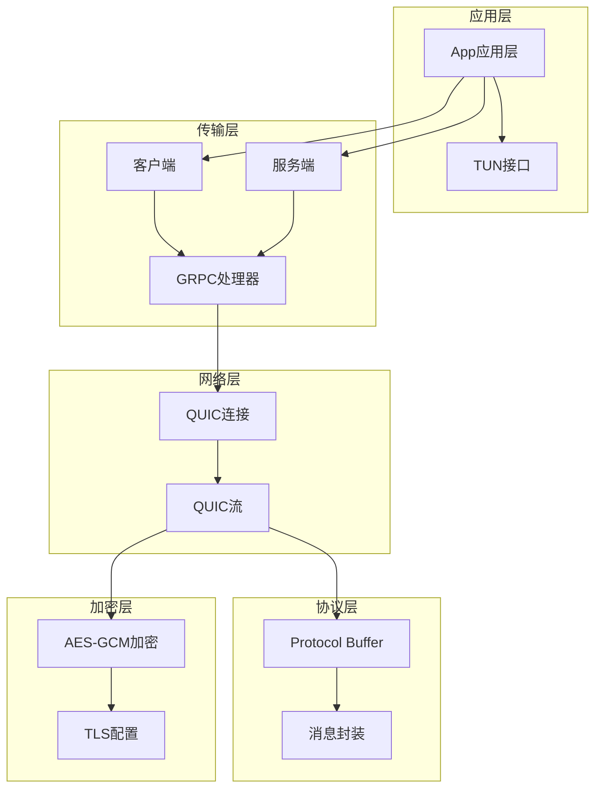

**图表来源**
- [app.go](file://qtun/app.go#L19-L27)
- [client.go](file://transport/client.go#L20-L29)
- [server.go](file://transport/server.go#L23-L35)

**章节来源**
- [main.go](file://main.go#L1-L136)
- [config.go](file://config/config.go#L1-L24)

## 核心组件

### Protocol Buffer消息定义

Qtun使用Protocol Buffer定义了三种核心消息类型：

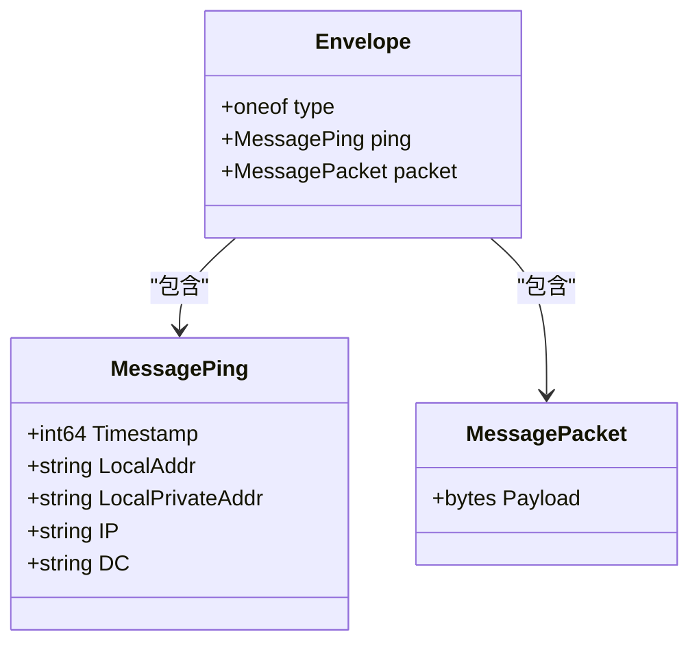

**图表来源**
- [protocol.proto](file://protocol/protocol.proto#L5-L22)

### QUIC连接管理

系统实现了完整的QUIC连接生命周期管理：

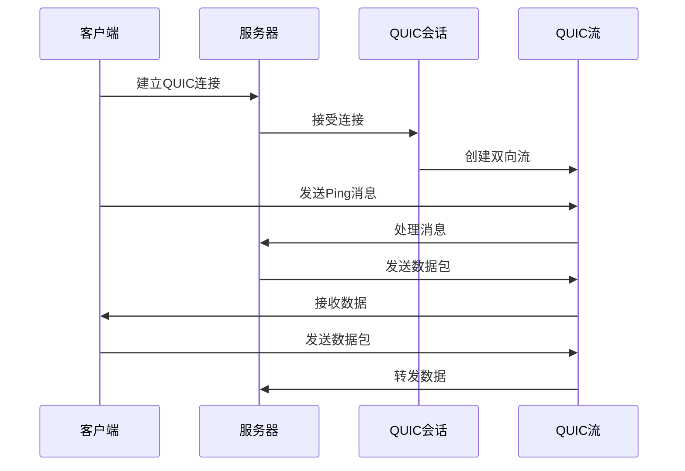

**图表来源**
- [client_conn.go](file://transport/client_conn.go#L69-L117)
- [server_conn.go](file://transport/server_conn.go#L58-L115)

**章节来源**
- [protocol.proto](file://protocol/protocol.proto#L1-L22)
- [protocol.pb.go](file://protocol/protocol.pb.go#L23-L92)

## 架构概览

Qtun的整体架构采用分层设计，从底层到上层依次为：

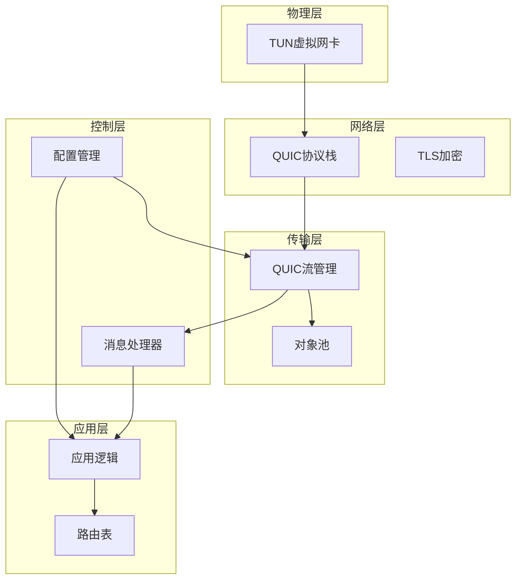

**图表来源**
- [app.go](file://qtun/app.go#L19-L27)
- [server.go](file://transport/server.go#L23-L35)
- [client.go](file://transport/client.go#L20-L29)

## 详细组件分析

### 客户端实现

客户端负责建立QUIC连接、发送心跳包和处理数据传输：

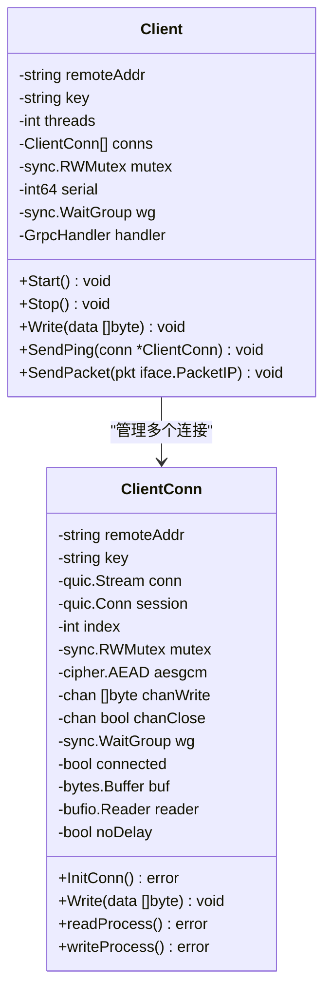

**图表来源**
- [client.go](file://transport/client.go#L20-L29)
- [client_conn.go](file://transport/client_conn.go#L24-L42)

#### 连接建立流程

客户端的连接建立过程如下：

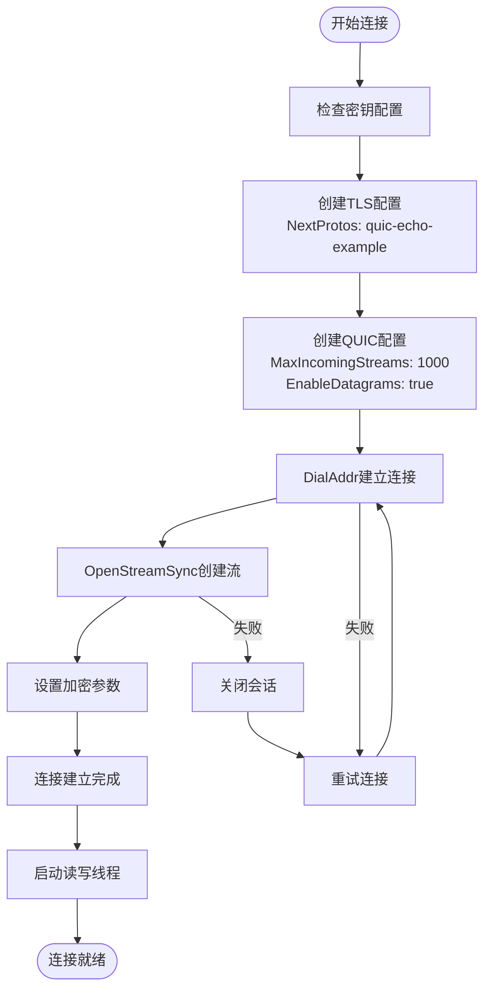

**图表来源**
- [client_conn.go](file://transport/client_conn.go#L69-L117)

**章节来源**
- [client.go](file://transport/client.go#L41-L83)
- [client_conn.go](file://transport/client_conn.go#L130-L151)

### 服务端实现

服务端负责接受客户端连接、维护连接状态和转发数据：

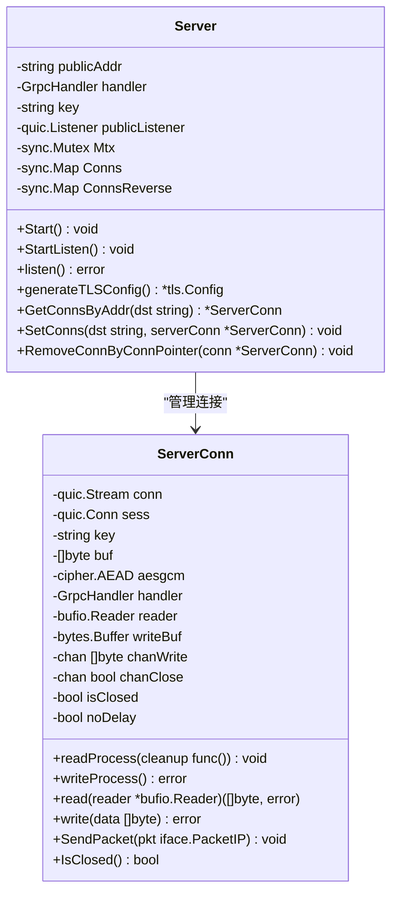

**图表来源**
- [server.go](file://transport/server.go#L23-L35)
- [server_conn.go](file://transport/server_conn.go#L24-L37)

#### 数据传输流程

服务端的数据处理流程：

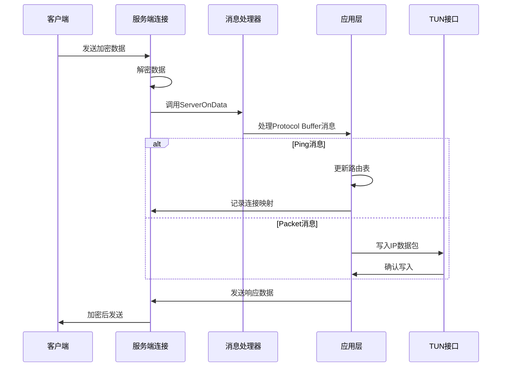

**图表来源**
- [server_conn.go](file://transport/server_conn.go#L58-L115)
- [app.go](file://qtun/app.go#L169-L207)

**章节来源**
- [server.go](file://transport/server.go#L91-L149)
- [server_conn.go](file://transport/server_conn.go#L117-L165)

### Protocol Buffer消息处理

消息处理采用Protocol Buffer进行序列化和反序列化：

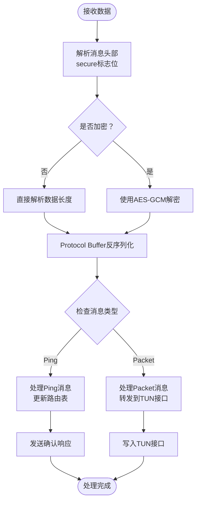

**图表来源**
- [app.go](file://qtun/app.go#L169-L207)
- [protocol.pb.go](file://protocol/protocol.pb.go#L73-L92)

**章节来源**
- [protocol.pb.go](file://protocol/protocol.pb.go#L102-L145)
- [app.go](file://qtun/app.go#L169-L248)

### 加密和安全

系统实现了基于AES-GCM的加密方案：

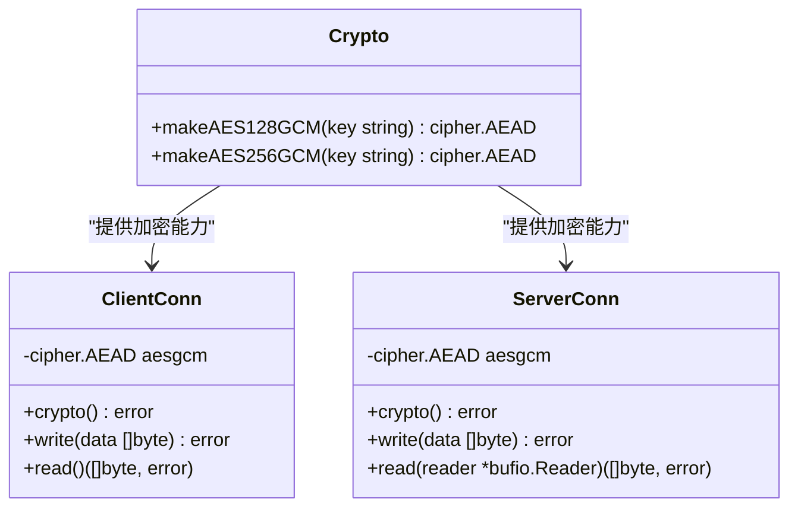

**图表来源**
- [crypto.go](file://transport/crypto.go#L10-L26)
- [client_conn.go](file://transport/client_conn.go#L119-L128)
- [server_conn.go](file://transport/server_conn.go#L117-L127)

**章节来源**
- [crypto.go](file://transport/crypto.go#L1-L27)
- [client_conn.go](file://transport/client_conn.go#L241-L294)
- [server_conn.go](file://transport/server_conn.go#L167-L220)

### 对象池优化

为了提高性能，系统实现了多种对象池：

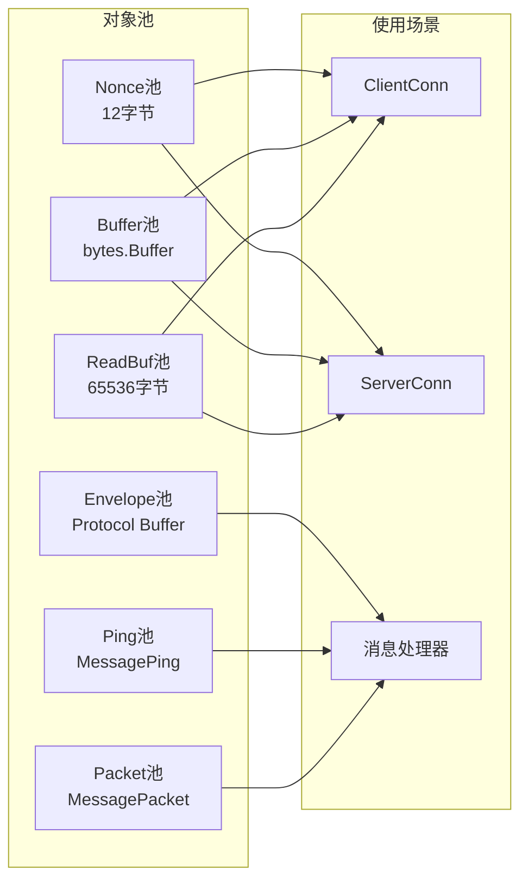

**图表来源**
- [pool.go](file://transport/pool.go#L11-L50)

**章节来源**
- [pool.go](file://transport/pool.go#L1-L108)

## 依赖关系分析

系统各组件之间的依赖关系如下：

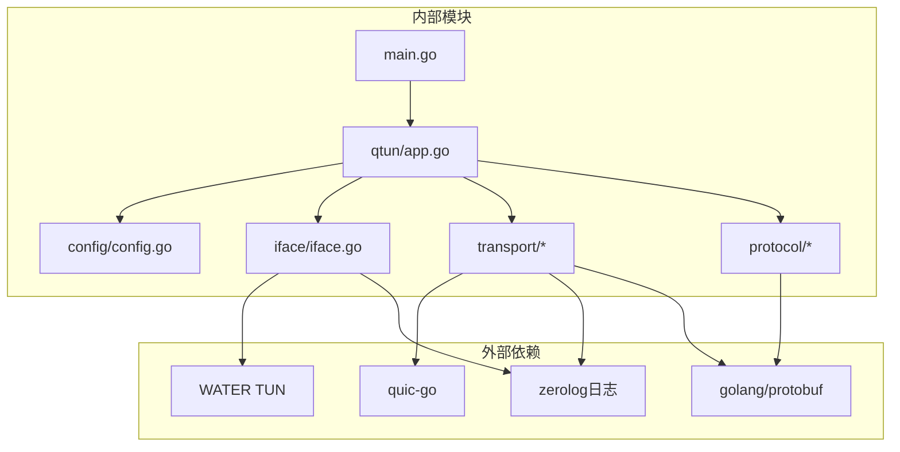

**图表来源**
- [main.go](file://main.go#L3-L20)
- [app.go](file://qtun/app.go#L3-L17)

**章节来源**
- [main.go](file://main.go#L1-L136)
- [app.go](file://qtun/app.go#L1-L271)

## 性能考量

### 连接性能优化

系统在多个方面进行了性能优化：

1. **并发连接管理**：支持多线程客户端连接，默认配置可扩展
2. **缓冲区优化**：读取缓冲区增大到64KB，提高吞吐量
3. **对象池复用**：减少内存分配和垃圾回收压力
4. **同步优化**：使用sync.Map替代互斥锁，提高并发性能

### QUIC配置优化

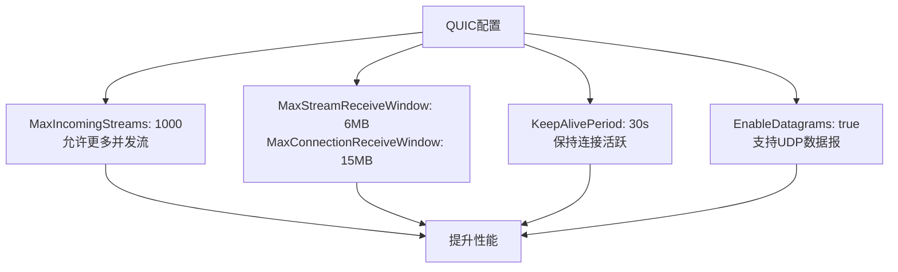

**图表来源**
- [client_conn.go](file://transport/client_conn.go#L84-L91)
- [server.go](file://transport/server.go#L97-L103)

## 故障排除指南

### 常见问题及解决方案

1. **连接无法建立**
   - 检查防火墙设置，确保端口8080开放
   - 验证服务器地址和端口配置
   - 查看TLS证书配置

2. **数据传输异常**
   - 检查Protocol Buffer消息格式
   - 验证加密密钥配置
   - 监控连接状态和错误日志

3. **性能问题**
   - 调整并发线程数
   - 优化缓冲区大小
   - 检查网络带宽和延迟

**章节来源**
- [client_conn.go](file://transport/client_conn.go#L130-L151)
- [server_conn.go](file://transport/server_conn.go#L58-L74)

## 结论

Qtun项目成功地将QUIC协议应用于VPN隧道实现中，通过Protocol Buffer消息格式提供了高效、安全的数据传输能力。系统的主要优势包括：

1. **高性能**：利用QUIC的多路复用和快速连接建立特性
2. **安全性**：内置TLS加密和前向保密机制
3. **可扩展性**：支持多线程并发和动态连接管理
4. **可靠性**：完善的错误处理和连接恢复机制

通过合理的架构设计和性能优化，Qtun为用户提供了稳定可靠的VPN解决方案，展示了现代网络协议在实际应用中的强大能力。