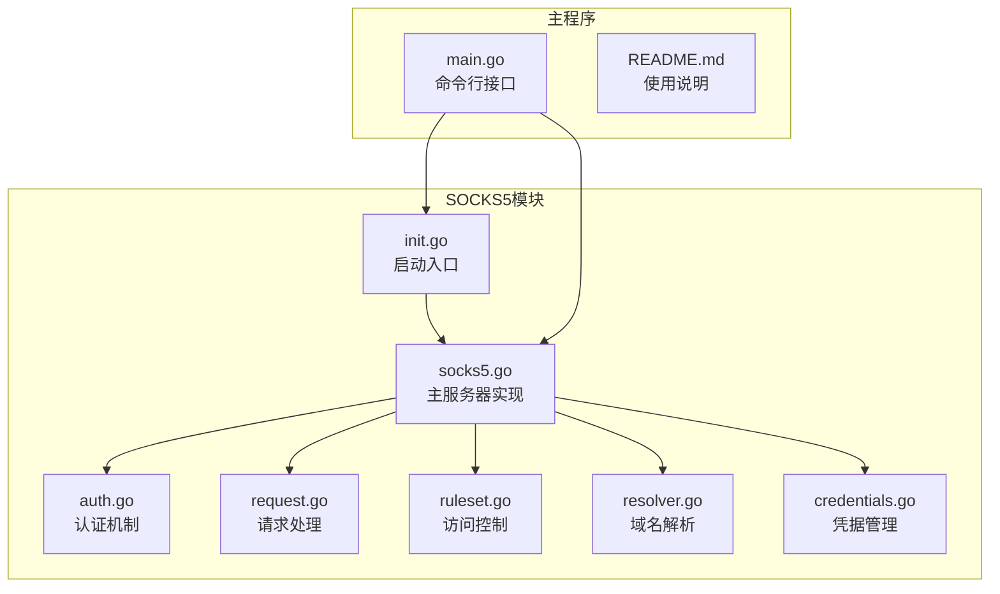
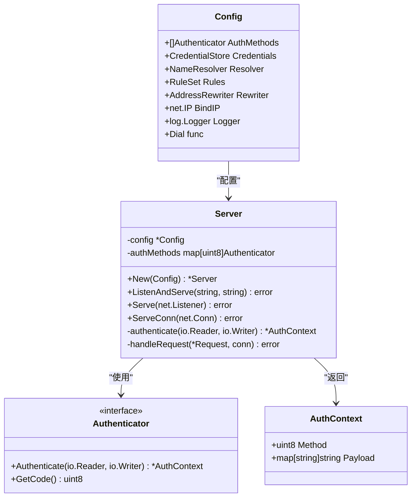
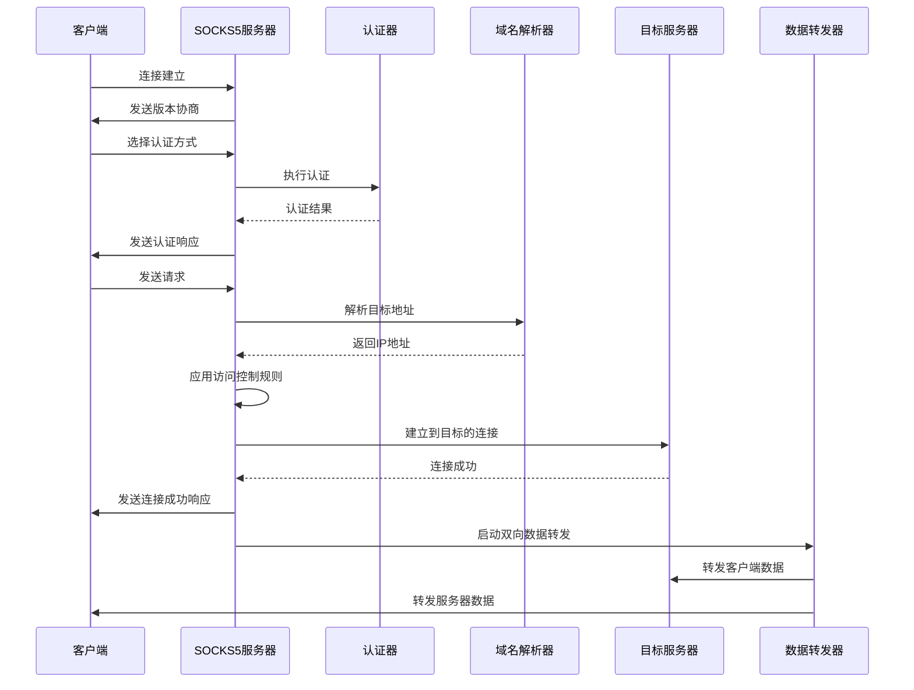
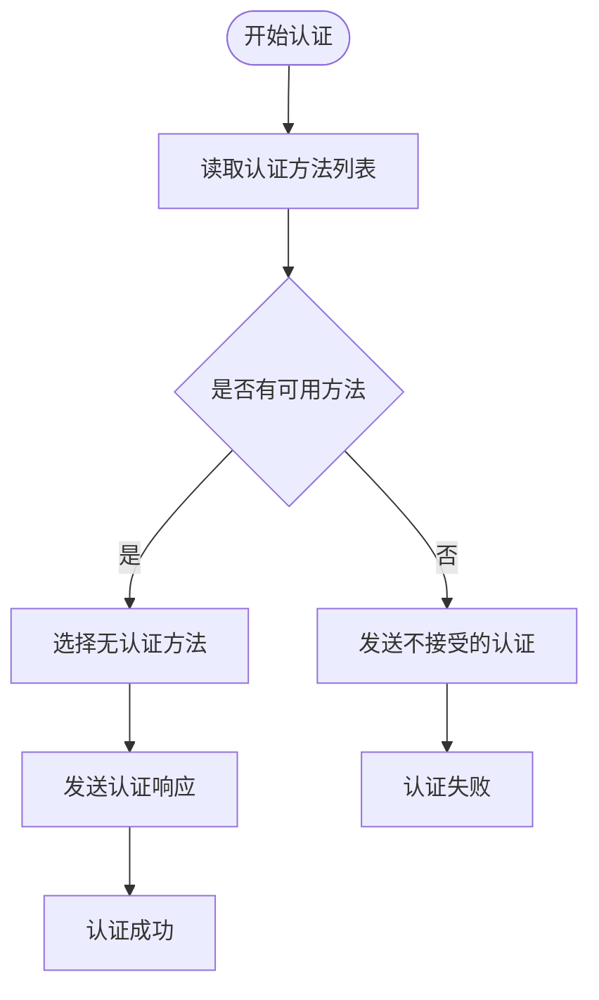
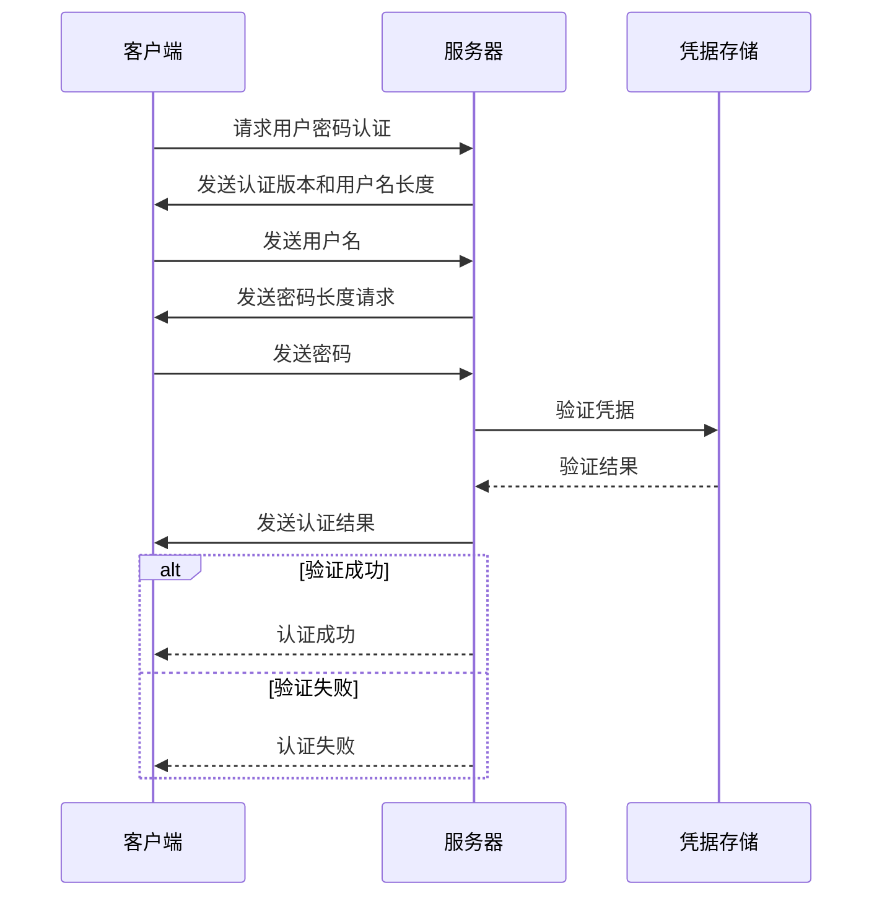
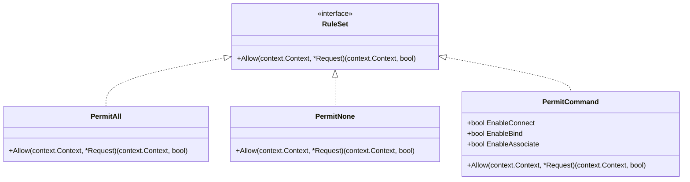
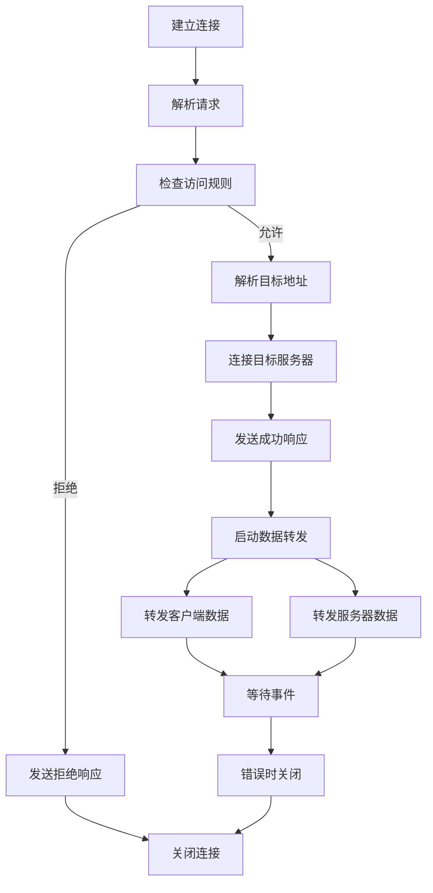
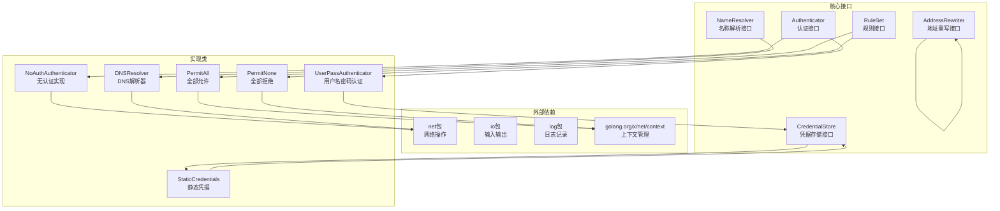

# SOCKS5代理协议

<cite>
**本文档引用的文件**
- [socks5.go](file://socks5/socks5.go)
- [auth.go](file://socks5/auth.go)
- [request.go](file://socks5/request.go)
- [ruleset.go](file://socks5/ruleset.go)
- [resolver.go](file://socks5/resolver.go)
- [credentials.go](file://socks5/credentials.go)
- [init.go](file://socks5/init.go)
- [main.go](file://main.go)
- [README.md](file://README.md)
- [auth_test.go](file://socks5/auth_test.go)
- [request_test.go](file://socks5/request_test.go)
- [ruleset_test.go](file://socks5/ruleset_test.go)
</cite>

## 目录
1. [简介](#简介)
2. [项目结构](#项目结构)
3. [核心组件](#核心组件)
4. [架构概览](#架构概览)
5. [详细组件分析](#详细组件分析)
6. [依赖关系分析](#依赖关系分析)
7. [性能考虑](#性能考虑)
8. [故障排除指南](#故障排除指南)
9. [结论](#结论)
10. [附录](#附录)

## 简介

SOCKS5代理协议是Qtun项目中的重要组成部分，为网络流量提供安全的代理转发服务。本文档深入解析了Qtun中SOCKS5代理的完整实现，包括握手过程、认证机制、请求处理和数据转发流程。

SOCKS5协议作为应用层代理协议，支持多种认证方式（无认证、用户名密码认证），能够透明地转发TCP和UDP流量。在Qtun中，SOCKS5代理不仅提供了基础的代理功能，还集成了访问控制规则系统，支持白名单和黑名单机制，为网络访问提供了灵活的安全控制。

## 项目结构

Qtun项目采用模块化设计，SOCKS5相关代码主要位于`socks5/`目录下，包含以下核心文件：



**图表来源**
- [socks5.go](file://socks5/socks5.go#L1-L170)
- [auth.go](file://socks5/auth.go#L1-L152)
- [request.go](file://socks5/request.go#L1-L365)
- [ruleset.go](file://socks5/ruleset.go#L1-L42)
- [resolver.go](file://socks5/resolver.go#L1-L24)
- [credentials.go](file://socks5/credentials.go#L1-L18)
- [init.go](file://socks5/init.go#L1-L23)
- [main.go](file://main.go#L1-L136)

**章节来源**
- [socks5.go](file://socks5/socks5.go#L1-L170)
- [main.go](file://main.go#L1-L136)

## 核心组件

### 服务器配置系统

SOCKS5服务器通过Config结构体进行配置管理，支持多种可定制选项：



**图表来源**
- [socks5.go](file://socks5/socks5.go#L18-L51)
- [socks5.go](file://socks5/socks5.go#L55-L58)
- [auth.go](file://socks5/auth.go#L33-L36)
- [auth.go](file://socks5/auth.go#L24-L31)

### 认证机制

SOCKS5支持多种认证方式，通过统一的Authenticator接口实现：

- **无认证模式**：适用于本地或受信任环境
- **用户名密码认证**：支持动态凭据验证
- **自定义认证**：通过实现Authenticator接口扩展

**章节来源**
- [auth.go](file://socks5/auth.go#L1-L152)
- [credentials.go](file://socks5/credentials.go#L1-L18)

## 架构概览

SOCKS5代理服务器采用事件驱动架构，每个客户端连接都会启动独立的处理流程：



**图表来源**
- [socks5.go](file://socks5/socks5.go#L121-L169)
- [auth.go](file://socks5/auth.go#L113-L130)
- [request.go](file://socks5/request.go#L119-L156)

## 详细组件分析

### 握手过程实现

SOCKS5握手过程严格按照RFC 1928规范实现，包含三个阶段：

#### 版本协商阶段
服务器首先检查客户端发送的SOCKS版本号，确保兼容性。

#### 认证协商阶段
客户端列出支持的认证方法，服务器选择合适的认证方式：
- 无认证（0x00）
- 用户名密码认证（0x02）
- 其他自定义认证方法

#### 请求处理阶段
认证完成后，客户端发送具体的代理请求，包含目标地址信息。

**章节来源**
- [socks5.go](file://socks5/socks5.go#L125-L145)

### 认证机制详解

#### 无认证模式
无认证是最简单的认证方式，适用于受信任的网络环境：



**图表来源**
- [auth.go](file://socks5/auth.go#L113-L130)

#### 用户名密码认证
用户名密码认证提供了基本的身份验证功能：



**图表来源**
- [auth.go](file://socks5/auth.go#L60-L110)
- [credentials.go](file://socks5/credentials.go#L11-L17)

**章节来源**
- [auth.go](file://socks5/auth.go#L1-L152)
- [credentials.go](file://socks5/credentials.go#L1-L18)

### 请求处理与数据转发

#### 请求解析
SOCKS5请求包含以下关键信息：
- 协议版本（固定为5）
- 命令类型（CONNECT、BIND、ASSOCIATE）
- 地址类型（IPv4、IPv6、FQDN）
- 目标地址和端口

#### 地址解析
服务器支持多种地址格式的解析：
- IPv4地址：直接使用
- IPv6地址：转换为标准格式
- FQDN域名：通过DNS解析获取IP地址

#### 访问控制规则
访问控制系统提供灵活的权限管理：



**图表来源**
- [ruleset.go](file://socks5/ruleset.go#L7-L10)
- [ruleset.go](file://socks5/ruleset.go#L22-L28)

**章节来源**
- [request.go](file://socks5/request.go#L1-L365)
- [ruleset.go](file://socks5/ruleset.go#L1-L42)

### 数据转发机制

SOCKS5代理采用异步双向数据转发，确保连接的高效性：



**图表来源**
- [request.go](file://socks5/request.go#L159-L214)
- [request.go](file://socks5/request.go#L358-L364)

**章节来源**
- [request.go](file://socks5/request.go#L159-L214)

## 依赖关系分析

SOCKS5模块内部具有清晰的依赖层次结构：



**图表来源**
- [socks5.go](file://socks5/socks5.go#L3-L11)
- [auth.go](file://socks5/auth.go#L33-L36)
- [ruleset.go](file://socks5/ruleset.go#L7-L10)
- [resolver.go](file://socks5/resolver.go#L9-L12)
- [credentials.go](file://socks5/credentials.go#L3-L6)

**章节来源**
- [socks5.go](file://socks5/socks5.go#L1-L170)
- [auth.go](file://socks5/auth.go#L1-L152)

## 性能考虑

### 并发处理
SOCKS5服务器采用并发模型，每个客户端连接独立处理，避免阻塞其他连接。

### 内存管理
- 使用缓冲区复用减少内存分配
- 及时清理认证上下文和请求对象
- 合理的超时设置防止资源泄露

### 网络优化
- 异步I/O操作提高吞吐量
- 连接池复用减少连接建立开销
- 适当的缓冲区大小平衡延迟和带宽

## 故障排除指南

### 常见问题诊断

#### 认证失败
- 检查用户名密码是否正确
- 确认认证方法配置是否匹配
- 验证凭据存储是否正常工作

#### 连接被拒绝
- 检查访问控制规则配置
- 验证目标服务器可达性
- 确认防火墙设置

#### DNS解析问题
- 检查DNS服务器配置
- 验证域名格式正确性
- 确认网络连通性

**章节来源**
- [auth_test.go](file://socks5/auth_test.go#L1-L120)
- [request_test.go](file://socks5/request_test.go#L1-L170)
- [ruleset_test.go](file://socks5/ruleset_test.go#L1-L25)

## 结论

Qtun中的SOCKS5代理实现了完整的SOCKS5协议栈，提供了灵活的认证机制和强大的访问控制功能。通过模块化的架构设计，该实现既保证了功能的完整性，又保持了良好的可扩展性和可维护性。

主要特点包括：
- 完整的SOCKS5协议实现
- 多种认证方式支持
- 灵活的访问控制规则
- 高效的数据转发机制
- 良好的错误处理和日志记录

该实现为开发者提供了坚实的基础，可以在此基础上进一步扩展功能，如添加更多认证方式、实现UDP支持、增强访问控制规则等。

## 附录

### 配置选项说明

| 配置项 | 类型 | 默认值 | 描述 |
|--------|------|--------|------|
| AuthMethods | []Authenticator | [] | 认证方法列表 |
| Credentials | CredentialStore | nil | 用户凭据存储 |
| Resolver | NameResolver | DNSResolver | 域名解析器 |
| Rules | RuleSet | PermitAll | 访问控制规则 |
| Rewriter | AddressRewriter | nil | 地址重写器 |
| BindIP | net.IP | nil | 绑定IP地址 |
| Logger | *log.Logger | stdout | 日志记录器 |
| Dial | func | net.Dial | 自定义拨号函数 |

### 使用示例

#### 基本SOCKS5服务器启动
```bash
# 启动SOCKS5代理服务器
./qtun qt --socks5_port 2080 --server_mode
```

#### 客户端配置
在浏览器中配置SOCKS5代理：
- 代理类型：SOCKS5
- 主机名：127.0.0.1
- 端口：2080

**章节来源**
- [README.md](file://README.md#L1-L99)
- [main.go](file://main.go#L88-L99)
- [init.go](file://socks5/init.go#L5-L22)