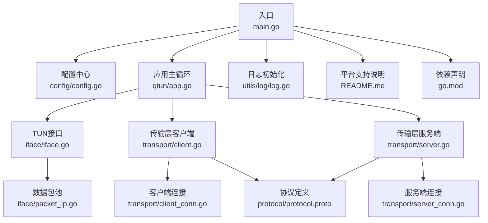
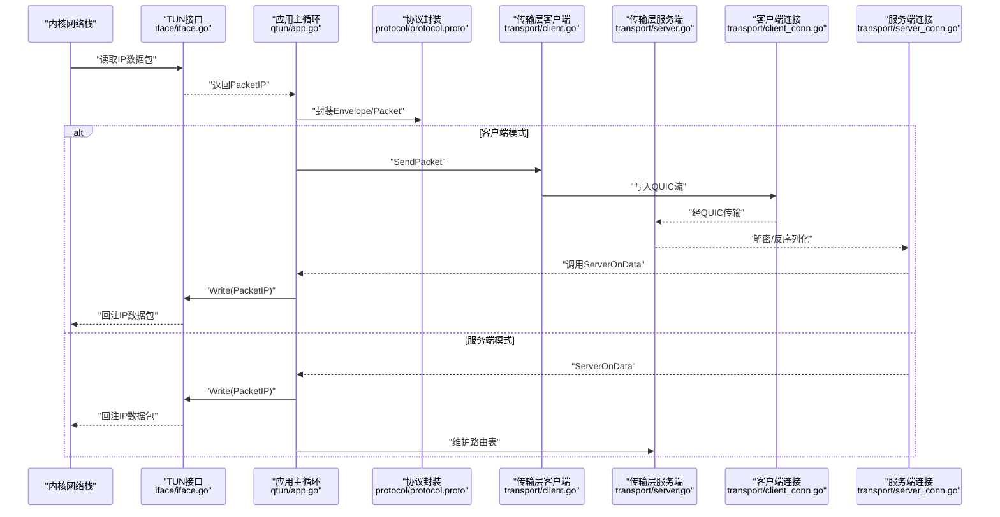
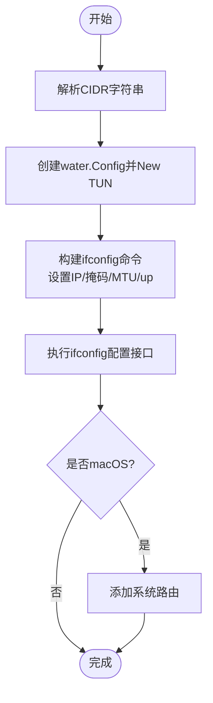
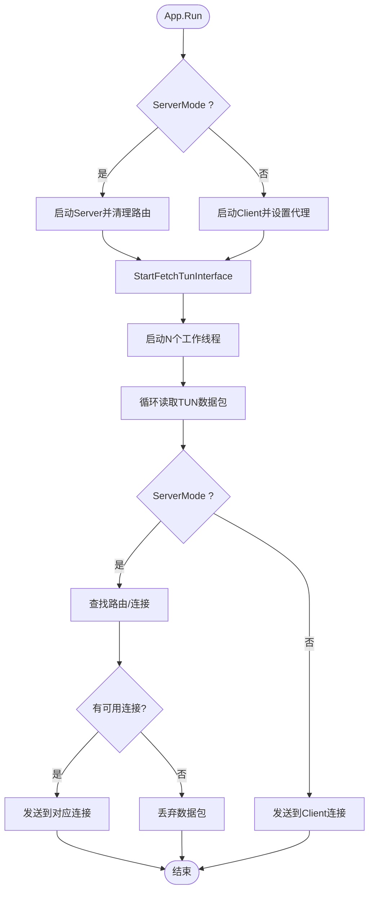
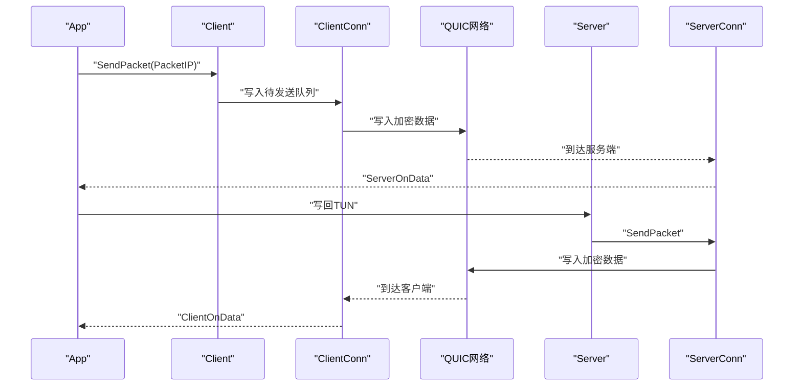
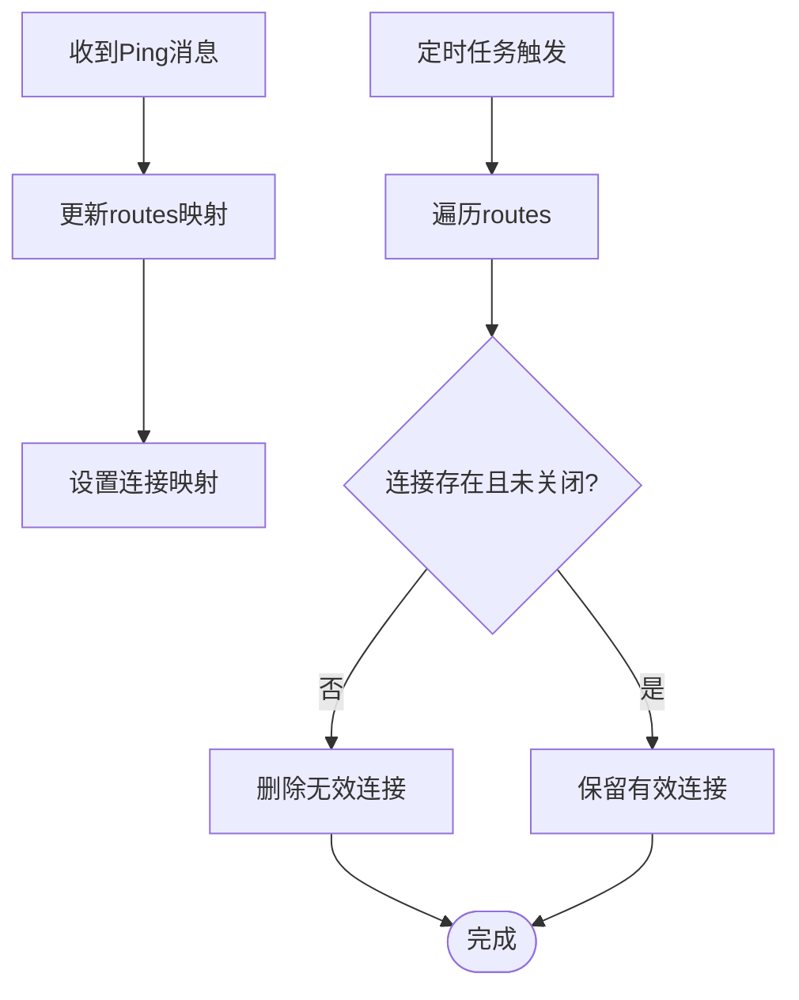
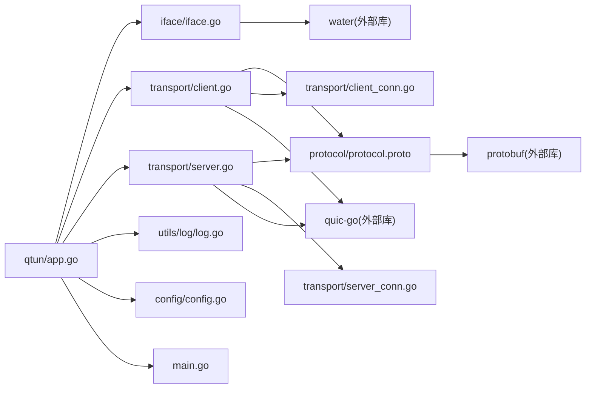

# TUN接口原理

<cite>
**本文引用的文件**
- [main.go](file://main.go)
- [config/config.go](file://config/config.go)
- [iface/iface.go](file://iface/iface.go)
- [iface/packet_ip.go](file://iface/packet_ip.go)
- [qtun/app.go](file://qtun/app.go)
- [transport/client.go](file://transport/client.go)
- [transport/server.go](file://transport/server.go)
- [transport/client_conn.go](file://transport/client_conn.go)
- [transport/server_conn.go](file://transport/server_conn.go)
- [transport/grpc_handler.go](file://transport/grpc_handler.go)
- [protocol/protocol.proto](file://protocol/protocol.proto)
- [go.mod](file://go.mod)
- [README.md](file://README.md)
- [utils/log/log.go](file://utils/log/log.go)
</cite>

## 目录
1. [引言](#引言)
2. [项目结构](#项目结构)
3. [核心组件](#核心组件)
4. [架构总览](#架构总览)
5. [详细组件分析](#详细组件分析)
6. [依赖关系分析](#依赖关系分析)
7. [性能考量](#性能考量)
8. [故障排查指南](#故障排查指南)
9. [结论](#结论)
10. [附录](#附录)

## 引言
本文件围绕TUN接口在Qtun中的实现进行系统化技术说明，涵盖以下主题：
- TUN接口概念与虚拟网络接口工作机制
- 在用户空间创建与管理虚拟网络设备的方法
- Qtun中TUN接口的初始化、IP地址配置、MTU设置与路由表管理
- IP数据包从内核到用户空间的转发机制
- 跨平台适配（macOS/Linux）与限制（Windows不支持）
- 基于协议缓冲区的封装与QUIC传输层集成
- 使用示例与最佳实践

## 项目结构
该项目采用模块化分层设计：
- 入口与命令行参数解析：main.go
- 配置中心：config/config.go
- TUN接口与数据包池：iface/iface.go、iface/packet_ip.go
- 应用主循环与TUN读写调度：qtun/app.go
- 传输层（客户端/服务端）：transport/client.go、transport/server.go、transport/client_conn.go、transport/server_conn.go
- 协议定义：protocol/protocol.proto
- 日志与运行环境：utils/log/log.go、README.md、go.mod



图表来源
- [main.go](file://main.go#L1-L136)
- [config/config.go](file://config/config.go#L1-L24)
- [qtun/app.go](file://qtun/app.go#L1-L271)
- [iface/iface.go](file://iface/iface.go#L1-L105)
- [iface/packet_ip.go](file://iface/packet_ip.go#L1-L47)
- [transport/client.go](file://transport/client.go#L1-L223)
- [transport/server.go](file://transport/server.go#L1-L219)
- [transport/client_conn.go](file://transport/client_conn.go#L1-L408)
- [transport/server_conn.go](file://transport/server_conn.go#L1-L295)
- [protocol/protocol.proto](file://protocol/protocol.proto#L1-L22)
- [utils/log/log.go](file://utils/log/log.go#L1-L26)
- [README.md](file://README.md#L1-L99)
- [go.mod](file://go.mod#L1-L29)

章节来源
- [main.go](file://main.go#L1-L136)
- [README.md](file://README.md#L1-L99)

## 核心组件
- 配置中心：集中管理密钥、远端地址、监听地址、IP段、MTU、是否服务端模式等全局参数。
- TUN接口：封装water库创建TUN设备，执行ifconfig配置IP与MTU，并在macOS上添加系统路由。
- 数据包池：基于sync.Pool复用PacketIP切片，降低GC压力。
- 应用主循环：启动TUN接口，动态创建工作线程并发读取TUN数据包；在服务端模式下维护路由表，在客户端模式下直接转发。
- 传输层：基于QUIC的客户端/服务端实现，负责加密、序列化与网络收发。
- 协议：Envelope/Packet/Ping三类消息，用于控制与数据转发。

章节来源
- [config/config.go](file://config/config.go#L1-L24)
- [iface/iface.go](file://iface/iface.go#L1-L105)
- [iface/packet_ip.go](file://iface/packet_ip.go#L1-L47)
- [qtun/app.go](file://qtun/app.go#L1-L271)
- [transport/client.go](file://transport/client.go#L1-L223)
- [transport/server.go](file://transport/server.go#L1-L219)
- [protocol/protocol.proto](file://protocol/protocol.proto#L1-L22)

## 架构总览
下图展示了从内核到用户空间的数据通路，以及服务端/客户端之间的QUIC隧道：



图表来源
- [qtun/app.go](file://qtun/app.go#L99-L167)
- [transport/client.go](file://transport/client.go#L208-L222)
- [transport/server.go](file://transport/server.go#L175-L210)
- [transport/client_conn.go](file://transport/client_conn.go#L241-L294)
- [transport/server_conn.go](file://transport/server_conn.go#L167-L220)
- [protocol/protocol.proto](file://protocol/protocol.proto#L5-L22)

## 详细组件分析

### TUN接口初始化与配置
- 初始化流程
  - 创建water.Config并指定设备类型为TUN
  - 调用water.New创建接口实例
  - 解析CIDR，生成ifconfig命令，设置IP、子网掩码、MTU并启动接口
  - 在macOS上为目标子网添加系统路由
- 关键点
  - 接口名称通过water库分配，可通过Name()获取
  - 读写通过Read/Write直接与内核交互
  - 路由仅在macOS上添加，Linux默认不添加系统路由



图表来源
- [iface/iface.go](file://iface/iface.go#L31-L92)

章节来源
- [iface/iface.go](file://iface/iface.go#L1-L105)

### IP数据包处理与对象池
- PacketIP类型为[]byte别名，便于统一处理
- 对象池策略
  - 默认容量2048字节，按需扩容或重用
  - 回收时仅对特定范围容量进行缓存，避免内存膨胀
- 读写路径
  - 读取：App从TUN读取到PacketIP
  - 写入：App将PacketIP写回TUN
  - 发送：Client/Server将PacketIP封装为Protocol Buffer后发送

```mermaid
classDiagram
class PacketIP {
+[]byte
+GetSourceIP() net.IP
+GetDestinationIP() net.IP
}
class Pool {
+New() interface{}
+Get() *[]byte
+Put(*[]byte) void
}
class App {
+FetchAndProcessTunPkt()
+ServerOnData()
+ClientOnData()
}
class Client {
+SendPacket(PacketIP)
}
class Server {
+SendPacket(PacketIP)
}
App --> PacketIP : "读/写"
Client --> PacketIP : "发送"
Server --> PacketIP : "发送"
Pool <.. PacketIP : "对象池"
```

图表来源
- [iface/packet_ip.go](file://iface/packet_ip.go#L8-L47)
- [qtun/app.go](file://qtun/app.go#L99-L167)
- [transport/client.go](file://transport/client.go#L208-L222)
- [transport/server.go](file://transport/server.go#L175-L210)

章节来源
- [iface/packet_ip.go](file://iface/packet_ip.go#L1-L47)
- [qtun/app.go](file://qtun/app.go#L99-L167)

### 应用主循环与工作线程
- 启动逻辑
  - 读取配置，创建Iface并Start
  - 动态计算工作线程数（CPU核数×2，最小4，最大32）
  - 启动若干工作线程并发读取TUN数据包
- 处理逻辑（客户端模式）
  - 读取PacketIP后直接封装并发送至服务端
- 处理逻辑（服务端模式）
  - 读取PacketIP后根据目的IP查找路由
  - 若无路由或连接不可用则丢弃
  - 随机选择可用连接发送
  - 维护路由表并清理失效连接



图表来源
- [qtun/app.go](file://qtun/app.go#L37-L97)
- [qtun/app.go](file://qtun/app.go#L99-L167)
- [transport/server.go](file://transport/server.go#L51-L70)

章节来源
- [qtun/app.go](file://qtun/app.go#L1-L271)

### 传输层与QUIC集成
- 客户端
  - 支持多连接（TransportThreads），轮询选择连接
  - 发送前封装Envelope/Packet，必要时进行AES-GCM加密
  - 读取时解密并回调App.ClientOnData
- 服务端
  - 基于QUIC监听，接受新连接并启动读写协程
  - 读取时解密并回调App.ServerOnData
  - 维护连接映射，支持删除失效连接



图表来源
- [transport/client.go](file://transport/client.go#L208-L222)
- [transport/client_conn.go](file://transport/client_conn.go#L241-L294)
- [transport/server_conn.go](file://transport/server_conn.go#L167-L220)
- [qtun/app.go](file://qtun/app.go#L169-L248)

章节来源
- [transport/client.go](file://transport/client.go#L1-L223)
- [transport/server.go](file://transport/server.go#L1-L219)
- [transport/client_conn.go](file://transport/client_conn.go#L1-L408)
- [transport/server_conn.go](file://transport/server_conn.go#L1-L295)

### 路由表管理（服务端）
- 路由表结构
  - dst -> set of local_addr
  - 通过Ping消息更新，记录客户端侧IP与本地地址映射
- 清理任务
  - 定期扫描并移除已关闭或失效的连接
  - 保证路由表一致性



图表来源
- [qtun/app.go](file://qtun/app.go#L51-L70)
- [qtun/app.go](file://qtun/app.go#L169-L207)
- [transport/server.go](file://transport/server.go#L175-L210)

章节来源
- [qtun/app.go](file://qtun/app.go#L51-L70)
- [qtun/app.go](file://qtun/app.go#L169-L207)
- [transport/server.go](file://transport/server.go#L175-L210)

### 跨平台支持与适配
- macOS
  - 通过ifconfig配置IP/掩码/MTU并启动接口
  - 添加系统路由以确保流量进入TUN
- Linux
  - 通过ifconfig配置IP/掩码/MTU并启动接口
  - 不自动添加系统路由（由用户自行配置）
- Windows
  - 不支持（README明确标注）

章节来源
- [iface/iface.go](file://iface/iface.go#L50-L92)
- [README.md](file://README.md#L96-L99)

### 协议与加密
- 协议定义
  - Envelope包含Ping与Packet两类消息
  - Ping携带时间戳、本地地址、私有地址、IP与数据中心标识
  - Packet承载原始IP数据负载
- 加密
  - 可选AES-GCM加密，使用随机nonce
  - 通过通道缓冲与对象池减少分配与拷贝

章节来源
- [protocol/protocol.proto](file://protocol/protocol.proto#L1-L22)
- [transport/client_conn.go](file://transport/client_conn.go#L241-L294)
- [transport/server_conn.go](file://transport/server_conn.go#L167-L220)

## 依赖关系分析
- 模块耦合
  - qtun/app.go依赖iface与transport，承担调度职责
  - transport层通过GrpcHandler回调qtun/app.go，形成双向交互
  - iface与protocol为纯数据结构，低耦合
- 外部依赖
  - water：跨平台TUN设备创建
  - quic-go：高性能QUIC传输
  - protobuf：消息序列化
  - zerolog：结构化日志



图表来源
- [qtun/app.go](file://qtun/app.go#L1-L271)
- [iface/iface.go](file://iface/iface.go#L1-L105)
- [transport/client.go](file://transport/client.go#L1-L223)
- [transport/server.go](file://transport/server.go#L1-L219)
- [transport/client_conn.go](file://transport/client_conn.go#L1-L408)
- [transport/server_conn.go](file://transport/server_conn.go#L1-L295)
- [protocol/protocol.proto](file://protocol/protocol.proto#L1-L22)
- [utils/log/log.go](file://utils/log/log.go#L1-L26)
- [config/config.go](file://config/config.go#L1-L24)
- [main.go](file://main.go#L1-L136)
- [go.mod](file://go.mod#L5-L14)

章节来源
- [go.mod](file://go.mod#L1-L29)

## 性能考量
- 并发模型
  - TUN读取工作线程数随CPU核数动态调整，兼顾吞吐与资源占用
  - 传输层客户端支持多连接，轮询发送提升带宽利用率
- 缓冲与对象池
  - PacketIP对象池减少频繁分配
  - 读写缓冲区增大（64KB）提升吞吐
- QUIC优化
  - 配置较大的流接收窗口与连接接收窗口，启用Datagrams
  - KeepAlive周期合理设置，避免空闲断连
- 锁优化
  - 服务端使用sync.Map与RWMutex，降低锁竞争
  - 路由表更新与清理尽量缩短临界区

章节来源
- [qtun/app.go](file://qtun/app.go#L72-L97)
- [transport/client.go](file://transport/client.go#L41-L83)
- [transport/server.go](file://transport/server.go#L97-L103)
- [transport/client_conn.go](file://transport/client_conn.go#L332-L332)
- [transport/server_conn.go](file://transport/server_conn.go#L89-L89)

## 故障排查指南
- TUN接口无法启动
  - 检查权限（需要root/sudo）
  - 确认ifconfig命令可用与参数正确
  - 查看日志输出的错误信息与命令输出
- macOS路由问题
  - 确认已添加系统路由
  - 检查目标子网是否正确
- 连接不稳定或断开
  - 检查QUIC连接建立与KeepAlive设置
  - 观察日志中的panic与异常关闭信息
- 丢包与延迟
  - 调整MTU与工作线程数
  - 检查对象池容量与缓冲区大小
- 日志级别
  - 通过命令行参数设置日志等级，便于定位问题

章节来源
- [iface/iface.go](file://iface/iface.go#L61-L67)
- [qtun/app.go](file://qtun/app.go#L51-L70)
- [transport/client_conn.go](file://transport/client_conn.go#L153-L188)
- [transport/server_conn.go](file://transport/server_conn.go#L58-L115)
- [utils/log/log.go](file://utils/log/log.go#L10-L25)

## 结论
Qtun通过TUN接口在用户空间实现了虚拟网络设备的创建与管理，结合QUIC传输与协议封装，完成了从内核到用户空间的数据包转发。项目在并发、对象池、锁优化与QUIC参数方面进行了系统性优化，同时提供了跨平台适配与清晰的路由管理机制。对于Windows平台，当前版本不支持；在macOS/Linux上，建议配合系统路由与代理配置使用，以获得最佳体验。

## 附录

### 使用示例与最佳实践
- 服务端启动
  - 设置监听地址、IP段、密钥与服务端模式
  - 自动启动Socks5代理（可选）
- 客户端启动
  - 设置远端地址、IP段、密钥与线程数
  - 自动配置系统代理（macOS）
- 最佳实践
  - 合理设置MTU与工作线程数
  - 使用对象池与大缓冲区提升吞吐
  - 在服务端定期清理失效连接，保持路由表健康
  - 严格管理密钥与加密开关

章节来源
- [README.md](file://README.md#L13-L26)
- [main.go](file://main.go#L48-L103)
- [qtun/app.go](file://qtun/app.go#L250-L270)