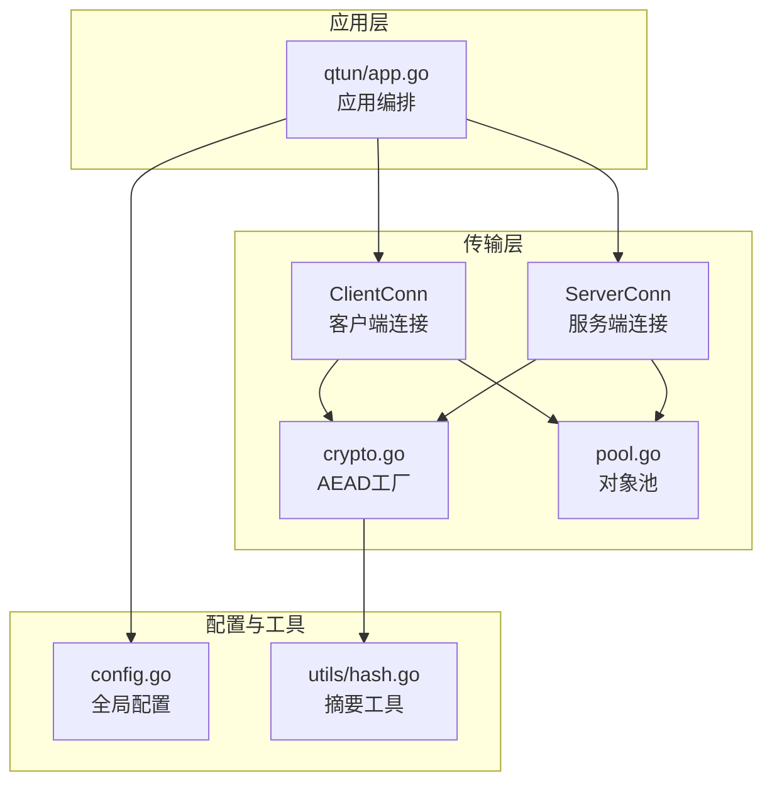
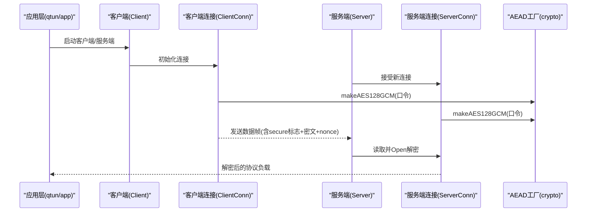
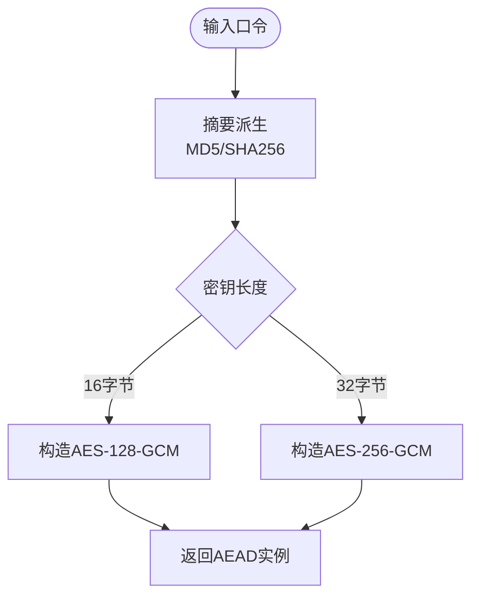
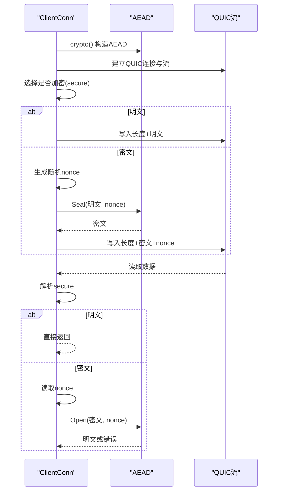
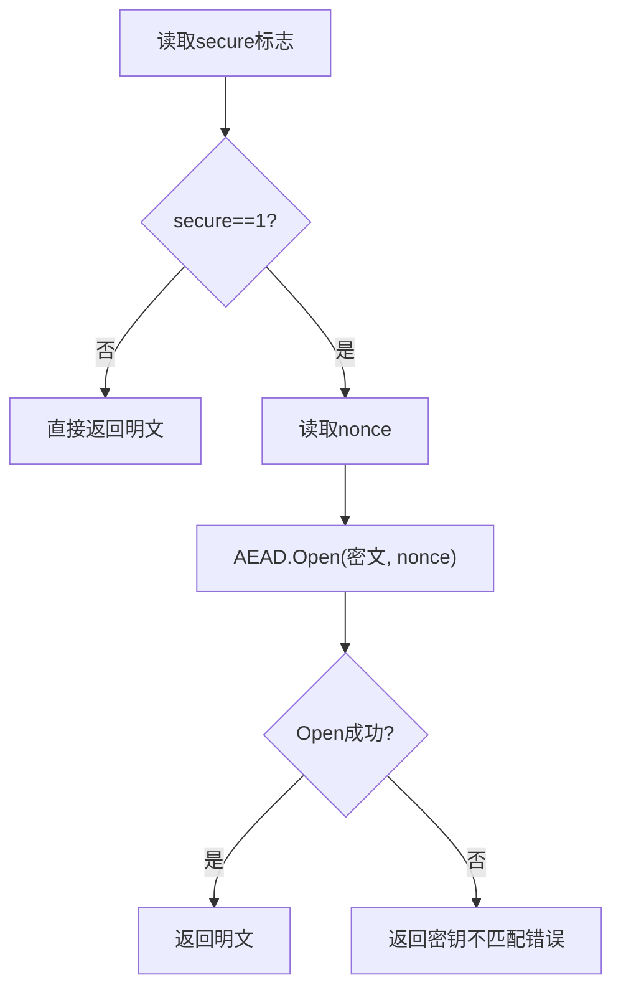
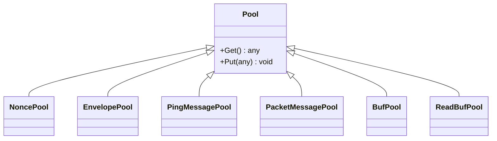
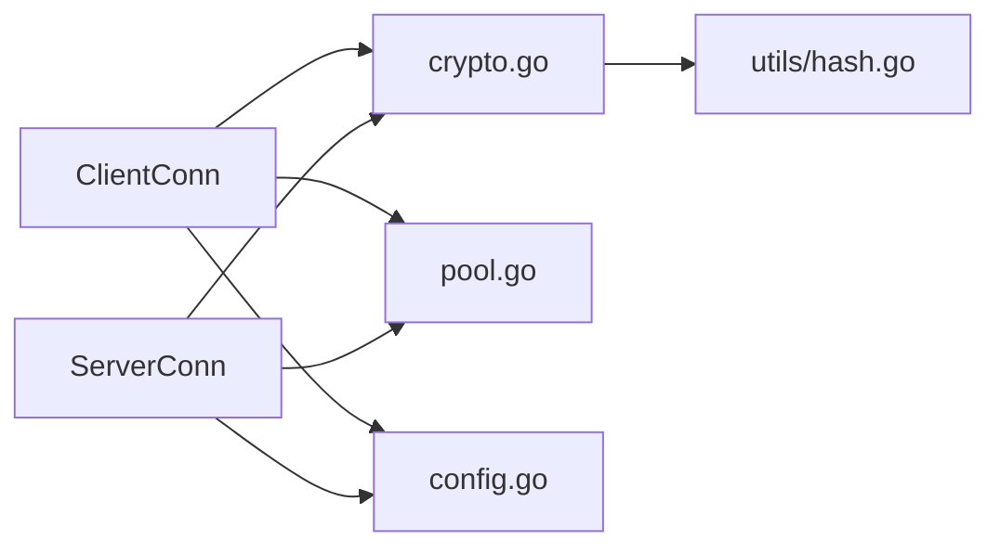

# 加密通信机制

<cite>
**本文引用的文件列表**
- [transport/crypto.go](file://transport/crypto.go)
- [transport/client_conn.go](file://transport/client_conn.go)
- [transport/server_conn.go](file://transport/server_conn.go)
- [transport/pool.go](file://transport/pool.go)
- [transport/client.go](file://transport/client.go)
- [transport/server.go](file://transport/server.go)
- [utils/hash.go](file://utils/hash.go)
- [config/config.go](file://config/config.go)
- [qtun/app.go](file://qtun/app.go)
</cite>

## 目录
1. [简介](#简介)
2. [项目结构与职责划分](#项目结构与职责划分)
3. [核心组件](#核心组件)
4. [架构总览](#架构总览)
5. [详细组件分析](#详细组件分析)
6. [依赖关系分析](#依赖关系分析)
7. [性能与优化](#性能与优化)
8. [故障排查指南](#故障排查指南)
9. [结论](#结论)

## 简介
本文件系统性梳理 Qtun 的加密通信机制，重点覆盖以下方面：
- 对称加密：AES-GCM（AEAD）的实现与密钥派生策略
- 密钥管理：基于用户输入口令的密钥派生与会话建立
- 数据流：从密钥初始化、握手、到数据传输的完整流程
- 安全性：完整性保护、抗重放与错误处理
- 性能：对象池、并发与缓冲区优化
- 使用示例与安全配置建议

注意：当前实现采用 AES-GCM（AEAD），但未实现前向保密（Forward Secrecy）。本文将明确指出该限制并给出替代方案建议。

## 项目结构与职责划分
- transport/crypto.go：定义对称加密套件工厂函数，负责将用户口令派生为固定长度密钥并构造 AEAD
- transport/client_conn.go / transport/server_conn.go：客户端/服务端连接层，负责读写、加解密、nonce 管理与错误处理
- transport/pool.go：对象池，复用 nonce、缓冲区与 protobuf 消息，降低 GC 压力
- transport/client.go / transport/server.go：高层客户端/服务端编排，连接生命周期与并发控制
- utils/hash.go：提供 MD5/SHA256 等摘要工具，用于密钥派生
- config/config.go：全局配置，包含密钥、远端地址、线程数等
- qtun/app.go：应用入口，驱动 TUN 接口与传输层交互

图表来源
- [transport/client_conn.go](file://transport/client_conn.go#L24-L42)
- [transport/server_conn.go](file://transport/server_conn.go#L24-L37)
- [transport/crypto.go](file://transport/crypto.go#L10-L26)
- [transport/pool.go](file://transport/pool.go#L11-L50)
- [utils/hash.go](file://utils/hash.go#L11-L27)
- [config/config.go](file://config/config.go#L3-L13)
- [qtun/app.go](file://qtun/app.go#L19-L27)

章节来源
- [transport/crypto.go](file://transport/crypto.go#L1-L27)
- [transport/client_conn.go](file://transport/client_conn.go#L1-L408)
- [transport/server_conn.go](file://transport/server_conn.go#L1-L295)
- [transport/pool.go](file://transport/pool.go#L1-L108)
- [utils/hash.go](file://utils/hash.go#L1-L42)
- [config/config.go](file://config/config.go#L1-L24)
- [qtun/app.go](file://qtun/app.go#L1-L271)

## 核心组件
- AEAD 工厂：提供 makeAES128GCM 与 makeAES256GCM，分别使用 MD5/SHA256 将口令映射为固定长度密钥后构造 GCM
- 连接层：ClientConn/ServerConn 负责：
  - 初始化加密上下文（crypto）
  - 写入时：选择是否加密（secure 标志位）、生成随机 nonce、调用 Seal/Open
  - 读取时：解析 secure 标志位、读取 nonce 并执行 Open；若解密失败返回特定错误
- 对象池：复用 nonce、缓冲区与 protobuf 消息，减少分配与 GC
- 配置：密钥、远端地址、线程数、是否启用 NoDelay 等

章节来源
- [transport/crypto.go](file://transport/crypto.go#L10-L26)
- [transport/client_conn.go](file://transport/client_conn.go#L119-L151)
- [transport/server_conn.go](file://transport/server_conn.go#L117-L127)
- [transport/pool.go](file://transport/pool.go#L11-L50)
- [config/config.go](file://config/config.go#L3-L13)

## 架构总览
下图展示了从应用层到传输层再到加密子系统的整体交互。

图表来源
- [qtun/app.go](file://qtun/app.go#L37-L49)
- [transport/client.go](file://transport/client.go#L31-L83)
- [transport/server.go](file://transport/server.go#L37-L52)
- [transport/client_conn.go](file://transport/client_conn.go#L119-L151)
- [transport/server_conn.go](file://transport/server_conn.go#L117-L127)
- [transport/crypto.go](file://transport/crypto.go#L10-L26)

## 详细组件分析

### AEAD 工厂与密钥派生
- makeAES128GCM：使用 MD5 将口令映射为 16 字节密钥，构造 AES-128-GCM
- makeAES256GCM：使用 SHA256 将口令映射为 32 字节密钥，构造 AES-256-GCM
- 两者均通过 utils.MD5/utils.SHA256 实现，确保密钥长度满足 AES-GCM 要求

图表来源
- [transport/crypto.go](file://transport/crypto.go#L10-L26)
- [utils/hash.go](file://utils/hash.go#L11-L27)

章节来源
- [transport/crypto.go](file://transport/crypto.go#L10-L26)
- [utils/hash.go](file://utils/hash.go#L11-L27)

### 客户端连接（ClientConn）
- 初始化：crypto() 构造 AEAD；tryConnect() 建立 QUIC 流；run() 循环处理写入队列
- 写入流程：secure 标志位指示是否加密；若加密则生成随机 nonce（来自随机源），调用 Seal 返回密文；将密文长度、密文与 nonce 写入底层流
- 读取流程：解析 secure 标志位；若加密则读取 nonce 并调用 Open；若 Open 失败，返回“密钥不匹配”错误
- 缓冲与并发：使用大缓冲（64KB）与通道队列（默认 256 缓冲），配合对象池复用 nonce

图表来源
- [transport/client_conn.go](file://transport/client_conn.go#L119-L151)
- [transport/client_conn.go](file://transport/client_conn.go#L241-L294)
- [transport/client_conn.go](file://transport/client_conn.go#L359-L394)
- [transport/crypto.go](file://transport/crypto.go#L10-L26)

章节来源
- [transport/client_conn.go](file://transport/client_conn.go#L119-L151)
- [transport/client_conn.go](file://transport/client_conn.go#L241-L294)
- [transport/client_conn.go](file://transport/client_conn.go#L359-L394)

### 服务端连接（ServerConn）
- 与客户端类似，crypto() 构造 AEAD；read() 读取并 Open；write() 写入时根据 secure 标志位决定明文/密文
- 错误处理：当 Open 失败时返回“密钥不匹配”错误，便于上层清理无效连接

图表来源
- [transport/server_conn.go](file://transport/server_conn.go#L129-L165)

章节来源
- [transport/server_conn.go](file://transport/server_conn.go#L117-L127)
- [transport/server_conn.go](file://transport/server_conn.go#L129-L165)
- [transport/server_conn.go](file://transport/server_conn.go#L167-L220)

### 对象池（pool.go）
- noncePool：固定 12 字节 nonce 的复用
- envelopePool/pingMessagePool/packetMessagePool：protobuf 消息复用
- bufPool/readBufPool：缓冲区复用，减少频繁分配

图表来源
- [transport/pool.go](file://transport/pool.go#L11-L50)

章节来源
- [transport/pool.go](file://transport/pool.go#L1-L108)

### 配置与密钥管理
- 全局配置包含 Key、RemoteAddrs、Listen、TransportThreads、Ip、Mtu、ServerMode、NoDelay 等字段
- 密钥通过 config.Key 提供，客户端与服务端在各自连接初始化阶段调用 crypto() 构造 AEAD
- 注意：当前实现未对密钥进行轮换或会话级随机化，因此不具备前向保密能力

章节来源
- [config/config.go](file://config/config.go#L3-L13)
- [transport/client_conn.go](file://transport/client_conn.go#L119-L151)
- [transport/server_conn.go](file://transport/server_conn.go#L117-L127)

### 应用层集成
- qtun/app.go 在 Run() 中根据 ServerMode 创建客户端或服务端实例，并启动 TUN 接口与数据转发
- 客户端/服务端通过 GrpcHandler 回调将解密后的协议负载写入 TUN 或路由表更新

章节来源
- [qtun/app.go](file://qtun/app.go#L37-L49)
- [qtun/app.go](file://qtun/app.go#L169-L207)
- [qtun/app.go](file://qtun/app.go#L209-L248)

## 依赖关系分析
- ClientConn/ServerConn 依赖 crypto.go 提供的 AEAD 工厂
- 二者均依赖 utils/hash.go 的摘要函数进行密钥派生
- 二者通过 transport/pool.go 复用 nonce、缓冲区与 protobuf 消息
- 配置由 config/config.go 提供，影响连接行为（如 NoDelay）

图表来源
- [transport/client_conn.go](file://transport/client_conn.go#L119-L151)
- [transport/server_conn.go](file://transport/server_conn.go#L117-L127)
- [transport/crypto.go](file://transport/crypto.go#L10-L26)
- [utils/hash.go](file://utils/hash.go#L11-L27)
- [transport/pool.go](file://transport/pool.go#L11-L50)
- [config/config.go](file://config/config.go#L3-L13)

章节来源
- [transport/client_conn.go](file://transport/client_conn.go#L1-L408)
- [transport/server_conn.go](file://transport/server_conn.go#L1-L295)
- [transport/crypto.go](file://transport/crypto.go#L1-L27)
- [utils/hash.go](file://utils/hash.go#L1-L42)
- [transport/pool.go](file://transport/pool.go#L1-L108)
- [config/config.go](file://config/config.go#L1-L24)

## 性能与优化
- 对象池：nonce、缓冲区、protobuf 消息均通过 sync.Pool 复用，显著降低 GC 压力
- 大缓冲：读写侧使用 64KB 缓冲，提升吞吐
- 并发：客户端/服务端连接均使用通道队列与 goroutine 并行处理
- QUIC 参数：连接与流窗口、保活周期等参数已优化，提升稳定性与带宽利用率
- 建议：
  - 批量加密：对小包合并后再 Seal，减少 AEAD 调用次数
  - 密钥缓存：在连接生命周期内复用 AEAD 实例，避免重复派生
  - 非对称握手：若需前向保密，建议引入基于 ECDHE 的握手并在会话结束后销毁密钥材料

章节来源
- [transport/pool.go](file://transport/pool.go#L11-L50)
- [transport/client_conn.go](file://transport/client_conn.go#L332-L333)
- [transport/server_conn.go](file://transport/server_conn.go#L88-L89)
- [transport/server.go](file://transport/server.go#L97-L103)
- [transport/client.go](file://transport/client.go#L46-L47)

## 故障排查指南
- “密钥不匹配”错误：当服务端 Open 失败时返回该错误，通常意味着客户端与服务端使用的密钥不一致或数据被篡改
- 连接异常：检查 QUIC 连接状态与通道关闭信号；确认 NoDelay 与缓冲设置
- 性能问题：确认对象池是否正确复用；检查通道阻塞与缓冲大小

章节来源
- [transport/server_conn.go](file://transport/server_conn.go#L159-L164)
- [transport/client_conn.go](file://transport/client_conn.go#L210-L218)
- [transport/server_conn.go](file://transport/server_conn.go#L251-L290)

## 结论
- 当前实现采用 AES-GCM（AEAD）对称加密，通过口令派生固定长度密钥，具备机密性与完整性保护
- 未实现前向保密：密钥在进程生命周期内固定，无法抵御长期密钥泄露带来的历史会话风险
- 建议：
  - 引入基于 ECDHE 的握手，实现会话级密钥协商与销毁
  - 对于高并发场景，结合批量加密与密钥缓存进一步优化性能
  - 在生产环境强制启用密钥校验与完整性检查，避免弱口令与明文传输