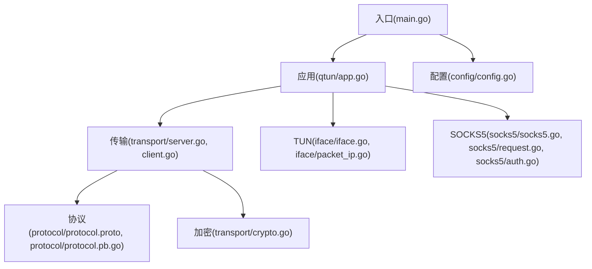
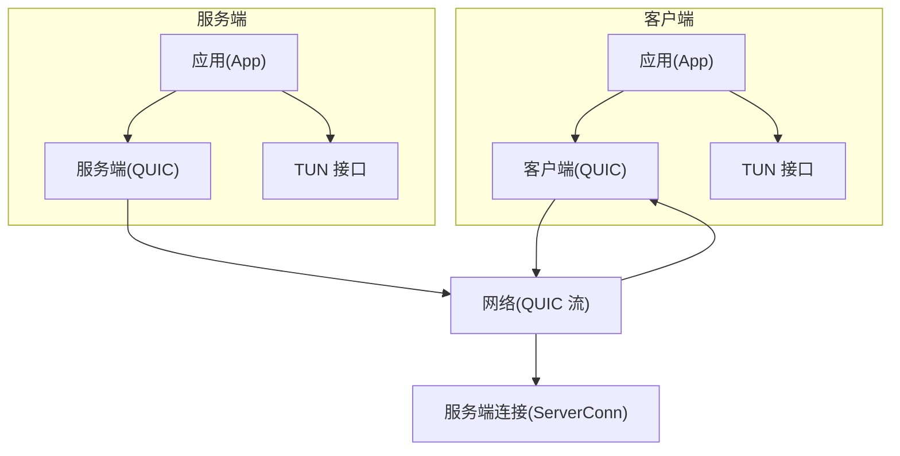
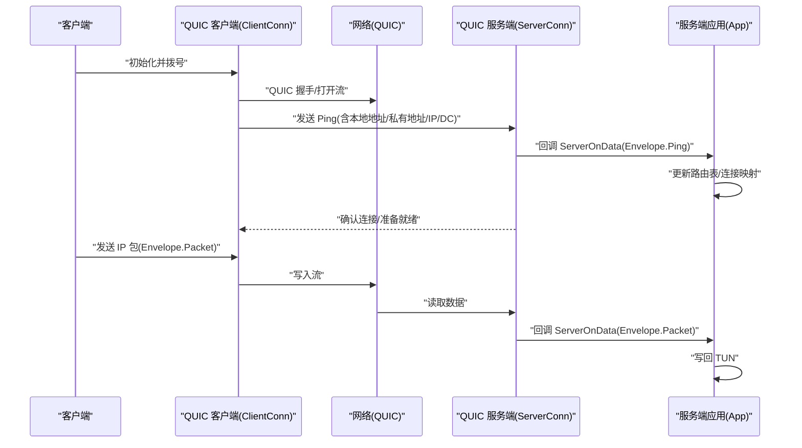
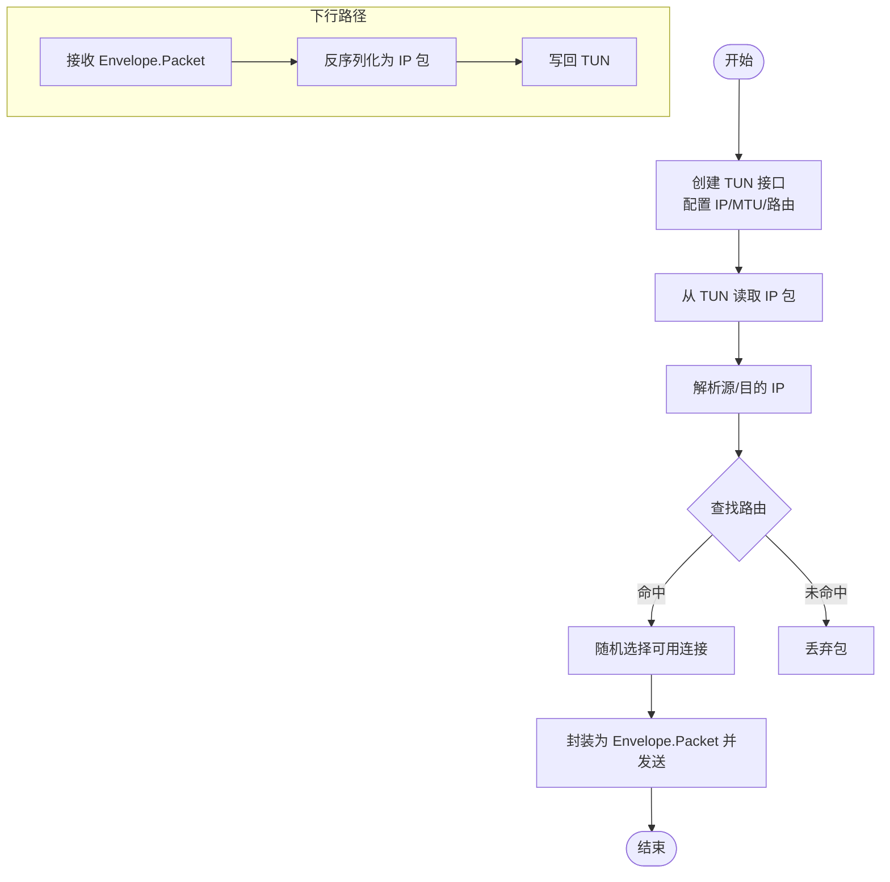
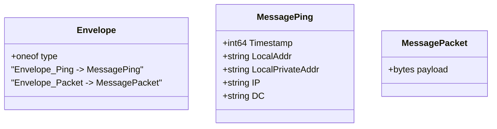
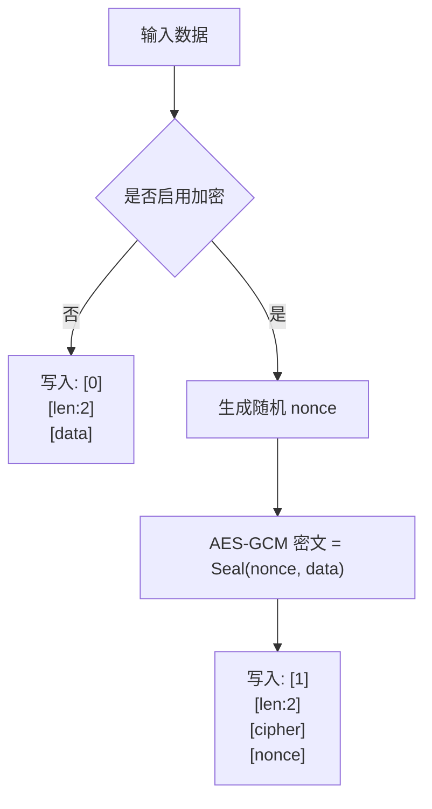
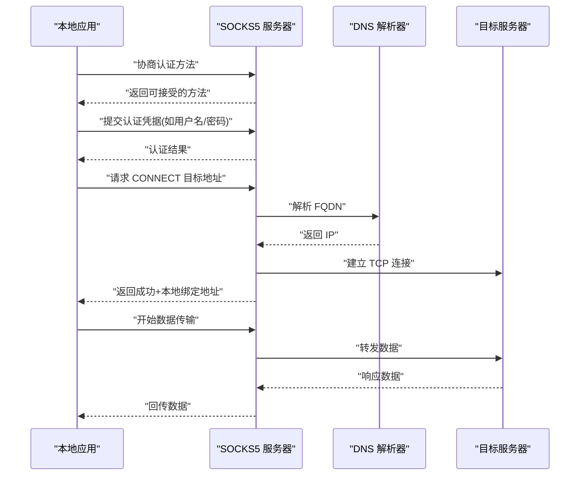
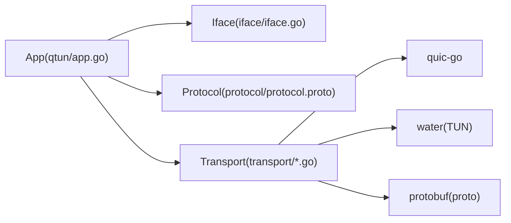

# 核心概念

<cite>
**本文引用的文件**
- [main.go](file://main.go)
- [config.go](file://config/config.go)
- [app.go](file://qtun/app.go)
- [protocol.proto](file://protocol/protocol.proto)
- [protocol.pb.go](file://protocol/protocol.pb.go)
- [iface.go](file://iface/iface.go)
- [packet_ip.go](file://iface/packet_ip.go)
- [server.go](file://transport/server.go)
- [client.go](file://transport/client.go)
- [server_conn.go](file://transport/server_conn.go)
- [client_conn.go](file://transport/client_conn.go)
- [crypto.go](file://transport/crypto.go)
- [socks5.go](file://socks5/socks5.go)
- [request.go](file://socks5/request.go)
- [auth.go](file://socks5/auth.go)
- [README.md](file://README.md)
</cite>

## 目录
1. [引言](#引言)
2. [项目结构](#项目结构)
3. [核心组件](#核心组件)
4. [架构总览](#架构总览)
5. [详细组件分析](#详细组件分析)
6. [依赖关系分析](#依赖关系分析)
7. [性能考量](#性能考量)
8. [故障排查指南](#故障排查指南)
9. [结论](#结论)
10. [附录](#附录)

## 引言
本文件面向开发者系统性梳理 Qtun 的核心概念与实现：QUIC 协议在传输层的应用、TUN 虚拟网卡与 IP 包处理流程、SOCKS5 代理协议的实现细节（认证、连接建立与数据转发）、Protocol Buffer 消息模型设计，以及基于对称加密的端到端安全通道。文档以图示与路径引用的方式帮助读者快速定位源码位置，理解各模块职责与交互。

## 项目结构
Qtun 采用分层清晰的组织方式：
- 入口与命令行参数解析位于根目录入口文件
- 配置单例集中于 config 包
- 应用主循环与 TUN 接口管理位于 qtun 子包
- 传输层基于 QUIC，包含客户端与服务端实现
- 网络协议定义位于 protocol 子包
- TUN 接口封装与 IP 包处理位于 iface 子包
- SOCKS5 代理服务位于 socks5 子包

**图示来源**
- [main.go](file://main.go#L70-L103)
- [config.go](file://config/config.go#L17-L23)
- [app.go](file://qtun/app.go#L37-L49)
- [server.go](file://transport/server.go#L37-L46)
- [client.go](file://transport/client.go#L31-L39)
- [protocol.proto](file://protocol/protocol.proto#L5-L22)
- [protocol.pb.go](file://protocol/protocol.pb.go)
- [crypto.go](file://transport/crypto.go#L10-L17)
- [iface.go](file://iface/iface.go#L23-L29)
- [packet_ip.go](file://iface/packet_ip.go#L18-L31)
- [socks5.go](file://socks5/socks5.go#L61-L97)
- [request.go](file://socks5/request.go#L89-L116)
- [auth.go](file://socks5/auth.go#L33-L36)

**章节来源**
- [main.go](file://main.go#L70-L103)
- [README.md](file://README.md#L1-L99)

## 核心组件
- 应用层(App)：负责启动 TUN 接口、调度 QUIC 客户端/服务端、维护路由表、处理来自 TUN 的 IP 包与来自 QUIC 的协议包
- 传输层(QUIC)：服务端监听 QUIC 地址，客户端拨号 QUIC，双方通过流进行可靠数据传输；内置轻量加密封装
- 协议层(Protocol Buffer)：定义 Envelope、MessagePing、MessagePacket 等消息类型，承载路由同步与数据转发
- 接口层(TUN)：抽象出 TUN 设备，读写原始 IP 包，配合对象池减少分配
- 代理层(SOCKS5)：提供本地代理服务，支持无认证或用户名密码认证，按规则放行/拦截

**章节来源**
- [app.go](file://qtun/app.go#L19-L35)
- [server.go](file://transport/server.go#L23-L35)
- [client.go](file://transport/client.go#L20-L29)
- [protocol.proto](file://protocol/protocol.proto#L5-L22)
- [iface.go](file://iface/iface.go#L16-L21)
- [socks5.go](file://socks5/socks5.go#L55-L58)

## 架构总览
下图展示 Qtun 的端到端工作流：客户端通过 QUIC 与服务端建立连接，服务端维护路由表并把从 TUN 读取的 IP 包经 QUIC 流转发给对应客户端；客户端收到协议包后写回 TUN，从而实现跨主机的虚拟网络互通。同时，服务端可选地提供 SOCKS5 代理能力。

**图示来源**
- [app.go](file://qtun/app.go#L37-L49)
- [server.go](file://transport/server.go#L91-L149)
- [client.go](file://transport/client.go#L41-L83)
- [server_conn.go](file://transport/server_conn.go#L39-L51)
- [client_conn.go](file://transport/client_conn.go#L44-L56)
- [iface.go](file://iface/iface.go#L94-L104)

## 详细组件分析

### QUIC 协议与传输实现
- 服务端监听与握手
  - 使用 quic-go 提供的 Listener 监听指定地址，配置最大并发流、接收窗口与保活周期等参数
  - 为每个新会话接受流并创建 ServerConn，分别启动读写协程
- 客户端拨号与多路复用
  - 客户端按线程数创建多个 ClientConn，每个持有独立流
  - 通过 ping 同步路由信息，定期发送心跳维持连接
- 加密封装
  - 双端均支持 AES-GCM 加密，密钥派生自 MD5 或 SHA256 哈希
  - 数据帧前缀包含“是否加密”标志与长度字段，随后是密文或明文及随机 nonce

**图示来源**
- [server.go](file://transport/server.go#L91-L149)
- [client.go](file://transport/client.go#L178-L206)
- [server_conn.go](file://transport/server_conn.go#L117-L165)
- [client_conn.go](file://transport/client_conn.go#L241-L294)
- [app.go](file://qtun/app.go#L169-L207)

**章节来源**
- [server.go](file://transport/server.go#L91-L149)
- [client.go](file://transport/client.go#L178-L206)
- [server_conn.go](file://transport/server_conn.go#L117-L165)
- [client_conn.go](file://transport/client_conn.go#L241-L294)
- [crypto.go](file://transport/crypto.go#L10-L17)

### TUN 接口与 IP 包处理
- TUN 创建与配置
  - 通过 water 库创建 TUN 设备，设置 IP/CIDR 与 MTU，并在 macOS 上添加系统路由
- IP 包读取与写回
  - 读取原始 IP 头部，解析源/目的 IP，按路由表选择连接发送
  - 将来自 QUIC 的协议包还原为 IP 包写回 TUN
- 对象池优化
  - PacketIP 使用 sync.Pool 减少频繁分配，按需扩容/回收

**图示来源**
- [iface.go](file://iface/iface.go#L31-L74)
- [app.go](file://qtun/app.go#L99-L167)
- [packet_ip.go](file://iface/packet_ip.go#L18-L39)

**章节来源**
- [iface.go](file://iface/iface.go#L31-L74)
- [app.go](file://qtun/app.go#L99-L167)
- [packet_ip.go](file://iface/packet_ip.go#L18-L39)

### Protocol Buffer 协议定义与消息格式
- 消息模型
  - Envelope：oneof 类型，承载 MessagePing 或 MessagePacket
  - MessagePing：包含时间戳、本地地址、私有地址、目标 IP、机房标识等
  - MessagePacket：承载原始 IP 包字节流
- 编解码与复用
  - 客户端/服务端均使用对象池复用 protobuf 消息，降低 GC 压力

**图示来源**
- [protocol.proto](file://protocol/protocol.proto#L5-L22)
- [protocol.pb.go](file://protocol/protocol.pb.go)

**章节来源**
- [protocol.proto](file://protocol/protocol.proto#L5-L22)
- [protocol.pb.go](file://protocol/protocol.pb.go)

### 加密通信与密钥管理
- 密钥派生
  - makeAES128GCM：使用 MD5(key) 作为 AES-128 密钥
  - makeAES256GCM：使用 SHA256(key) 作为 AES-256 密钥
- 数据帧格式
  - 前缀：1 字节“是否加密”，2 字节长度
  - 明文：直接写入数据
  - 密文：AES-GCM 密文 + 随机 nonce（固定长度）
- 错误处理
  - 解密失败时返回特定错误，便于连接侧清理无效会话

**图示来源**
- [crypto.go](file://transport/crypto.go#L10-L17)
- [client_conn.go](file://transport/client_conn.go#L241-L294)
- [server_conn.go](file://transport/server_conn.go#L167-L220)

**章节来源**
- [crypto.go](file://transport/crypto.go#L10-L17)
- [client_conn.go](file://transport/client_conn.go#L241-L294)
- [server_conn.go](file://transport/server_conn.go#L167-L220)

### SOCKS5 代理协议实现
- 认证机制
  - 支持“无认证”与“用户名/密码”两种方式
  - 用户名/密码认证版本号、用户名/密码长度与内容按协议读取与校验
- 请求处理
  - 读取版本、命令与目标地址（IPv4/IPv6/FQDN），按规则集放行
  - 建立 TCP 连接后双向复制数据（proxy）
- 服务生命周期
  - New 初始化默认认证器、解析器、规则集与日志
  - Serve/ServeConn 循环接受连接并处理

**图示来源**
- [socks5.go](file://socks5/socks5.go#L61-L97)
- [request.go](file://socks5/request.go#L119-L156)
- [auth.go](file://socks5/auth.go#L113-L130)

**章节来源**
- [socks5.go](file://socks5/socks5.go#L61-L97)
- [request.go](file://socks5/request.go#L119-L156)
- [auth.go](file://socks5/auth.go#L113-L130)

## 依赖关系分析
- 组件耦合
  - App 依赖 Config、iface、protocol、transport，形成控制与数据流的中枢
  - 传输层内部通过 GrpcHandler 回调与 App 交互，避免强耦合
- 外部依赖
  - quic-go：QUIC 传输栈
  - water：TUN 设备创建与读写
  - golang/protobuf：协议编解码
  - x/net/context：上下文控制

**图示来源**
- [app.go](file://qtun/app.go#L10-L16)
- [server.go](file://transport/server.go#L18-L21)
- [client.go](file://transport/client.go#L11-L18)
- [iface.go](file://iface/iface.go#L12-L13)
- [protocol.proto](file://protocol/protocol.proto#L1-L4)

**章节来源**
- [app.go](file://qtun/app.go#L10-L16)
- [server.go](file://transport/server.go#L18-L21)
- [client.go](file://transport/client.go#L11-L18)
- [iface.go](file://iface/iface.go#L12-L13)
- [protocol.proto](file://protocol/protocol.proto#L1-L4)

## 性能考量
- 并发与负载均衡
  - 客户端多线程（可配置）与服务端并发流，提升吞吐
  - App 在服务端按目的 IP 查找连接时使用 RWMutex 与只读锁最小化临界区
- 缓冲与对象池
  - 读写缓冲区扩大至 64KB，显著提升大包场景性能
  - PacketIP、protobuf 消息与 nonce 使用对象池，降低 GC 压力
- QUIC 参数优化
  - 调整最大并发流、接收窗口与保活周期，适配高延迟/高丢包环境
- I/O 并行
  - TUN 读取与处理拆分为多个 worker，CPU 核数 × 2 动态扩展

**章节来源**
- [client.go](file://transport/client.go#L115-L132)
- [server.go](file://transport/server.go#L97-L103)
- [app.go](file://qtun/app.go#L81-L96)
- [packet_ip.go](file://iface/packet_ip.go#L10-L16)
- [client_conn.go](file://transport/client_conn.go#L332-L333)
- [server_conn.go](file://transport/server_conn.go#L88-L89)

## 故障排查指南
- 连接无法建立
  - 检查服务端 QUIC 监听与 TLS 配置，确认客户端 NextProtos 一致
  - 核对密钥一致性，确保两端使用相同 key
- 路由不生效
  - 确认客户端已发送 Ping，服务端路由表是否更新
  - 检查 App 中路由清理任务是否正常运行
- TUN 写入失败
  - 确认 TUN 接口已创建并配置 IP/MTU，系统路由是否正确添加
  - 观察对象池容量是否满足 MTU，必要时调整
- 加密异常
  - 若解密失败，检查 nonce 长度与随机源，确认密钥一致
- 代理不可用
  - 确认 SOCKS5 服务已启动，系统 PAC 自动代理指向正确端口

**章节来源**
- [server.go](file://transport/server.go#L151-L173)
- [client_conn.go](file://transport/client_conn.go#L119-L128)
- [server_conn.go](file://transport/server_conn.go#L117-L127)
- [app.go](file://qtun/app.go#L51-L70)
- [iface.go](file://iface/iface.go#L31-L74)
- [socks5.go](file://socks5/socks5.go#L109-L118)

## 结论
Qtun 通过 QUIC 提供稳定高效的传输通道，结合 TUN 实现跨主机的虚拟网络互通；Protocol Buffer 明确的消息契约简化了协议演进；SOCKS5 代理为本地流量提供了灵活的出口控制。整体设计强调并发与内存效率，适合在多核环境下运行，满足中高负载场景下的低时延与高吞吐需求。

## 附录
- 快速启动参考
  - 服务端模式与客户端模式的命令行参数与默认值可参考入口与帮助输出
- 平台支持
  - macOS/Linux 支持，Windows 不支持

**章节来源**
- [README.md](file://README.md#L13-L26)
- [README.md](file://README.md#L85-L88)
- [README.md](file://README.md#L94-L99)