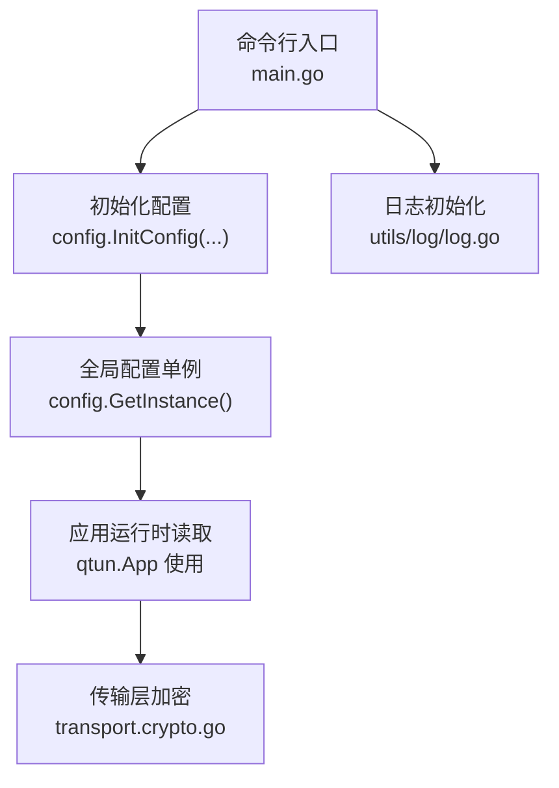
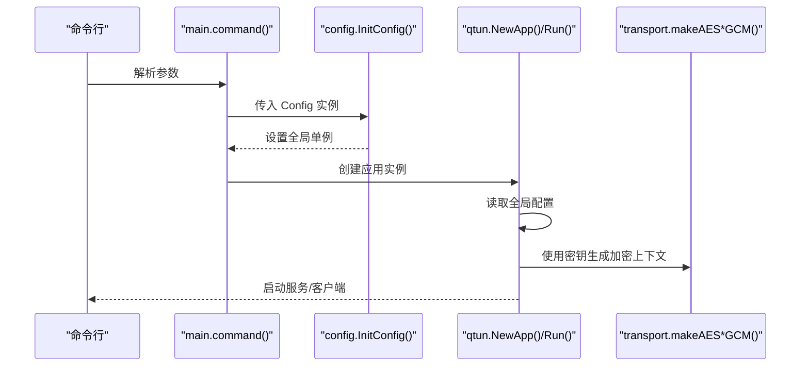
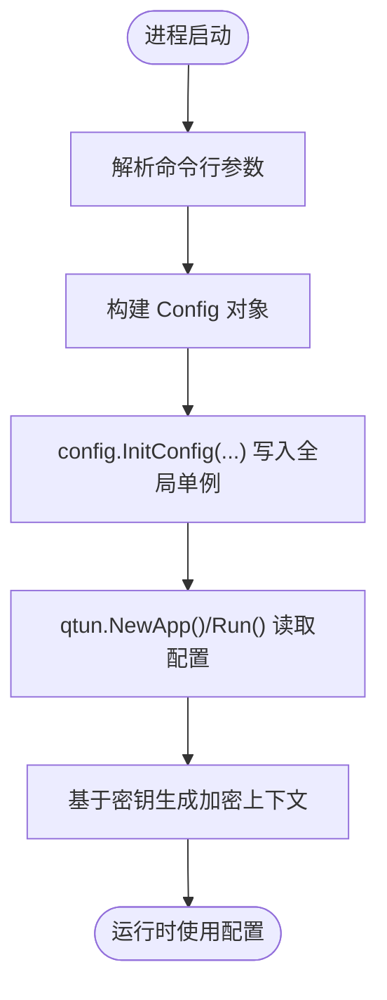
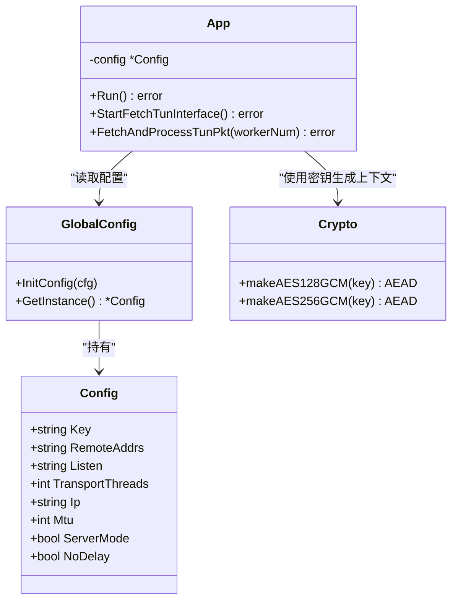

# 配置管理

<cite>
**本文引用的文件**
- [config/config.go](file://config/config.go)
- [main.go](file://main.go)
- [qtun/app.go](file://qtun/app.go)
- [transport/crypto.go](file://transport/crypto.go)
- [utils/hash.go](file://utils/hash.go)
- [README.md](file://README.md)
- [transport/server_conn.go](file://transport/server_conn.go)
- [utils/log/log.go](file://utils/log/log.go)
</cite>

## 目录
1. [简介](#简介)
2. [项目结构](#项目结构)
3. [核心组件](#核心组件)
4. [架构总览](#架构总览)
5. [详细组件分析](#详细组件分析)
6. [依赖关系分析](#依赖关系分析)
7. [性能考量](#性能考量)
8. [故障排除指南](#故障排除指南)
9. [结论](#结论)
10. [附录](#附录)

## 简介
本文件系统化梳理 qtun 的配置管理方案，覆盖以下主题：
- 全局配置结构与配置项定义
- 配置来源与优先级（命令行参数）
- 配置加载机制与生命周期
- 配置验证流程（默认值、类型与有效性）
- 动态更新与热重载机制现状与建议
- 配置模板与示例（服务器/客户端/高级选项）
- 安全考虑（敏感信息保护、配置加密）
- 配置迁移与版本兼容性处理
- 故障排除与调试方法

## 项目结构
配置相关的核心位置如下：
- 命令行参数定义与解析：位于主程序入口
- 全局配置对象与单例访问：位于配置模块
- 应用运行时使用配置：由应用层通过单例读取
- 加密与安全：基于配置中的密钥进行对称加密
- 日志级别：通过配置项控制

图表来源
- [main.go](file://main.go#L71-L103)
- [config/config.go](file://config/config.go#L15-L23)
- [qtun/app.go](file://qtun/app.go#L37-L49)
- [transport/crypto.go](file://transport/crypto.go#L10-L26)
- [utils/log/log.go](file://utils/log/log.go#L10-L25)

章节来源
- [main.go](file://main.go#L22-L103)
- [config/config.go](file://config/config.go#L1-L24)
- [README.md](file://README.md#L62-L88)

## 核心组件
- 配置结构体：集中定义所有可配置项及其默认值
- 命令行参数：提供配置项的命令行输入
- 全局配置单例：应用各处通过单例读取配置
- 应用运行时：在启动阶段读取配置并驱动后续行为
- 加密模块：基于配置中的密钥生成对称加密上下文
- 日志模块：根据配置项设置日志级别

章节来源
- [config/config.go](file://config/config.go#L3-L13)
- [main.go](file://main.go#L22-L68)
- [qtun/app.go](file://qtun/app.go#L19-L35)
- [transport/crypto.go](file://transport/crypto.go#L10-L26)
- [utils/log/log.go](file://utils/log/log.go#L10-L25)

## 架构总览
配置从命令行进入，经初始化写入全局单例，随后被应用与传输层消费。

图表来源
- [main.go](file://main.go#L71-L103)
- [config/config.go](file://config/config.go#L17-L23)
- [qtun/app.go](file://qtun/app.go#L37-L49)
- [transport/crypto.go](file://transport/crypto.go#L10-L26)

## 详细组件分析

### 配置结构与默认值
- 配置项与默认值均在配置结构体中声明，便于统一管理与文档化
- 默认值来源于结构体标签，便于在命令行帮助中呈现
- 当前未见显式的配置文件格式（如 JSON/YAML/TOML）或环境变量映射逻辑

章节来源
- [config/config.go](file://config/config.go#L3-L13)
- [README.md](file://README.md#L62-L88)

### 命令行参数与优先级
- 所有配置项均通过命令行参数提供，且在命令行帮助中给出默认值
- 优先级顺序（当前实现）：命令行参数 → 全局配置单例
- 未发现环境变量解析与覆盖逻辑；因此不存在“环境变量 > 命令行”的优先级

章节来源
- [main.go](file://main.go#L53-L65)
- [README.md](file://README.md#L62-L88)

### 配置加载机制与生命周期
- 初始化流程：命令行解析完成后，调用初始化函数将参数封装为配置对象并写入全局单例
- 生命周期：全局单例在应用启动后贯穿整个进程生命周期，供应用与传输层读取
- 未见配置热重载逻辑；若需变更配置，需重启进程以重新初始化

图表来源
- [main.go](file://main.go#L71-L103)
- [config/config.go](file://config/config.go#L17-L23)
- [qtun/app.go](file://qtun/app.go#L37-L49)
- [transport/crypto.go](file://transport/crypto.go#L10-L26)

### 配置验证流程
- 类型检查：命令行参数在解析时按字符串/整数/布尔类型绑定，Go 的类型系统保证基本类型一致性
- 有效性验证：当前未见显式校验逻辑（如 IP 地址格式、端口范围、密钥长度等）
- 默认值设置：通过结构体标签与命令行默认值共同提供

建议补充：
- 在初始化阶段增加显式校验（如地址格式、端口范围、MTU边界、密钥长度）
- 对于敏感字段（如密钥），在日志中避免直接打印明文

章节来源
- [main.go](file://main.go#L53-L65)
- [config/config.go](file://config/config.go#L3-L13)

### 动态更新与热重载机制
- 现状：未实现配置热重载；配置仅在进程启动时初始化一次
- 建议：
  - 引入配置文件监听（如 fsnotify）与原子替换（atomic.Value）
  - 对可热更新的配置项（如日志级别、限速参数）设计独立的热更新接口
  - 对加密密钥等敏感项，采用安全轮换策略并在运行时平滑切换

章节来源
- [config/config.go](file://config/config.go#L15-L23)
- [qtun/app.go](file://qtun/app.go#L37-L49)

### 配置模板与示例
- 服务器模式示例：指定监听地址、IP 段、密钥与服务器模式开关
- 客户端模式示例：指定远端地址、IP 段、密钥
- 高级选项示例：并发线程数、MTU、日志级别、Socks5 端口、文件服务器端口与目录

章节来源
- [README.md](file://README.md#L13-L26)
- [README.md](file://README.md#L85-L88)

### 安全考虑
- 密钥来源：密钥来自命令行参数，建议通过安全渠道注入（如环境变量或密钥管理服务）
- 明文泄露风险：避免在日志中输出密钥；当前日志初始化不直接打印密钥
- 加密算法：基于密钥派生（MD5/SHA256）生成 AES-GCM 上下文，建议使用更强的密钥派生与更安全的密钥管理
- 连接加密：连接层具备加解密能力，但密钥一致性需严格管理

章节来源
- [transport/crypto.go](file://transport/crypto.go#L10-L26)
- [utils/hash.go](file://utils/hash.go#L11-L27)
- [transport/server_conn.go](file://transport/server_conn.go#L117-L164)
- [utils/log/log.go](file://utils/log/log.go#L10-L25)

### 配置迁移与版本兼容性
- 当前未见配置文件格式与版本标记
- 建议：
  - 引入配置文件格式（如 YAML/JSON）并加入版本字段
  - 提供迁移脚本或内置迁移器，处理字段重命名、类型变更与默认值演进
  - 保持向后兼容的默认值策略，避免破坏性变更

## 依赖关系分析
配置在应用中的依赖关系如下：

图表来源
- [config/config.go](file://config/config.go#L3-L23)
- [qtun/app.go](file://qtun/app.go#L19-L35)
- [transport/crypto.go](file://transport/crypto.go#L10-L26)

章节来源
- [config/config.go](file://config/config.go#L1-L24)
- [qtun/app.go](file://qtun/app.go#L1-L271)
- [transport/crypto.go](file://transport/crypto.go#L1-L27)

## 性能考量
- 配置读取开销极低，主要影响在应用启动阶段
- 若引入配置热重载，需确保读取路径无锁或使用无锁数据结构，避免阻塞关键路径
- 对于频繁读取的配置项，可在应用内部缓存副本并在热更新时原子替换

## 故障排除指南
- 参数未生效
  - 检查命令行参数是否正确传递
  - 确认未被其他来源覆盖（当前无环境变量覆盖）
- 日志级别无效
  - 确认日志初始化调用与参数一致
- 加密异常
  - 检查密钥是否一致
  - 关注连接层加解密失败的日志提示
- 网络连通性问题
  - 核对监听地址/远端地址、端口与防火墙设置
  - 核对 IP 段与 MTU 设置

章节来源
- [utils/log/log.go](file://utils/log/log.go#L10-L25)
- [transport/server_conn.go](file://transport/server_conn.go#L117-L164)
- [README.md](file://README.md#L13-L26)

## 结论
当前配置管理以命令行参数为主，结构清晰、实现简洁。建议在未来版本中引入配置文件格式、环境变量支持与配置热重载，并完善配置验证与安全策略，以提升可用性与安全性。

## 附录

### 配置项清单与默认值
- key：加密密钥，默认值参见帮助
- remote_addrs：客户端远端地址，默认值参见帮助
- listen：服务器监听地址，默认值参见帮助
- transport_threads：客户端并发线程数，默认值参见帮助
- ip：VPN 虚拟 IP 段，默认值参见帮助
- mtu：网络 MTU，默认值参见帮助
- log_level：日志级别，默认值参见帮助
- server_mode：服务器模式开关，默认值参见帮助
- socks5_port：Socks5 服务端口，默认值参见帮助
- file_dir：文件服务器目录，默认值参见帮助
- file_svr_port：文件服务器端口，默认值参见帮助
- nodelay：TCP NoDelay 开关，默认值参见帮助
- proxyonly：仅启用代理模式，默认值参见帮助

章节来源
- [README.md](file://README.md#L62-L88)
- [main.go](file://main.go#L53-L65)

### 示例配置模板
- 服务器配置模板
  - key、listen、ip、server_mode
- 客户端配置模板
  - key、remote_addrs、ip、transport_threads
- 高级配置模板
  - mtu、log_level、socks5_port、file_dir、file_svr_port、nodelay、proxyonly

章节来源
- [README.md](file://README.md#L13-L26)
- [README.md](file://README.md#L85-L88)