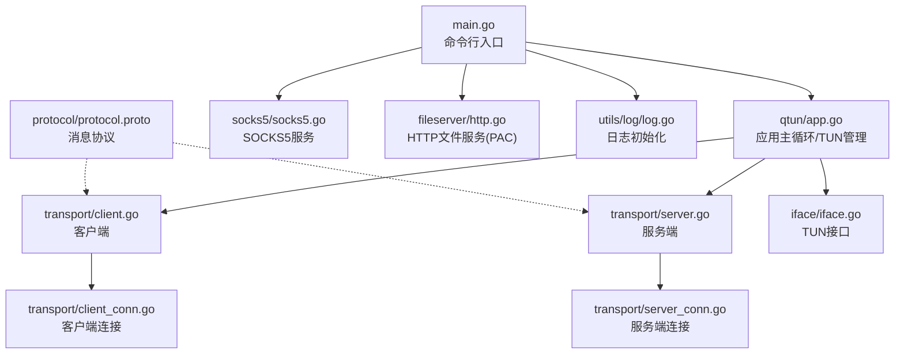
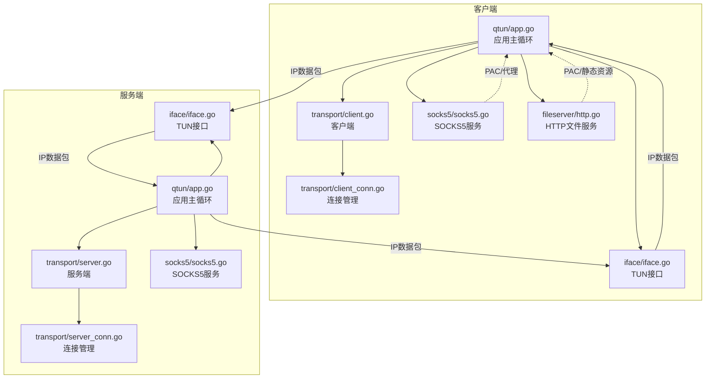
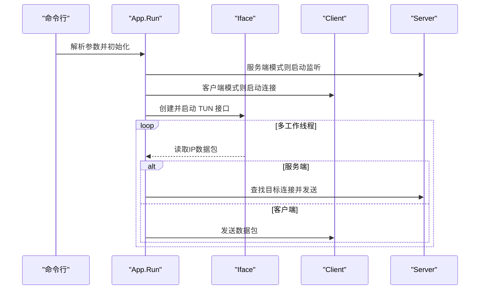
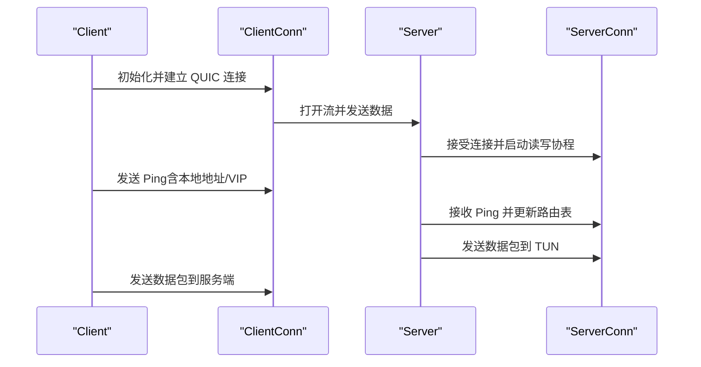
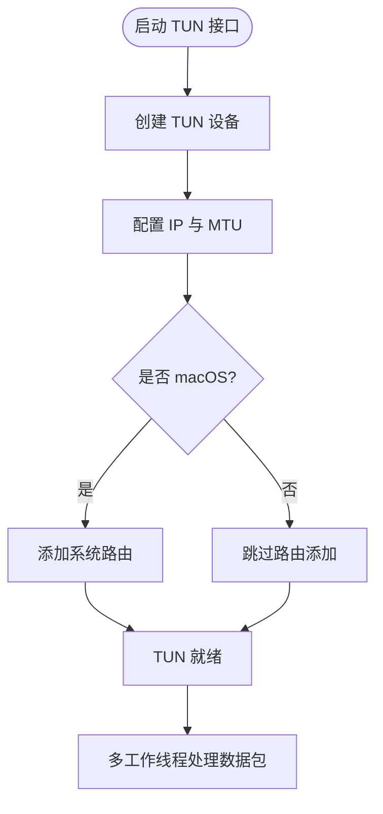
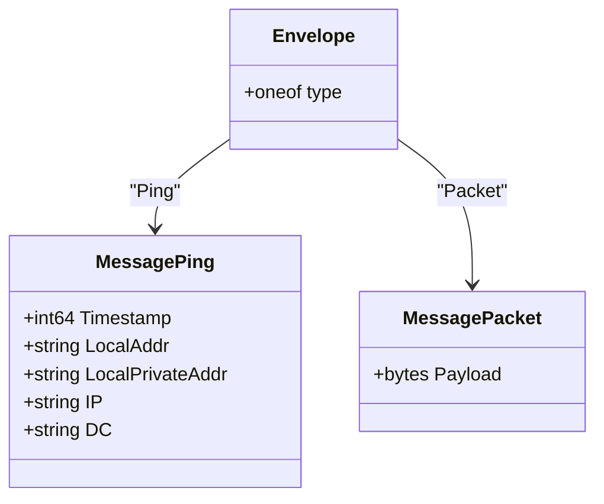
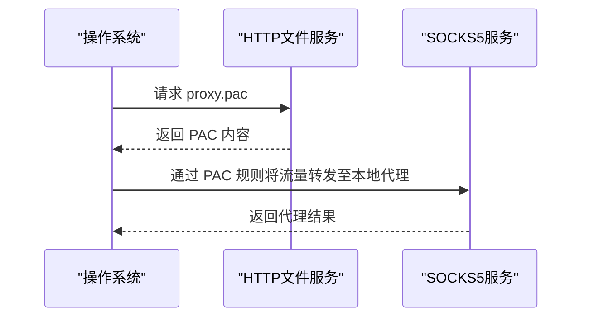
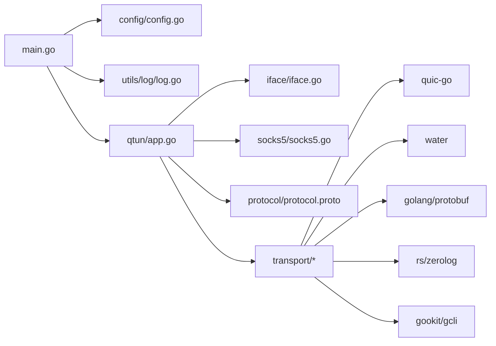

# 项目概述

<cite>
**本文档引用的文件**
- [README.md](file://README.md)
- [main.go](file://main.go)
- [qtun/app.go](file://qtun/app.go)
- [config/config.go](file://config/config.go)
- [transport/client.go](file://transport/client.go)
- [transport/server.go](file://transport/server.go)
- [transport/client_conn.go](file://transport/client_conn.go)
- [transport/server_conn.go](file://transport/server_conn.go)
- [iface/iface.go](file://iface/iface.go)
- [socks5/socks5.go](file://socks5/socks5.go)
- [protocol/protocol.proto](file://protocol/protocol.proto)
- [fileserver/http.go](file://fileserver/http.go)
- [utils/log/log.go](file://utils/log/log.go)
- [Makefile](file://Makefile)
- [go.mod](file://go.mod)
</cite>

## 目录
1. [简介](#简介)
2. [项目结构](#项目结构)
3. [核心组件](#核心组件)
4. [架构总览](#架构总览)
5. [详细组件分析](#详细组件分析)
6. [依赖关系分析](#依赖关系分析)
7. [性能考量](#性能考量)
8. [故障排查指南](#故障排查指南)
9. [结论](#结论)
10. [附录](#附录)

## 简介
Qtun 是一款基于 QUIC 协议的安全网络隧道工具，采用 CLI 设计，通过 TUN 虚拟网卡实现全流量转发，并内置 SOCKS5 代理服务，为用户提供安全、高效的网络访问能力。项目以“QUIC 实现版”为推荐版本，具备多 IP 管道、高并发传输、自适应工作线程等特性，适用于跨网络环境下的隐私保护与网络穿透场景。

- 核心价值
  - 安全：内置 AES-GCM 加密通道，保障数据传输机密性与完整性。
  - 高效：基于 QUIC 的低时延、多路复用与拥塞控制，显著优于传统 TCP。
  - 易用：一键启动 TUN 与 SOCKS5 服务，自动配置系统代理（部分平台）。
  - 可扩展：模块化设计，便于二次开发与定制。

- 主要功能
  - QUIC 协议传输：客户端与服务端通过 QUIC 建立稳定、高性能的数据通道。
  - TUN 接口虚拟化：将 IP 层数据包注入/从 TUN 接口读取，实现全流量转发。
  - SOCKS5 代理服务：提供本地 SOCKS5 代理，支持系统自动代理 PAC 文件。
  - 多连接与负载均衡：客户端可建立多条 QUIC 连接，按序轮询发送数据包。
  - 路由管理与健康检查：服务端维护客户端路由表，定期清理失效连接。

- 与传统 TCP 实现的差异与优势
  - 时延更低：QUIC 基于 UDP，避免 TCP 的队头阻塞与握手延迟。
  - 更强韧性：内置加密与多路复用，提升弱网与高抖动环境下的稳定性。
  - 更好吞吐：服务端 QUIC 配置优化了流窗口与连接窗口，提升带宽利用率。
  - 更易部署：无需复杂 TLS 握手细节，QUIC 自带安全与协议协商。

- 兼容性与系统要求
  - 支持平台：macOS、Linux；Windows 不支持。
  - 运行时：Go 1.19+（当前模块版本为 1.24.0）。
  - 权限：需管理员权限运行以创建 TUN 接口与修改系统路由。

- 快速开始
  - 服务器端：启动后同时提供 TUN 与 SOCKS5 服务，默认监听 127.0.0.1:2080。
  - 客户端：启动后自动配置系统代理（仅 macOS），并通过指定远端地址建立 QUIC 隧道。

**章节来源**
- [README.md](file://README.md#L1-L99)
- [go.mod](file://go.mod#L1-L29)

## 项目结构
项目采用分层与功能域结合的组织方式：
- 应用入口与命令行：main.go 负责参数解析、日志初始化与应用启动。
- 核心业务：qtun/app.go 提供隧道主循环、TUN 接口管理与路由调度。
- 传输层：transport/ 下实现 QUIC 客户端与服务端、连接管理与加解密。
- 网络接口：iface/ 封装 TUN 接口创建、配置与读写。
- 代理服务：socks5/ 实现 SOCKS5 代理协议处理。
- 协议定义：protocol/ 使用 protobuf 定义消息载体。
- 文件服务：fileserver/ 提供 PAC 文件与静态资源服务。
- 工具与日志：utils/log/ 提供统一日志初始化。
- 构建与依赖：Makefile、go.mod 管理构建与依赖。

**图示来源**
- [main.go](file://main.go#L1-L136)
- [qtun/app.go](file://qtun/app.go#L1-L271)
- [transport/client.go](file://transport/client.go#L1-L223)
- [transport/server.go](file://transport/server.go#L1-L219)
- [transport/client_conn.go](file://transport/client_conn.go#L1-L408)
- [transport/server_conn.go](file://transport/server_conn.go#L1-L295)
- [iface/iface.go](file://iface/iface.go#L1-L105)
- [socks5/socks5.go](file://socks5/socks5.go#L1-L170)
- [fileserver/http.go](file://fileserver/http.go#L1-L17)
- [utils/log/log.go](file://utils/log/log.go#L1-L26)
- [protocol/protocol.proto](file://protocol/protocol.proto#L1-L22)

**章节来源**
- [main.go](file://main.go#L1-L136)
- [Makefile](file://Makefile#L1-L23)
- [go.mod](file://go.mod#L1-L29)

## 核心组件
- 应用主控（App）
  - 负责根据运行模式启动服务端或客户端，管理 TUN 接口与数据包收发，维护路由表并清理失效连接。
  - 启动多工作线程处理 TUN 数据包，实现高并发与低延迟。
- 传输层（Client/Server）
  - 客户端：支持多连接并发，按序轮询选择连接发送数据；周期性发送 Ping 包用于路由建立与健康检测。
  - 服务端：基于 QUIC 监听并接受连接，维护连接映射与反向映射，支持高并发流与大窗口配置。
- TUN 接口（Iface）
  - 创建 TUN 设备、配置 IP 与 MTU，并在 macOS 上添加系统路由，确保流量正确进入隧道。
- SOCKS5 代理（socks5）
  - 提供 SOCKS5 代理服务，支持认证与规则集，配合 PAC 文件实现系统级自动代理。
- 协议与消息（protocol）
  - 使用 protobuf 定义 Envelope、MessagePing、MessagePacket，承载隧道中的控制与数据消息。
- 日志与文件服务（utils/log、fileserver）
  - 统一日志级别初始化；客户端启动时提供 HTTP 文件服务，用于 PAC 与静态资源。

**章节来源**
- [qtun/app.go](file://qtun/app.go#L1-L271)
- [transport/client.go](file://transport/client.go#L1-L223)
- [transport/server.go](file://transport/server.go#L1-L219)
- [iface/iface.go](file://iface/iface.go#L1-L105)
- [socks5/socks5.go](file://socks5/socks5.go#L1-L170)
- [protocol/protocol.proto](file://protocol/protocol.proto#L1-L22)
- [utils/log/log.go](file://utils/log/log.go#L1-L26)
- [fileserver/http.go](file://fileserver/http.go#L1-L17)

## 架构总览
下图展示了 Qtun 的整体架构与数据流：客户端通过 QUIC 与服务端建立隧道，TUN 接口负责捕获与注入 IP 层数据包，SOCKS5 代理提供透明代理能力，协议层封装消息类型，文件服务提供 PAC 与静态资源。

**图示来源**
- [qtun/app.go](file://qtun/app.go#L1-L271)
- [transport/client.go](file://transport/client.go#L1-L223)
- [transport/server.go](file://transport/server.go#L1-L219)
- [transport/client_conn.go](file://transport/client_conn.go#L1-L408)
- [transport/server_conn.go](file://transport/server_conn.go#L1-L295)
- [iface/iface.go](file://iface/iface.go#L1-L105)
- [socks5/socks5.go](file://socks5/socks5.go#L1-L170)
- [fileserver/http.go](file://fileserver/http.go#L1-L17)

## 详细组件分析

### 应用主控（App）与 TUN 管理
- 运行模式
  - 服务端模式：启动 SOCKS5 服务与 QUIC 监听，维护路由表并清理无效连接。
  - 客户端模式：启动 QUIC 客户端，周期性发送 Ping 并将 TUN 数据包发送至服务端。
- TUN 工作机制
  - 动态工作线程数：根据 CPU 核心数计算（2×CPU，最小 4，最大 32），提升 I/O 并发。
  - 数据包处理：从 TUN 读取 IP 层数据包，服务端按目的 IP 查找连接并发送，客户端直接发送。
- 路由与清理
  - 客户端 Ping 中携带本地地址与 VIP，服务端据此更新路由表。
  - 定时任务清理已关闭或失效连接，保持路由表一致性。

**图示来源**
- [qtun/app.go](file://qtun/app.go#L37-L167)
- [iface/iface.go](file://iface/iface.go#L31-L105)
- [transport/client.go](file://transport/client.go#L41-L132)
- [transport/server.go](file://transport/server.go#L48-L149)

**章节来源**
- [qtun/app.go](file://qtun/app.go#L1-L271)
- [iface/iface.go](file://iface/iface.go#L1-L105)

### 传输层（Client/Server）与 QUIC 连接
- 客户端
  - 多连接并发：按序轮询选择连接，提高可用性与吞吐。
  - Ping 机制：周期性发送 Ping，携带本地地址与 VIP，用于服务端建立路由。
  - 加解密：支持 AES-GCM 加密，非对称密钥通过配置传入。
- 服务端
  - QUIC 监听：启用高并发流与大窗口配置，提升性能与稳定性。
  - 连接管理：使用 sync.Map 存储连接映射，支持快速查找与删除。
  - 路由维护：根据 Ping 消息更新路由表，定期清理失效连接。

**图示来源**
- [transport/client.go](file://transport/client.go#L31-L223)
- [transport/client_conn.go](file://transport/client_conn.go#L44-L151)
- [transport/server.go](file://transport/server.go#L37-L219)
- [transport/server_conn.go](file://transport/server_conn.go#L39-L115)

**章节来源**
- [transport/client.go](file://transport/client.go#L1-L223)
- [transport/server.go](file://transport/server.go#L1-L219)
- [transport/client_conn.go](file://transport/client_conn.go#L1-L408)
- [transport/server_conn.go](file://transport/server_conn.go#L1-L295)

### TUN 接口与系统集成
- TUN 创建与配置
  - 使用 water 库创建 TUN 设备，设置 IP 与 MTU，并在 macOS 上添加系统路由。
- 系统代理
  - 在 macOS 上通过 networksetup 设置系统自动代理 URL 指向本地 PAC 文件。
- 数据包处理
  - 多工作线程并发读取 TUN 数据包，服务端按路由表选择连接发送，客户端直接转发。

**图示来源**
- [iface/iface.go](file://iface/iface.go#L31-L105)
- [qtun/app.go](file://qtun/app.go#L250-L271)

**章节来源**
- [iface/iface.go](file://iface/iface.go#L1-L105)
- [qtun/app.go](file://qtun/app.go#L250-L271)

### 协议与消息模型
- 协议定义
  - Envelope：承载消息类型（Ping 或 Packet）。
  - MessagePing：包含时间戳、本地地址、私有地址、VIP 与数据中心标识。
  - MessagePacket：承载原始 IP 层数据包字节流。
- 消息池优化
  - 客户端与服务端均使用消息池减少 GC 压力，提升吞吐。

**图示来源**
- [protocol/protocol.proto](file://protocol/protocol.proto#L5-L22)

**章节来源**
- [protocol/protocol.proto](file://protocol/protocol.proto#L1-L22)
- [transport/client.go](file://transport/client.go#L184-L222)
- [transport/server_conn.go](file://transport/server_conn.go#L235-L249)

### SOCKS5 代理与 PAC 文件
- SOCKS5 服务
  - 支持无认证与用户密码认证，提供 DNS 解析与规则集。
- PAC 文件
  - 客户端启动时提供 HTTP 文件服务，暴露 PAC 文件路径，便于系统自动代理配置。

**图示来源**
- [socks5/socks5.go](file://socks5/socks5.go#L109-L170)
- [fileserver/http.go](file://fileserver/http.go#L9-L17)

**章节来源**
- [socks5/socks5.go](file://socks5/socks5.go#L1-L170)
- [fileserver/http.go](file://fileserver/http.go#L1-L17)

## 依赖关系分析
- 外部库
  - quic-go：QUIC 协议栈，提供高性能、低时延的传输能力。
  - water：TUN 接口抽象，简化跨平台设备创建与配置。
  - golang/protobuf：消息序列化与反序列化。
  - rs/zerolog：结构化日志输出。
  - gookit/gcli：命令行框架，提供参数解析与帮助信息。
- 内部模块
  - config：全局配置单例，贯穿各模块。
  - utils/log：日志初始化与级别控制。
  - protocol：消息协议定义与复用池。
  - transport：QUIC 客户端/服务端与连接管理。
  - iface：TUN 接口封装。
  - socks5：SOCKS5 代理实现。
  - fileserver：PAC 与静态资源服务。

**图示来源**
- [main.go](file://main.go#L1-L136)
- [config/config.go](file://config/config.go#L1-L24)
- [utils/log/log.go](file://utils/log/log.go#L1-L26)
- [qtun/app.go](file://qtun/app.go#L1-L271)
- [transport/client.go](file://transport/client.go#L1-L223)
- [transport/server.go](file://transport/server.go#L1-L219)
- [iface/iface.go](file://iface/iface.go#L1-L105)
- [socks5/socks5.go](file://socks5/socks5.go#L1-L170)
- [protocol/protocol.proto](file://protocol/protocol.proto#L1-L22)
- [go.mod](file://go.mod#L5-L14)

**章节来源**
- [go.mod](file://go.mod#L1-L29)
- [main.go](file://main.go#L1-L136)

## 性能考量
- QUIC 参数优化
  - 服务端与客户端均配置较大的最大流数量、接收窗口与连接窗口，提升吞吐与稳定性。
  - KeepAlive 周期合理设置，降低空闲连接断开概率。
- 并发与缓冲
  - 客户端/服务端连接读写缓冲区扩大至 64KB，减少系统调用次数。
  - 连接写通道容量增加至 256，降低背压影响。
- 资源池与锁优化
  - 消息对象与随机数 nonce 使用池化，减少内存分配与 GC 压力。
  - 服务端使用 sync.Map 替代互斥锁，提升高并发场景下的读写性能。
- TUN 工作线程
  - 根据 CPU 核心数动态调整工作线程数量，兼顾吞吐与资源占用。

**章节来源**
- [transport/server.go](file://transport/server.go#L97-L103)
- [transport/client_conn.go](file://transport/client_conn.go#L332-L333)
- [transport/server_conn.go](file://transport/server_conn.go#L89-L89)
- [transport/client.go](file://transport/client.go#L184-L206)
- [transport/server_conn.go](file://transport/server_conn.go#L235-L249)
- [qtun/app.go](file://qtun/app.go#L79-L96)

## 故障排查指南
- 无法创建 TUN 接口
  - 检查是否以管理员权限运行；确认系统支持 TUN 设备；查看 ifconfig 输出与错误日志。
- 无法连接服务端
  - 核对远程地址与端口；检查防火墙策略；确认 QUIC TLS 配置与证书链。
- 代理不生效
  - macOS 上确认已设置系统自动代理 URL；检查 PAC 文件可达性；验证 SOCKS5 端口未被占用。
- 日志级别与输出
  - 使用 --verbose 与 --log_level 控制日志等级；默认输出到控制台，便于调试。
- 连接频繁断开
  - 检查 KeepAlive 配置与网络质量；确认客户端 Ping 是否正常发送；查看服务端路由清理任务是否误删有效连接。

**章节来源**
- [utils/log/log.go](file://utils/log/log.go#L10-L25)
- [iface/iface.go](file://iface/iface.go#L31-L105)
- [transport/server.go](file://transport/server.go#L151-L173)
- [socks5/socks5.go](file://socks5/socks5.go#L109-L170)

## 结论
Qtun 以 QUIC 为核心，结合 TUN 虚拟网卡与 SOCKS5 代理，构建出一套安全、高效且易于使用的网络隧道方案。其模块化设计与性能优化（如消息池、并发连接、窗口调优）使其在复杂网络环境下仍能保持稳定与低时延。对于需要隐私保护、网络穿透与透明代理的用户而言，Qtun 提供了可靠的解决方案。

## 附录
- 快速开始
  - 服务器端：以管理员权限运行，启动后自动提供 SOCKS5 服务与 TUN。
  - 客户端：以管理员权限运行，配置系统代理（macOS），连接指定远端地址。
- 系统要求
  - Go 1.19+；支持 macOS 与 Linux；Windows 不支持。
- 构建与安装
  - 使用 Makefile 提供多平台编译目标；依赖通过 go.mod 管理。

**章节来源**
- [README.md](file://README.md#L9-L99)
- [Makefile](file://Makefile#L1-L23)
- [go.mod](file://go.mod#L1-L29)